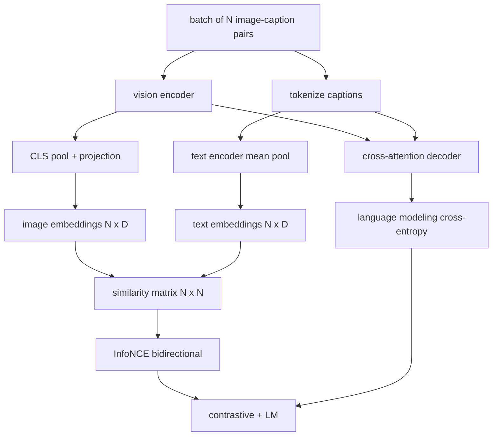

<!-- i18n:manual -->
# Претрейн модели зрения и языка

> Энкодер, проекция и декодер уже соединены. Теперь обучаем их вместе. Обучение тянут две цели: контрастная потеря картинка-текст (InfoNCE), которая стягивает совпадающие пары в общем пространстве эмбеддингов, и потеря языкового моделирования, которая требует от декодера написать подпись к каждой картинке. Вместе они учат сеть и находить нужную картинку по подписи, и сочинять подпись по картинке.

**Type:** Build
**Languages:** Python
**Prerequisites:** Phase 19 lessons 30-37 (Track B foundations)
**Time:** ~90 minutes

> 🎒 **На пальцах.** Представьте ученика, которому дают стопку из 16 фотографий и 16 подписей вперемешку. Первое задание — разложить их по парам. Второе — закрыть подписи и написать их заново по памяти. Первое учит узнавать, второе учит рассказывать, и обе способности нужны, чтобы модель была полезной.

## Learning Objectives

- Реализовать контрастную потерю InfoNCE по батчу пар картинка-подпись.
- Собрать композицию контрастной потери и авторегрессионной потери языкового моделирования.
- Синтезировать игрушечный корпус из 200 пар картинка-подпись, ничего не скачивая.
- Прогнать демо-цикл обучения на 50 шагов и увидеть, как обе потери падают.

> 🎒 **На пальцах.** Обратите внимание на слово «синтезировать»: весь датасет здесь генерируется кодом за долю секунды. Настоящий CLIP учили на 400 миллионах пар из интернета, а нам для проверки проводки градиента хватает 200 сгенерированных. Цель урока — не качество модели, а работающий механизм.

## The Problem

Модели зрения и языка нужны два умения. Она должна ранжировать: по подписи найти нужную картинку среди многих. И она должна генерировать: по картинке написать подпись. Претрейн только на одном умении даёт половину системы. CLIP отлично ранжирует, но не умеет подписывать. GPT-4V умеет подписывать, но для ранжирования использует отдельную поисковую голову. Многоцелевой претрейн даёт оба умения за один проход.

> 🎒 **На пальцах.** Это как разница между «узнать человека на фото» и «описать его словами». Первое — задача поиска, второе — задача рассказа, и одно не следует из другого автоматически. CLIP умеет только первое, поэтому подпись к картинке он выдать не может физически: у него просто нет декодера.

InfoNCE закрывает половину с ранжированием. Для батча из N пар модель считает N совпадающих пар позитивами, а `N^2 - N` несовпадающих — негативами, и прогоняет кросс-энтропию по получившейся матрице похожести формы `(N, N)`. Потеря LM закрывает половину с генерацией: обычное предсказание следующего токена с условием на картинку. Обе потери дифференцируемы и могут делить веса энкодера, проектора и декодера.

> 🎒 **На пальцах.** Посчитайте негативы для батча 16: всего клеток 16 × 16 = 256, из них 16 на диагонали — правильные пары, а оставшиеся 240 — неправильные. То есть каждый шаг обучения даёт модели 16 положительных примеров и 240 отрицательных бесплатно, просто из того, что они лежат в одном батче.

## The Concept



> 🎒 **На пальцах.** Посмотрите на схему: батч разветвляется на два пути и снова сходится внизу. Левый путь ведёт к матрице похожести N × N, правый — через декодер к кросс-энтропии по токенам. Энкодер стоит в начале обоих путей, поэтому градиент до него доходит дважды за шаг.

### InfoNCE in one paragraph

Сложите N эмбеддингов картинок как строки и N эмбеддингов текста как строки. Нормируйте обе матрицы по L2. Посчитайте матрицу `N x N` вида `S = I T^T / tau`, где `tau` — обучаемая temperature. Элементы на диагонали — совпадающие пары, вне диагонали — негативы. Примените кросс-энтропию с целью `argmax`, идущей по диагонали: в строке `i` максимум должен стоять в столбце `i`. Сделайте то же самое симметрично по столбцам. Итог — среднее из двух. Это и есть потеря CLIP в восемь строк.

> 🎒 **На пальцах.** После L2-нормировки каждая клетка матрицы — это косинус угла между картинкой и подписью, число от −1 до 1. Задача обучения формулируется одной фразой: сделать диагональ максимальной в каждой строке. Для батча 16 это 16 строк, в каждой надо угадать одну колонку из 16.

### Temperature matters

Temperature `tau` управляет тем, насколько острым получается softmax. Слишком маленькая (например, `tau = 0.01`) — и градиент приходит только от самого сложного негатива, обучение шумит. Слишком большая — softmax размазывается и градиент исчезает. CLIP учит `tau` как параметр; демо здесь делает так же.

> 🎒 **На пальцах.** При `tau = 0.01` косинусы 0.30 и 0.28 превращаются в логиты 30 и 28 — softmax отдаёт первому почти всю вероятность, и весь градиент уходит на одну клетку. При `tau = 1.0` те же числа остаются 0.30 и 0.28, вероятности почти равны, и модель не понимает, что вообще надо менять. Рабочий диапазон посередине, у CLIP он около 0.07.

### Language modeling loss

Декодер потребляет память картинки через cross-attention и предсказывает следующий текстовый токен в каждой позиции. Потеря — обычная кросс-энтропия с целью «следующая позиция». Позиции с паддингом маскируются и в потерю не входят.

> 🎒 **На пальцах.** Маскирование паддинга обязательно, а не для красоты. Если подписи выровнены до длины 32, а реальная длина 8, то 24 позиции из 32 — это пустышка. Без маски три четверти сигнала научат модель уверенно предсказывать символ-заполнитель, и метрика будет выглядеть отлично при бесполезной модели.

### Combining the losses

`total = contrastive + lm_weight * lm`, где `lm_weight` — скаляр (часто 1.0). Обе потери разделяют градиенты в энкодер и проекцию; градиент от потери LM получает только декодер. Это тот самый многозадачный рецепт, который используют CoCa, BLIP и модели в стиле SigLIP, отличаясь только весами.

| Component | Loss surface | Affects |
|-----------|--------------|---------|
| InfoNCE | Ранжирование пар в общем пространстве | Энкодер + проекция + текстовая голова |
| LM | Предсказание токена с условием на картинку | Энкодер + проекция + декодер |
| Combined | Многозадачность | Весь стек |

> 🎒 **На пальцах.** Прочитайте столбец Affects как карту градиентов. Энкодер и проекция стоят в обеих строках, значит их веса тянут сразу две силы, а декодер — только в строке LM. Отсюда практическое следствие: если поднять `lm_weight` до 10, ранжирование просядет, потому что общие слои начнут оптимизировать в основном генерацию.

### Why 50 steps is enough for a demo

Игрушечный корпус — это синтетический набор из 200 пар со случайными картинками и случайными id подписей. После 50 шагов SGD с батчем 16 обе потери заметно падают, даже если абсолютные значения остаются выше того, что взяла бы модель на настоящих данных. Смысл демо — убедиться, что проводка градиента работает от начала до конца и что добавление потери LM не расшатывает контрастную цель.

> 🎒 **На пальцах.** Ключевая фраза — «даже если абсолютные значения остаются выше». На случайных данных выучить нечего, и низкой потери здесь быть не может в принципе. Смотреть надо на направление: вниз — проводка цела, стоит на месте — где-то оборван градиент.

```figure
ch-infonce-diagonal
```

## Build It

`code/main.py` реализует:

- `MultimodalModel` — сборка небольшого энкодера ViT, MLP-проектора, крошечного текстового энкодера (усреднение по эмбеддингам id) и декодера с cross-attention из урока 61.
- `info_nce_loss(image_emb, text_emb, temperature)` — двунаправленная контрастная потеря в стиле CLIP.
- `lm_loss(logits, target_ids, padding_id)` — кросс-энтропия следующего токена с маской.
- `make_mock_corpus(seed, n_pairs)` — возвращает 200 детерминированных пар (картинка, caption_ids).
- Цикл обучения на 50 шагов с батчем 16, оптимизатором Adam и обучаемым параметром log-temperature. Обе потери печатаются каждые 5 шагов.

> 🎒 **На пальцах.** Обратите внимание, что температура хранится как логарифм. Причина простая: `tau` обязана быть положительной, а градиентный спуск про это не знает и легко загонит параметр в минус. Через `exp(log_tau)` любое значение параметра даёт положительную температуру, и ограничение соблюдается само.

Запустите:

```bash
python3 code/main.py
```

Вывод: контрастная потеря падает примерно с `ln(16) = 2.77` в сторону 2.4; потеря LM падает с базовой линии случайного равномерного выбора `ln(512) ≈ 6.24` примерно к 4.7. Оба падения доказывают, что градиент подключён правильно. Настоящие модели учатся миллионы шагов; динамика та же самая.

> 🎒 **На пальцах.** Эти числа легко проверить в уме. Батч 16 — угадывание наугад даёт вероятность 1/16, а потеря равна `ln(16) = 2.77`; словарь 512 даёт `ln(512) ≈ 6.24`. Падение LM с 6.24 до 4.7 означает, что модель фактически выбирает уже не из 512 вариантов, а примерно из 110.

## Use It

Тот же рецепт потерь стоит в:

- **CLIP (2021).** Только контрастная связка картинка-текст, плюс отдельная проба для подписей поверх замороженного энкодера.
- **CoCa (2022).** Контрастная связка картинка-текст плюс потеря LM на подписи в одной модели. Ровно та схема, которую собирает этот урок.
- **BLIP (2022) and BLIP-2.** Контрастная потеря плюс LM плюс голова сопоставления картинки и текста. Три потери вместе.
- **SigLIP (2023).** Меняет InfoNCE на попарную сигмоидную потерю; та же контрастная роль, другая функциональная форма.
- **LLaVA family.** Двухэтапное обучение: на первом этапе выравнивание (косинус поверх замороженной LM), на втором добавляется потеря LM с размороженной LM. Урок 60 соответствует первому этапу, этот урок — второму.

> 🎒 **На пальцах.** Пробегитесь по списку и посчитайте потери: у CLIP одна, у CoCa две, у BLIP три. Это буквально эволюция одной идеи через добавление слагаемых в сумму. Ваш `total = contrastive + lm_weight * lm` — это CoCa; чтобы получить BLIP, к сумме добавляют третье слагаемое.

## Tests

`code/test_main.py` покрывает:

- потеря InfoNCE симметрична по строкам картинок и текста
- потеря InfoNCE равна 0, когда матрица похожести — идеальная диагональ из больших положительных чисел
- потеря LM корректно маскирует позиции с паддингом
- прямой проход модели выдаёт обе потери без ошибок
- цикл обучения на 5 шагов уменьшает суммарную потерю

Запустите их:

```bash
python3 -m unittest code/test_main.py
```

> 🎒 **На пальцах.** Второй тест — самая честная проверка формулы. Подставьте на диагональ 100, а вне диагонали 0: softmax по строке даст диагонали вероятность практически 1, а `-ln(1) = 0`. Если ваш код при таком входе выдаёт не ноль, значит перепутаны оси softmax — это самая частая ошибка в InfoNCE.

## Exercises

1. Замените InfoNCE на попарную сигмоидную потерю в стиле SigLIP и сравните сходимость на игрушечном корпусе.

2. Добавьте шаг добычи сложных негативов: через батч выбирайте самую сложную внедиагональную пару из предыдущего батча и дописывайте её. Обучите и посмотрите, падает ли контрастная потеря быстрее.

3. Добавьте бинарную голову сопоставления картинки и текста поверх общего эмбеддинга (правда или ложь: это пара?) как третью потерю, воспроизведя схему BLIP с тремя головами.

4. Замените игрушечный корпус на последовательности id подписей из цепи Маркова, у которой матрица переходов зависит от хеша картинки. Потеря на подписях должна упасть сильнее, потому что появится настоящий обучаемый сигнал.

5. Обучите ту же модель с `lm_weight = 0` и потом с `lm_weight = 1`. Сравните контрастную потерю; потеря LM не должна ухудшать цель ранжирования.

> 🎒 **На пальцах.** Задание 5 — самое дешёвое и самое информативное: два прогона по 50 шагов, и вы своими глазами видите, конфликтуют цели или помогают друг другу. Если при `lm_weight = 1` контрастная потеря заметно хуже, чем при 0, значит вес подобран плохо. Именно так на практике и подбирают этот коэффициент — перебором на коротких прогонах.

## Key Terms

| Term | What it means |
|------|---------------|
| InfoNCE | Оценка через контраст с шумом: кросс-энтропия по матрице похожести |
| Temperature | Скаляр, управляющий остротой контрастного softmax |
| Hard negative | Внедиагональная пара, которая путает модель; полезна для сэмплирования |
| LM loss | Обычная кросс-энтропия следующего токена на стороне подписей |
| Joint embedding space | Общее пространство, где после проекции живут векторы картинок и текста |

## Further Reading

- Статья про CLIP — оригинальный контрастный рецепт.
- Статья про CoCa — контрастная потеря плюс генерация подписей в одной модели.
- Статья про SigLIP — вариант с попарной сигмоидной потерей и объяснение, почему он лучше масштабируется.
