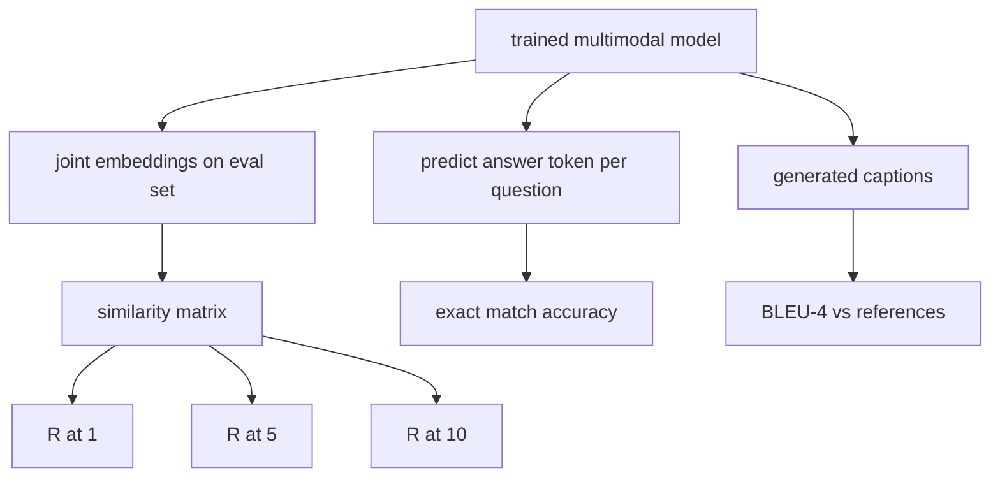

<!-- i18n:manual -->
# Оценка мультимодальных моделей

> Обучение — это половина цикла. Вторая половина — измерение. В этом уроке мы строим три поверхности оценки из примитивов: поиск картинки по подписи с отчётом в R@1, R@5, R@10; ответы на вопросы по картинке с отчётом в accuracy по точному совпадению; и генерацию подписей с отчётом в BLEU-4. Каждая метрика — это функция от выходов модели плюс синтетический набор для оценки, который прогоняется за секунды.

**Type:** Build
**Languages:** Python
**Prerequisites:** Phase 19 lessons 58-62 (Track E foundations: encoder, transformer, projection, cross-attention fusion, pretraining)
**Time:** ~90 minutes

> 🎒 **На пальцах.** Обучить модель и не измерить её — всё равно что готовить блюдо, не пробуя его на вкус. Падающая кривая потерь говорит только «модель что-то выучила на своих данных», но не отвечает, найдёт ли она нужную картинку и напишет ли осмысленную подпись. Эти три метрики и есть ложка, которой пробуют.

## Learning Objectives

- Посчитать Recall@K по матрице похожести между эмбеддингами картинок и подписей.
- Посчитать VQA accuracy по точному совпадению для модели, которая отображает пары (картинка, вопрос) в фиксированный словарь ответов.
- Посчитать BLEU-4 по сгенерированным и эталонным последовательностям токенов без единой внешней библиотеки.
- Прогнать все три оценки на синтетическом наборе, построенном поверх модели, обученной в уроке 62.

> 🎒 **На пальцах.** Обратите внимание, что все три метрики пишутся руками, без библиотек. Это не упражнение на упрямство: каждая из них — десяток строк арифметики, и, написав их один раз, вы перестанете воспринимать цифры в статьях как магию. BLEU-4 — это просто четыре доли и один множитель.

## The Problem

Соблазн — объявить мультимодальную модель готовой, как только потеря на обучении вышла на плато. Потеря на обучении измеряет подгонку под обучающее распределение; она не говорит, умеет ли модель ранжировать пары в отложенном батче, ответить на вопрос или написать подпись, которую примет человек. Стандартных поверхностей оценки три:

> 🎒 **На пальцах.** Плато потери означает ровно одно: модель перестала улучшаться на тех данных, которые видела. Она может при этом просто запомнить 200 обучающих пар наизусть и провалиться на 51-й новой. Поэтому оценка всегда идёт на данных, которых в обучении не было, — иначе вы измеряете память, а не умение.

- **Retrieval (R@1, R@5, R@10).** Постройте общий эмбеддинг для подписи-запроса; отранжируйте все картинки в наборе оценки по косинусу; отчитайтесь, попала ли нужная картинка в топ-1, топ-5, топ-10. Симметричная форма (картинка-к-тексту) считается так же.
- **Visual question answering (exact match).** По паре (картинка, вопрос) модель выдаёт токен ответа. Точное совпадение — это один бит на пример: совпал ли предсказанный ответ с эталонным? Усредняем по набору оценки.
- **Captioning (BLEU-4).** Сгенерируйте подпись. Посчитайте среднее геометрическое точностей по 1-граммам, 2-, 3- и 4-граммам против эталонных подписей, со штрафом за краткость. Стандартная форма — с несколькими эталонами (одна картинка, несколько эталонных подписей).

> 🎒 **На пальцах.** Заметьте разницу в природе трёх метрик. Поиск сравнивает вашу картинку со всеми остальными и потому зависит от размера пула: R@1 на 50 картинках и на 5000 — совсем разные задачи. VQA сравнивает один токен с одним токеном. BLEU сравнивает две последовательности слов. Одно число ни одну из трёх не заменяет.

Каждая метрика — это тонкая функция. Урок строит их все в коде, чтобы математика была наглядной, а поверхность оценки оставалась под вашим контролем. Настоящие бенчмарки (MS-COCO, VQA v2, GQA, OK-VQA) подключаются к тем же сигнатурам функций.

> 🎒 **На пальцах.** Фраза «подключаются к тем же сигнатурам» — это обещание, что работа не пропадёт. Функция `recall_at_k(sim_matrix, k)` не знает и не хочет знать, откуда взялась матрица: из 50 синтетических пар или из 5000 картинок MS-COCO. Меняется только загрузчик данных, тело метрики остаётся тем же.

## The Concept



> 🎒 **На пальцах.** На схеме от обученной модели расходятся три ветки, и они не пересекаются. Значит, три метрики можно считать независимо и добавлять по одной: сначала запустить только поиск, убедиться, что он выше случайного уровня, и лишь потом браться за VQA и BLEU.

### Recall@K from a similarity matrix

Постройте матрицу косинусной похожести `(N, N)` между эмбеддингами картинок и подписей. Для каждой строки отсортируйте столбцы по убыванию похожести. Recall@K — это доля строк, где индекс диагонального столбца оказался в топ-K позициях. Симметричный Recall@K (подпись-к-картинке) считается на транспонированной матрице. Отчитываются оба числа. Для оценки при N=100 значение R@1 = 0.6 означает, что 60 подписей из 100 вытащили свою картинку первой.

> 🎒 **На пальцах.** Это та же матрица похожести, что была на обучении в уроке 62, только смотрим мы на неё иначе. Там мы толкали диагональ вверх градиентом, здесь просто считаем, сколько раз она оказалась наверху. Обучение и оценка используют один объект — разница лишь в том, что оценка ничего не меняет.

### VQA exact match

Для каждой тройки (картинка, вопрос, ответ) кодируем картинку, эмбеддим вопрос, сливаем через декодер и считываем следующий токен. Предсказанный id токена сравнивается с эталонным; правильно, если равны. Усредняем по набору оценки. Настоящие датасеты VQA поставляются с несколькими ответами живых аннотаторов на вопрос и используют формулу мягкой точности (1.0, если согласны хотя бы 3 аннотатора из 10, и меньше при меньшем согласии); в уроке для наглядности берётся точное совпадение с единственным ответом.

> 🎒 **На пальцах.** Мягкая точность нужна, потому что у людей нет одного правильного ответа. На вопрос «сколько человек на фото?» девять аннотаторов скажут «2», а один — «двое». Точное совпадение назовёт ответ «двое» ошибкой, хотя он верен. Мы этой проблемы избегаем просто: словарь ответов у нас фиксированный, и вариантов написания нет.

### BLEU-4

```text
BLEU-4 = BP * exp(mean(log p1, log p2, log p3, log p4))
```

Здесь `p_n` — модифицированная точность по n-граммам (обрезанное число сгенерированных n-грамм, встречающихся хоть в одном эталоне, делённое на общее число сгенерированных n-грамм), а `BP` — штраф за краткость:

```text
BP = 1                if generated length > reference length
   = exp(1 - r/g)     otherwise, where r is reference length and g is generated
```

На маленьких выборках нужно сглаживание, потому что какая-нибудь `p_n` окажется нулём. В реализации взят «метод 1» Чена и Черри (прибавить 1 к числителю и знаменателю при любом нулевом счётчике) — самый безопасный вариант по умолчанию для режима малых чисел.

> 🎒 **На пальцах.** Почему без сглаживания всё ломается: BLEU перемножает четыре точности, и один ноль обнуляет произведение целиком. Подпись из 5 слов даёт всего две 4-граммы, и если ни одна не совпала точно, `p4 = 0` и BLEU-4 = 0 — даже когда три слова из пяти угаданы. Прибавление единицы к числителю и знаменателю превращает этот ноль в маленькое, но живое число.

### Synthetic eval suite

Набор оценки из 50 примеров строится в памяти по той же схеме игрушечного корпуса, что и в уроке 62, но с отложенным seed. Набор состоит из трёх списков:

- `pairs`: 50 пар (картинка, caption_ids) для поиска.
- `vqa`: 50 троек (картинка, question_ids, answer_id).
- `caps`: 50 записей (картинка, [reference_caption_ids, ...]) с числом эталонов до 3 на картинку.

> 🎒 **На пальцах.** Три списка — это ровно три метрики, по списку на каждую. Обратите внимание на «до 3 эталонов» в третьем: BLEU разрешает засчитать совпадение с любым из них, поэтому три эталона вместо одного заметно поднимают числа. Настоящий MS-COCO даёт 5 эталонных подписей на картинку — и именно поэтому BLEU там выглядит выше.

Набор детерминирован по seed и отложен от обучающего корпуса, так что метрики считаются на данных, которых модель никогда не видела. Сохранение набора в JSON оставлено как упражнение (см. ниже).

| Metric | Range | Random baseline (N=50) |
|--------|-------|------------------------|
| R@1 | от 0 до 1 | 0.02 (1 / N) |
| R@5 | от 0 до 1 | 0.10 |
| R@10 | от 0 до 1 | 0.20 |
| VQA EM | от 0 до 1 | 1 / vocab |
| BLEU-4 | от 0 до 1 | маленькое, но не ноль |

> 🎒 **На пальцах.** Столбец случайной базы — это ваш ноль отсчёта, и его надо считать до запуска. При N=50 случайное угадывание даёт R@1 = 1/50 = 0.02, R@5 = 5/50 = 0.10, R@10 = 0.20. Если модель показала R@5 = 0.10, она не выучила ничего, как бы солидно ни выглядели десять процентов.

Для прогона обучения на 50 шагов по синтетическим данным высоких метрик ждать не стоит; ждать стоит того, что они окажутся выше случайной базы, — это демо и проверяет.

> 🎒 **На пальцах.** Планка «выше случайной базы» звучит скромно, но это первая честная проверка всей цепочки. Она ловит настоящие баги: перепутанные оси матрицы, сдвиг подписей относительно картинок, оценку на обучающих данных. Пока метрика сидит ровно на случайном уровне, обсуждать архитектуру бессмысленно — где-то оборван провод.

```figure
ch-recall-window
```

## Build It

`code/main.py` реализует:

- `recall_at_k(sim_matrix, k)` — возвращает число с плавающей точкой в `[0, 1]` для обоих направлений.
- `vqa_exact_match(predictions, references)` — возвращает среднее по равенству `int`.
- `bleu4(generated, references, smoothing=True)` — с поддержкой нескольких эталонов.
- `build_eval_suite(seed, n_samples, vocab_size, max_len)` — возвращает три детерминированных списка для оценки.
- `evaluate(model, suite)` — прогоняет все три метрики и возвращает `dict` из чисел.
- Демо, которое берёт свежеинициализированную мультимодальную модель из урока 62, оценивает её, потом обучает 50 шагов и оценивает снова, печатая метрики до и после.

> 🎒 **На пальцах.** Замер «до» на свежей необученной модели — самая полезная привычка во всём уроке. Он даёт вам вашу собственную случайную базу, измеренную, а не выведенную по формуле. Если метрика «до» уже подозрительно высокая, значит утекли данные или метрика считает не то, что вы думаете.

Запустите:

```bash
python3 code/main.py
```

Вывод: таблица метрик до и после показывает, как поиск уходит от почти случайного уровня к выученному сигналу модели, VQA поднимается над случайным уровнем, а BLEU-4 растёт (синтетической структуры хватает, чтобы точность по 4-граммам подросла).

## Use It

Каждая метрика напрямую ложится на продакшен-бенчмарк:

- **Retrieval.** MS-COCO 5K val, Flickr30K и zero-shot на ImageNet — всё это задачи R@K на той же самой матрице похожести. Замените синтетическую оценку на настоящие файлы, и сигнатура функции не изменится.
- **VQA.** VQA v2, GQA, OK-VQA используют ту же форму с точным совпадением (с мягкой точностью вместо одиночного EM в случае VQA v2).
- **BLEU-4.** Подписи MS-COCO, NoCaps, подписи Flickr30K — везде BLEU-4 плюс CIDEr и METEOR. Добавить CIDEr — это ещё одна функция.

Для настоящих бенчмарков замените `build_eval_suite` на реальный загрузчик, а тела функций оставьте. Математика от бенчмарка не зависит.

> 🎒 **На пальцах.** Обратите внимание, что в каждой строке по два-три названия на одну метрику. Это значит, что выучив три функции, вы получаете доступ примерно к десятку публичных бенчмарков. Разница между ними — в картинках и разметке, а не в арифметике.

## Tests

`code/test_main.py` покрывает:

- recall@k возвращает 1.0 на идеальной единичной матрице похожести и 0.0 на перевёрнутой при k < N
- recall@k соблюдает верхнюю границу `k <= N`
- bleu4 возвращает 1.0, когда сгенерированное точно совпадает с одним из эталонов
- bleu4 возвращает 0.0 на непересекающемся словаре
- точное совпадение VQA равно доле совпавших пар
- build_eval_suite возвращает ожидаемое число пар, элементов vqa и записей с подписями

Запустите их:

```bash
python3 -m unittest code/test_main.py
```

> 🎒 **На пальцах.** Первые два теста задают метрике границы сверху и снизу. Единичная матрица — идеальный случай, диагональ везде первая, значит R@K обязан быть ровно 1.0; перевёрнутая матрица — худший случай, значит 0.0. Метрика, которая не выдаёт ровно 1.0 и ровно 0.0 на этих двух входах, сломана, и никакие промежуточные числа от неё принимать нельзя.

## Exercises

1. Добавьте CIDEr к метрикам генерации подписей. CIDEr взвешивает n-граммы по TF-IDF, тем самым поощряя информативные токены.

2. Реализуйте VQA с мягкой точностью: несколько человеческих ответов на вопрос, accuracy равна `min(human_count / 3, 1)`, если хоть один совпал. Воспроизводит VQA v2.

3. Добавьте вариант `bleu4`, устойчивый к NaN, чтобы пустая сгенерированная последовательность не роняла программу.

4. Посчитайте средний обратный ранг (MRR) рядом с R@K. MRR чувствителен к тому, где именно оказался правильный элемент за пределами топ-K; R@K чувствителен только к факту попадания в топ-K.

5. Прогоните оценку на модели в пяти точках обучения (шаг 0, 10, 20, 30, 40, 50) и постройте кривую обучения. Убедитесь, что траектории метрик повторяют траекторию потери.

> 🎒 **На пальцах.** Разница между R@K и MRR из задания 4 видна на примере. Если правильная картинка стоит на 11-м месте, то R@10 = 0 и R@10 = 0 же при 500-м месте — метрика их не различает. MRR даст 1/11 ≈ 0.09 против 1/500 = 0.002, и вы увидите, что модель всё-таки движется в нужную сторону.

## Key Terms

| Term | What it means |
|------|---------------|
| R@K | Доля запросов, у которых правильное соответствие попало в топ-K результатов |
| Exact match | Самый простой способ оценки VQA: предсказанный ответ равен эталонному |
| BLEU-4 | Среднее геометрическое точностей по n-граммам от 1 до 4, со штрафом за краткость |
| Multi-reference | Метрика подписей принимает несколько эталонных подписей на картинку |
| Held-out | Набор оценки насэмплирован по seed, не пересекающемуся с обучающим корпусом |

## Further Reading

- Статья про VQA v2 — формула мягкой точности и статистика датасета.
- Статья про CIDEr — генерация подписей с n-граммами, взвешенными по TF-IDF.
- Оригинальная статья BLEU (Papineni et al., 2002) — варианты сглаживания.
- Скрипты оценки подписей MS-COCO — каноническая эталонная реализация.
