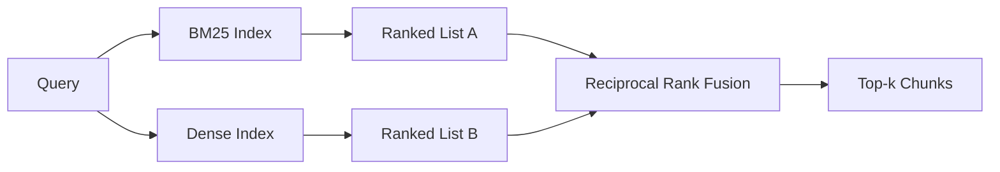

<!-- i18n:manual -->
# Гибридный поиск на BM25 и плотных эмбеддингах

> Лексический и семантический поиск проваливаются на противоположных классах запросов. Гибридный поиск с reciprocal rank fusion не интерполирует, а голосует — и голосование выигрывает на любом классе запросов.

**Type:** Build
**Languages:** Python
**Prerequisites:** Phase 11 lessons 04 (embeddings), 06 (RAG); Phase 19 Track B foundations (lessons 20-29); Phase 19 lesson 64 (chunking strategies)
**Time:** ~90 minutes

## Learning Objectives
- Реализовать BM25 с нуля по формулировке Робертсона и Спарк Джонс — с весами по полям, нормализацией на длину документа и настраиваемыми k1 и b.
- Собрать плотный ретривер поверх детерминированного мок-эмбеддинга, чтобы цикл крутился офлайн.
- Реализовать reciprocal rank fusion ровно в том виде, в каком его опубликовали Кормак, Кларк и Бюттхер в 2009 году, и объяснить, почему он обыгрывает взвешивание по баллам.
- Подобрать константу k в RRF и веса по модальностям и прочитать компромиссы на маленьком фикстурном корпусе.

## The Problem

Лексический поиск выигрывает, когда в запросе есть буквальный идентификатор, который встречается в корпусе дословно. Запрос `AbortMultipartOnFail` возвращает нужную Go-функцию через BM25 за микросекунды. Тот же запрос в виде эмбеддинга оказывается на стыке трёх кластеров похожести, и плотный ретривер ставит на первое место не тот файл.

Плотный поиск выигрывает, когда запрос перефразирован и не совпадает с буквальными токенами корпуса. Пользователь, который спрашивает «how do we handle cancelled uploads», не написал ни слова abort, ни слова multipart. BM25 вернёт чанк документации про «uploading large files», потому что на той странице есть слово uploads. Плотный поиск найдёт функцию abort, в описании которой упомянута отмена.

Выбор между этими двумя вариантами не делается раз и навсегда. Переменная здесь — распределение запросов. Продакшен-RAG обслуживает оба класса из одной точки входа, значит и поиск должен тянуть оба одновременно. Это и есть гибридный поиск. Правильно сделать нужно именно шаг слияния.

> 🎒 **На пальцах.** Два примера выше — зеркальные провалы. `AbortMultipartOnFail` буквально есть в коде, но у эмбеддинга нет для него смысла: модель видит бессмысленную склейку слов. «Cancelled uploads» имеет ясный смысл, но в документе нет ни одного из этих слов. Один поиск умеет читать буквы, второй умеет читать смысл, и любой отдельно взятый обязательно провалит половину ваших пользователей.

## The Concept



### BM25 in one paragraph

BM25 оценивает пару «запрос-документ», суммируя по терминам запроса произведение фактора обратной документной частоты на насыщающийся фактор частоты термина, в который зашита поправка на длину документа. Две ручки. `k1` управляет насыщением по частоте термина; значение по умолчанию 1.5 — это опубликованная рекомендация, и без бенчмарка его лучше не трогать. `b` управляет тем, насколько важна длина документа; значение по умолчанию 0.75 означает, что длинные документы штрафуются, но не линейно.

Формула IDF использует сглаженное определение Робертсона и Спарк Джонс: `log((N - df + 0.5) / (df + 0.5) + 1)`. Единица внутри логарифма удерживает IDF положительным, когда термин встречается более чем в половине корпуса. Это важно на маленьких корпусах, где стоп-слова формально оказываются редкими.

Веса по полям позволяют объяснить BM25, что совпадение по имени символа значит больше, чем совпадение в теле текста. Реализуется это множителем на счётчики терминов во время индексации, а не во время оценки. Так математика остаётся прежней и не приходится считать отдельный балл на каждое поле.

> 🎒 **На пальцах.** Подставьте числа в формулу IDF при корпусе из 1000 документов. Термин в 900 документах: log((1000-900+0.5)/(900.5)+1) ≈ log(1.11) ≈ 0.11. Термин в 5 документах: log(995.5/5.5+1) ≈ log(182) ≈ 5.2. Редкое слово весит почти в 50 раз больше частого — поэтому `AbortMultipartOnFail` вытягивает нужный файл в одиночку, а слово «the» не влияет ни на что.

> 🎒 **На пальцах.** Трюк с весами по полям проще, чем кажется. Хотите, чтобы имя символа считалось втрое важнее — при индексации запишите его токены три раза, как будто они и правда встретились трижды. Формула не меняется ни на символ, а BM25 сам поднимет документ выше. Одна строка в индексаторе вместо отдельной ветки в скоринге.

### Dense retrieval in one paragraph

Кодируем каждый чанк в вектор фиксированной размерности embedding-моделью. В момент запроса кодируем запрос, ранжируем все чанки по косинусной похожести и возвращаем top-k. Качество определяет модель. Сам алгоритм поиска — две строки: скалярное произведение и сортировка.

В этом уроке используется детерминированный эмбеддинг на хешах, чтобы можно было разобрать математику слияния без единого сетевого вызова. Хеш складывает офсеты, привязанные к токенам, в 96-мерный вектор и нормализует его. Косинусные ранги воспроизводятся от прогона к прогону — именно это и требуется набору тестов.

> 🎒 **На пальцах.** Обратите внимание на асимметрию цены: BM25 нужен словарь частот терминов, плотному поиску — 96 чисел на каждый чанк. На корпусе из 100 000 чанков это 9,6 миллиона чисел, около 38 МБ во float32. У настоящих моделей размерность 768 или 1536, то есть в 8-16 раз больше — вот почему в продакшене векторы уезжают в отдельное хранилище с HNSW.

### Reciprocal rank fusion, the published formula

Два ранжированных списка. Для каждого кандидата, который встретился хотя бы в одном списке, суммируем его вклады вида «единица делить на ранг». В статье 2009 года использовалась формула `1 / (k + rank)` с k, равным 60, по умолчанию. Сортируем по суммарному баллу. Вот и весь алгоритм.

Опубликованная константа k = 60 взята не с потолка. При k = 60 вклад первого места равен 1/61, а вклад десятого — 1/70. Вклад убывает медленно, поэтому голосуют даже кандидаты из глубины списка. Меньшее k даёт верхушке задавить остальных. Большее k делает кривую вкладов плоской.

В нашей реализации две настраиваемые ручки. Константа `k`. И пара весов по модальностям — на случай, когда у вас есть основания заранее считать, что на вашем корпусе одна из них лучше другой. Умножение вклада ранга на вес — самая простая принципиальная реализация: она сохраняет форму убывания по рангу и остаётся независимой от шкал.

> 🎒 **На пальцах.** Посчитайте разницу между первым и десятым местом: 1/61 = 0.0164 против 1/70 = 0.0143. Всего на 13 процентов меньше — то есть десятый кандидат почти так же весом, как первый. Если бы k было равно 1, то было бы 1/2 = 0.5 против 1/11 = 0.09, разница в пять с половиной раз. Константа 60 — это ручка «насколько мы доверяем верхушке каждого списка».

### Why fusion beats score-weighted interpolation

Баллы BM25 ничем не ограничены сверху и зависят от корпуса. Косинусные похожести лежат в диапазоне от -1 до 1. Линейная комбинация `alpha * bm25 + (1 - alpha) * cosine` требует подбора alpha под каждый корпус и ломается при каждой переиндексации. Слияние по рангам — нет. Два ранга сопоставимы между модальностями. Опубликованная база RRF обыгрывает интерполяцию по баллам во всех публичных треках TREC начиная с 2010 года.

Это тот же аргумент, который вы слышите про RankFusion против RRF в документации Vespa и Weaviate. Они пришли к тому же выводу: оставайтесь на рангах, пока у вас нет очень веских оснований интерполировать баллы.

```figure
rrf-fusion
```

> 🎒 **На пальцах.** Представьте, что один судья ставит баллы от 0 до 3.7, а другой от -1 до 1. Складывать такие баллы бессмысленно — шкалы разные. А вот «первое место» и «третье место» у обоих судей значат одно и то же. RRF работает именно с местами, поэтому его не надо перенастраивать, когда вы переиндексировали корпус и все баллы BM25 разъехались.

## Build It

`code/main.py` реализует:

- `tokenize(text)` — быстрый токенизатор на регулярках.
- `BM25Index` — с весами по полям, методами `add` и `search` и настраиваемыми k1, b.
- `mock_embed`, `DenseIndex` — тот же детерминированный эмбеддинг, что в уроке 64, чтобы чанки были сопоставимы.
- `rrf(rankings, k, weights)` — опубликованное слияние с весами по модальностям.
- `HybridRetriever` — объединяет BM25 и плотный поиск.
- Демонстрационный `main()`, который грузит маленький фикстурный корпус, гоняет три запроса, бьющих по сильным и слабым сторонам каждого ретривера, и печатает ранжирование от каждой модальности плюс слитый список.

Запускаем:

```bash
python3 code/main.py
```

Читайте вывод демо в две колонки. Запрос с буквальным идентификатором даёт ранг 1 в BM25, ранг 4 в плотном поиске и ранг 1 после RRF. Перефразированный запрос даёт ранг 6 в BM25, ранг 1 в плотном поиске и ранг 1 после RRF. Неоднозначный запрос даёт ранг 3 и ранг 3, а после RRF — ранг 1. Слияние здесь не разрешает ничью, а выигрывает на всех классах запросов.

> 🎒 **На пальцах.** Третья строка самая красноречивая. Неоднозначный запрос: ранг 3 у BM25, ранг 3 у плотного, а после слияния ранг 1. Документ ни в одном из списков не был первым, но был устойчиво третьим в обоих — и обошёл тех, кто был первым в одном списке и никаким в другом. Точно так же в многоборье два стабильных третьих места бьют одну победу и один провал.

## Tuning the knobs

| Knob | Default | Move it up when | Move it down when |
|------|---------|----------------|------------------|
| BM25 k1 | 1.5 | Термины повторяются внутри документов, и вы хотите, чтобы частота значила больше | Документы короткие, и повтор термина — это шум |
| BM25 b | 0.75 | Длинные документы и правда несут меньше смысла на слово | Длина документа не связана с темой |
| RRF k | 60 | Кандидаты из глубины списка должны продолжать голосовать | Первое место должно доминировать |
| BM25 weight | 1.0 | В вашем корпусе есть буквальные идентификаторы, и запросы им соответствуют | Запросы пользователи формулируют своими словами |
| Dense weight | 1.0 | Запросы перефразированы | Запросы буквальные |

Настраивайте, перезапуская стенд для оценки из урока 68 на отложенном наборе запросов, а не по интуиции.

> 🎒 **На пальцах.** Пять ручек в таблице — это 5 измерений, и перебирать их вслепую бессмысленно. Разумный порядок такой: k1 и b не трогать вообще (у них опубликованные значения), RRF k проверить на сетке 10/30/60/100, а веса модальностей менять только тогда, когда оценка показала перекос. Три четверти выигрыша даёт правильная нарезка из урока 64, а не подкрутка этих чисел.

## Failure modes the demo will hide

**Out-of-vocabulary tokens.** IDF в BM25 считается по корпусу, поэтому термины, которые есть только в запросе, дают нулевой вклад. Плотные эмбеддинги для того же термина галлюцинируют какой-то вектор. На идентификаторах, которых в корпусе нет, плотная модальность возвращает правдоподобно выглядящих, но неправильных соседей. Слияние это гасит, потому что BM25 не возвращает ничего и вклад ранга выпадает, — но только если вы дедуплицируете по документу, а не по чанку.

> 🎒 **На пальцах.** Пользователь спросил про `RetryBudgetV3`, а в корпусе есть только `RetryBudgetV2`. BM25 честно молчит: такого токена нет. А плотный поиск обязан вернуть хоть что-то и уверенно выдаёт пять соседей про ретраи — ни один из них не про V3. Молчание BM25 здесь полезный сигнал, и слияние его сохраняет.

**Stop-token domination.** BM25 по слову «the» выдаёт равномерное ранжирование по всему корпусу. Фильтруйте стоп-токены в индексаторе или примите, что термины с высоким IDF доминируют естественным образом.

**Identical content across modalities.** Если ваш корпус настолько мал, что первое место у BM25 совпадает с первым местом у плотного поиска, RRF выдаст тот же top-1 и тех же соседей. Это правильное поведение, а не поломка, но слияние в таком случае выглядит бесполезным. Добавьте в оценку пару состязательных запросов, чтобы убедиться, что слияние вообще работает.

> 🎒 **На пальцах.** Это классическая ловушка демо на десяти документах: обе модальности дают один и тот же ответ, вы делаете вывод «слияние ничего не даёт» и выкидываете его. Состязательная пара запросов — это ровно два запроса из The Problem: один с буквальным идентификатором, один перефразированный. Если на них ранги расходятся, слияние живо.

## Use It

Продакшен-паттерны:

- Держите BM25 в процессе приложения; узкое место — словарь частот терминов, а не векторы.
- Держите плотные векторы в отдельном хранилище (в этом уроке у нас плоский список, в продакшене был бы HNSW).
- Запускайте оба запроса параллельно; слияние — это слияние по объединению за константное время.
- Сохраняйте модальность каждого найденного попадания, чтобы реранкер дальше по потоку видел, какая модальность за него проголосовала.

> 🎒 **На пальцах.** Третий пункт про параллельность даёт бесплатную скорость. Если BM25 отвечает за 5 мс, а плотный поиск за 20 мс, то последовательно это 25 мс, а параллельно — 20 мс плюс микросекунды на слияние. Гибридный поиск стоит ровно столько же, сколько самая медленная из двух его половин.

## Ship It

Урок 66 берёт слитый top-k из этого урока и переранжирует его cross-encoder. Урок 68 оценивает весь пайплайн по precision, recall, MRR и nDCG. Гибридный ретривер из этого урока — первая стадия сквозной системы из урока 69.

## Exercises

1. Замените `mock_embed` на настоящую модель от вашего провайдера. Перезапустите демо и отчитайтесь, как изменилось чисто плотное ранжирование на перефразированном запросе.
2. Добавьте третью модальность: описания чанков, проиндексированные отдельно и слитые как третий ранжированный список. Померьте прирост.
3. Пройдитесь по RRF k со значениями 10, 30, 60, 100, 200. Постройте кривую recall@k из урока 68. Отчитайтесь, при каком k кривая на вашем корпусе достигает максимума.
4. Реализуйте BM25F честно (нормализация длины по каждому полю вместо трюка с множителем) и сравните на корпусе, где совпадения по именам символов важнее всего.

> 🎒 **На пальцах.** В третьем задании вас ждёт спокойная кривая, а не резкий пик. Между k = 30 и k = 100 recall обычно меняется на единицы процентов, потому что вклады отличаются на 1/31 против 1/101 только у первых мест, а порядок в целом почти тот же. Это хорошая новость: RRF устойчив, и ошибиться с k на пару десятков не страшно.

## Key Terms

| Term | What people say | What it actually means |
|------|-----------------|------------------------|
| BM25 | «Лексический поиск» | Вероятностное ранжирование: idf × насыщающийся tf × нормализация на длину |
| RRF | «Слияние рангов» | Сумма 1 / (k + ранг) по всем ранжированным спискам; k = 60 по умолчанию |
| k1 | «Насыщение по TF» | Управляет тем, как быстро повтор термина перестаёт добавлять балл |
| b | «Штраф за длину» | 0 — игнорировать длину документа, 1 — полная нормализация |
| Field weighting | «Буст по символам» | Повторить токены при индексации, чтобы поднять совпадения в этом поле |
| Rank-based vs score-based fusion | «Почему RRF бьёт линейное» | Ранги сопоставимы между модальностями, баллы — нет |

## Further Reading

- Cormack, Clarke, Buettcher, "Reciprocal Rank Fusion outperforms Condorcet and individual rank learning methods", SIGIR 2009 — исходная статья про RRF, где формулу опубликовали вместе с константой k = 60
- Robertson, Walker, Beaulieu, Gatford, Payne, "Okapi at TREC-3" (исходная статья про BM25)
- [Vespa: Hybrid Retrieval with BM25 and Embeddings](https://docs.vespa.ai/en/tutorials/hybrid-search.html)
- [Weaviate: Hybrid Search](https://weaviate.io/developers/weaviate/search/hybrid)
- Phase 11 lesson 06 — основы RAG
- Phase 19 lesson 64 — чанкеры, чей вывод здесь индексируется
- Phase 19 lesson 66 — cross-encoder-реранкер, который потребляет слитый top-k
