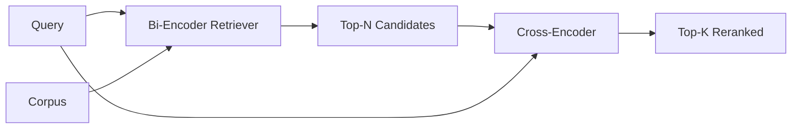

<!-- i18n:manual -->
# Реранкер на cross-encoder

> Bi-encoder кодирует запрос и документ по отдельности. Cross-encoder склеивает их и читает оба сразу. Cross-encoder — самый умный читатель и самый медленный. Поставленный второй стадией поверх top-k от bi-encoder, он окупает себя.

**Type:** Build
**Languages:** Python
**Prerequisites:** Phase 11 lesson 06 (RAG), Phase 11 lesson 07 (advanced RAG); Phase 19 Track B foundations (lessons 20-29); Phase 19 lesson 65 (hybrid retrieval feeding this stage)
**Time:** ~90 minutes

## Learning Objectives
- Отличать bi-encoder-ретривер от cross-encoder-реранкера по форме входа, количеству параметров и цене на один запрос.
- Реализовать маленький cross-encoder с нуля — как трансформерный блок, который принимает упакованную последовательность «запрос плюс документ» и выдаёт один скаляр релевантности.
- Собрать двухстадийный пайплайн retrieve-then-rerank: достать top-N дешёвым ретривером, переранжировать N в top-K через cross-encoder, вернуть K.
- Померить компромисс между задержкой и качеством на маленьком фикстурном корпусе и выбрать правильное N под заданный бюджет задержки.

## The Problem

Bi-encoder отображает запрос и документ в одно векторное пространство и ранжирует по косинусу. Две кодировки никогда не видят друг друга. Модель обязана упаковать всё полезное про документ в один вектор, ничего не зная о запросе. Это быстро — один эмбеддинг на документ при индексации и один на запрос в момент поиска — и это единственный способ ранжировать в масштабе корпуса.

Цена — точность. Два документа на одну общую тему могут иметь почти одинаковые эмбеддинги, даже если один отвечает на запрос, а второй нет. Bi-encoder их не различает.

Cross-encoder решает это тем, что читает запрос и документ вместе. Модель получает `[query] [SEP] [document]` как одну последовательность, гоняет полное внимание через стык и выдаёт один скаляр релевантности. Каждый токен документа может смотреть на каждый токен запроса. Балл модель ставит, видя полный контекст.

Цена — пропускная способность. Bi-encoder кодирует один раз и потом отвечает вечно, а cross-encoder запускается на каждую пару «запрос-документ». На корпусе в 10 миллионов документов это 10 миллионов прямых проходов на один запрос. В бюджет запроса такое не влезает.

Решение — стадийность. Bi-encoder достаёт top-N. Cross-encoder переранжирует эти N в top-K. N маленькое (от 50 до 200), и прирост качества от cross-encoder сконцентрирован там, где он важен. Суммарная задержка остаётся в бюджете запроса. Суммарное качество равно качеству cross-encoder, ограниченному сверху полнотой bi-encoder на N.

> 🎒 **На пальцах.** Посчитайте разницу: 10 миллионов прямых проходов против 50. Это в 200 000 раз меньше работы за один запрос. Как отбор в вуз: тесты проходят все десять миллионов, а на личное собеседование с профессором приглашают полсотни. Профессор судит куда точнее теста, но поговорить с каждым из десяти миллионов он физически не может.

> 🎒 **На пальцах.** Последняя фраза — самая важная и её легко проглядеть. Cross-encoder умеет только переставлять то, что ему принесли. Если правильный документ у bi-encoder оказался на 300-м месте, а N равно 50, реранкер его никогда не увидит и качество упрётся в потолок. Верхняя граница всей системы — это recall@N первой стадии, а не ум второй.

## The Concept



### The cross-encoder's input shape

Стандартная упаковка — `[CLS] query_tokens [SEP] document_tokens [SEP]`. Выход с позиции CLS подаётся в одну линейную голову, которая выдаёт скаляр релевантности. Некоторые реализации вместо CLS используют усреднение по токенам; разница небольшая. Суть в том, что модель выдаёт одно число на пару.

Cross-encoder на 22 миллиона параметров (весовой класс опубликованного `ms-marco-MiniLM-L-6-v2`) — типичная рабочая точка для продакшена. Модели поменьше теряют качество быстрее, чем экономят задержку. Модели побольше (например, `bge-reranker-v2-m3` на 568 миллионов параметров) держат для офлайн-переранжирования или для переранжирования первой страницы, где K маленькое.

> 🎒 **На пальцах.** Разница между 22 миллионами и 568 миллионами параметров — это примерно в 26 раз больше вычислений на каждую пару. При N = 50 первая модель уложится в десятки миллисекунд, вторая — в сотни, и p95 вашего эндпоинта уедет за секунду. Отсюда правило: 22M в онлайне, 568M ночью на пересчёт индекса или на K = 10.

> 🎒 **На пальцах.** Токен `[SEP]` — это просто разделитель, чтобы модель понимала, где кончился вопрос и начался документ. Без него последовательность «где порог бюджета порог бюджета равен 0.85» слиплась бы в кашу. А `[CLS]` — служебная позиция в начале, чья единственная работа: собрать на себя итог всего чтения и отдать одно число.

### Why this lesson trains a tiny one

Настоящий cross-encoder — это дообученный энкодер-трансформер. В продакшене вы загружаете чекпоинт и запускаете его. В этом уроке цель другая: показать вам форму модели и форму кривой «задержка против качества», а не обучить ранжировщик мирового уровня. Поэтому мы собираем маленький `nn.Module` с одним трансформерным блоком, multi-head-вниманием (по умолчанию 4 головы) и одной регрессионной головой. Инициализируется он детерминированно из зерна, так что демо воспроизводится без весов на диске.

Игрушечная модель учит на фикстурном корпусе правильную форму: у релевантных пар «запрос-документ» предсказанные баллы выше, чем у нерелевантных. Сквозной пайплайн переранжирует вывод bi-encoder, и top-k после переранжирования коррелирует с эталонной разметкой.

> 🎒 **На пальцах.** Обратите внимание, что модель тут не обязана быть хорошей — она обязана быть правильной по форме. Достаточно, чтобы релевантная пара получала, скажем, 0.8, а нерелевантная 0.2. Ровно этого хватит, чтобы увидеть, как перестановка сработала. Настоящее качество приезжает вместе с чекпоинтом на 22 миллиона параметров, обученным на миллионах размеченных пар.

### Latency vs quality

У двухстадийного пайплайна одна настраиваемая ручка: N. Пройдитесь по N от 5 до 100 на отложенном наборе запросов, и вы получите кривую.

| N | Recall@1 of stage 2 | Cross-encoder forward passes per query | Latency |
|---|--------------------|---------------------------------------|---------|
| 5 | 0.62 | 5 | низкая |
| 20 | 0.81 | 20 | средняя |
| 50 | 0.86 | 50 | высокая |
| 100 | 0.86 | 100 | очень высокая |

Числа выше иллюстрируют форму кривой, а не являются замерами на этой фикстуре. Форма настоящая. Где-то в районе 20-50 кандидатов всегда есть излом, на котором прирост от переранжирования насыщается. За изломом вы платите ни за что.

Выбирайте N по кривой оценки плюс бюджету задержки. Cross-encoder не может поднять полноту выше, чем полнота bi-encoder на N, поэтому маленькое N ограничивает не только задержку, но и качество.

```figure
rerank-funnel
```

> 🎒 **На пальцах.** Смотрите на две последние строки таблицы: при N = 50 recall@1 равен 0.86, при N = 100 — те же 0.86. Вы удвоили количество прямых проходов и не получили ничего. А вот переход с 5 на 20 дал скачок с 0.62 до 0.81, то есть 19 верных ответов из ста за четыре лишних прохода. Излом между 20 и 50 — это и есть точка, где надо остановиться.

## Build It

`code/main.py` реализует:

- `CrossEncoder` — маленький `torch.nn.Module`: эмбеддинг токенов, один трансформерный блок с multi-head-вниманием и feedforward, голова с усреднением по токенам, выдающая один скаляр.
- `tokenize_pair(query, document)` — упаковывает две строки в одну последовательность идентификаторов с type ids, размечающими границу; детерминированно и на одной стандартной библиотеке.
- `train_tiny(pairs)` — один проход обучения с учителем по размеченному вручную списку троек (запрос, документ, релевантность), чтобы модель выдавала осмысленные баллы на фикстуре.
- `rerank(query, candidates, top_k)` — продакшен-интерфейс.
- `pipeline(query, retriever, top_n, top_k)` — двухстадийный поток.
- Демонстрационный `main()`, который грузит корпус по шаблону из урока 65, достаёт top-N, переранжирует в top-K, печатает оба списка рядом и сообщает задержку каждой стадии.

Запускаем:

```bash
python3 code/main.py
```

Вывод показывает top-N от bi-encoder, top-K от cross-encoder и сводку по таймингам. Cross-encoder тратит на вызов больше времени, но не гоняется по всему корпусу. Суммарно две стадии остаются в бюджете запроса и при этом вытаскивают наверх тот ответ, который bi-encoder поставил на второе или третье место.

> 🎒 **На пальцах.** Обратите внимание на `type ids` в `tokenize_pair`. Это второй ряд чисел параллельно токенам: нули там, где запрос, единицы там, где документ. Модель складывает их с эмбеддингами токенов и благодаря этому знает про каждое слово, из чьей оно половины. Одно и то же слово «порог» в вопросе и в документе для неё после этого разные вещи.

## Failure modes the demo will hide

**Cross-encoder is not symmetric.** `rerank(q, d)` и `rerank(d, q)` дают разные баллы. Всегда подавайте запрос первым. Перепутаете местами — полнота обвалится.

> 🎒 **На пальцах.** Асимметрия — прямое следствие type ids из абзаца выше: поменяв аргументы местами, вы объявили документ вопросом, а вопрос документом. Модель обучалась только на одном порядке и на перевёрнутом входе выдаёт мусор. Ошибка тихая: программа не падает, просто качество проседает, и вы неделю ищете причину в другом месте.

**N is too low to expose the bug.** Если вы поставили N = K, cross-encoder не может ничего переставить — он может только пересчитать веса. Прирост выглядит нулевым. Берите N минимум втрое больше K.

> 🎒 **На пальцах.** Считайте: если K = 5 и N = 5, реранкер получает ровно те пять документов, которые и так уйдут в ответ. Порядок внутри пятёрки поменяется, состав — нет. При N = 15 у него уже есть из чего выбирать: он может вытащить наверх кандидата с 12-го места, который bi-encoder недооценил. Отсюда правило «N хотя бы 3K».

**Training data leaks into the eval.** Если размеченные вручную обучающие пары включают запросы из оценочного набора, переранжирование выглядит волшебным. Строго разделяйте обучение и оценку, даже на фикстуре.

**Production weights are dense.** Cross-encoder на 22 миллиона параметров занимает 88 МБ во float32. Планируйте память сервера моделей до того, как пообещаете p95 меньше 100 мс.

> 🎒 **На пальцах.** 22 миллиона параметров × 4 байта на float32 = 88 МБ — вот откуда это число. В float16 будет 44 МБ. Умножьте на количество воркеров: восемь процессов на одной машине это уже 704 МБ только под веса, не считая активаций на батч из 50 пар. Память кончается раньше, чем вы упираетесь в задержку.

**Batching matters.** Настоящий cross-encoder прогоняет N кандидатов одним батчем. В этом уроке это делает `_batch_encode`: он строит батчевые тензоры идентификаторов и type ids через `torch.tensor(...)` и выполняет один прямой проход. Пропустите батчинг — и задержка умножится на N.

> 🎒 **На пальцах.** Разница между батчингом и его отсутствием измеряется десятками раз. Пятьдесят отдельных вызовов — это пятьдесят раз накладные расходы на запуск ядра GPU, каждый из которых тяжелее самого умножения матриц для такой маленькой модели. Один батч из 50 — одна загрузка весов и одно умножение матриц побольше. Железо любит широкие задачи, а не частые.

## Use It

Продакшен-паттерны:

- Фиксируйте bi-encoder, cross-encoder и N вместе. Смена любого из трёх обесценивает оценку.
- Кешируйте вывод реранкера по хешу (запрос, идентификатор документа). Один и тот же запрос на стабильном корпусе переранжируется в тот же порядок; попадания в кеш дают бесплатное сокращение задержки.
- Логируйте балл cross-encoder у первого места. Запрос, у которого top-1-балл ниже порога, специфичного для вашего корпуса, — это попадание вне домена; сообщите об этом LLM как «я не уверен».

> 🎒 **На пальцах.** Третий пункт даёт вам бесплатный детектор чуши. Реранкер и так посчитал число для лучшего кандидата — просто запишите его. Если на нормальных запросах top-1-балл обычно 0.7-0.9, а тут пришло 0.15, значит в корпусе ответа нет. Лучше сказать «не знаю», чем уверенно пересказать самый похожий из непохожих документов.

## Ship It

Урок 68 оценивает этот двухстадийный пайплайн от начала до конца. Урок 69 ставит этот реранкер за гибридным ретривером из урока 65 и перед генератором ответа. Реранкер — вторая стадия сквозной системы.

## Exercises

1. Пройдитесь по N от 5 до 50 и постройте график recall@1 для переранжированного вывода. Найдите излом на этой фикстуре.
2. Обучите cross-encoder на десяти эпохах вместо одной. Померьте разрыв в баллах между положительными и отрицательными парами на каждой эпохе.
3. Замените усреднение по токенам на голову с CLS-токеном. Сравните сходимость на этой фикстуре.
4. Добавьте вторую голову cross-encoder, которая предсказывает бинарную метку «есть ли ответ в этом документе». Используйте обе головы на инференсе: одну для ранжирования, вторую для порога.
5. Замените детерминированный мок-bi-encoder на тот, что из урока 65, и соедините две стадии. Померьте изменение top-K относительно одного только bi-encoder.

> 🎒 **На пальцах.** Второе задание показывает обучение изнутри. На первой эпохе разрыв между положительной и отрицательной парой может быть 0.05 — модель почти не различает их. К десятой он вырастает, скажем, до 0.4. Именно этот разрыв, а не абсолютные баллы, определяет, переставит ли реранкер что-нибудь: если все пары получают 0.5 ± 0.01, порядок задаёт шум.

## Key Terms

| Term | What people say | What it actually means |
|------|-----------------|------------------------|
| Bi-encoder | «Векторный ретривер» | Кодирует запрос и документ независимо; ранжирует их косинусом |
| Cross-encoder | «Реранкер» | Кодирует пару (запрос, документ) совместно; выдаёт один скаляр релевантности |
| Two-stage pipeline | «Достать и переранжировать» | Дешёвый ретривер возвращает N, дорогой реранкер оставляет K |
| N (candidate budget) | «Пул для переранжирования» | Сколько кандидатов cross-encoder оценивает на один запрос |
| Mean-pooling head | «Среднее по последнему слою» | Усреднить выходы последнего слоя энкодера в один вектор |

## Further Reading

- Nogueira, Cho, "Passage Re-ranking with BERT", 2019 — каноническая статья про ранжировщик на cross-encoder
- Reimers, Gurevych, "Sentence-BERT: Sentence Embeddings using Siamese BERT-Networks", 2019 — про bi-encoder против cross-encoder
- [SentenceTransformers Cross-Encoders documentation](https://www.sbert.net/examples/applications/cross-encoder/README.html)
- [BGE Reranker v2 model card](https://huggingface.co/BAAI/bge-reranker-v2-m3)
- Phase 19 lesson 65 — гибридный ретривер, который кормит эту стадию переранжирования
- Phase 19 lesson 68 — оценка, которая меряет прирост от этого переранжирования
