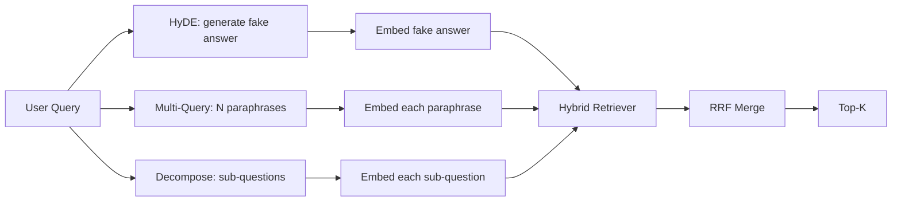

<!-- i18n:manual -->
# Переписывание запроса: HyDE, Multi-Query и декомпозиция

> Запрос, который набирает пользователь, — не тот запрос, который нужен вашему ретриверу. Переписывание закрывает этот разрыв до поиска, чтобы индекс увидел текст, похожий на сам ответ.

**Type:** Build
**Languages:** Python
**Prerequisites:** Phase 11 lessons 04 (embeddings), 06 (RAG); Phase 19 Track B foundations (lessons 20-29); Phase 19 lessons 64 and 65
**Time:** ~90 minutes

## Learning Objectives
- Реализовать Hypothetical Document Embeddings (HyDE): сгенерировать фальшивый ответ, закодировать его и искать по этому вектору вместо вектора запроса.
- Реализовать multi-query-расширение: переписать один запрос в N перефразировок, поискать по каждой, слить объединение через reciprocal rank fusion.
- Реализовать декомпозицию запроса: разбить сложный вопрос на подвопросы, поискать по каждому, слить результаты.
- Сравнить три переписывателя лоб в лоб на одной фикстуре и объяснить, когда какая стратегия выигрывает.
- Подключить мок-LLM, который выдаёт детерминированные ответы под фикстуру, чтобы цикл переписывания работал офлайн.

## The Problem

Пользователь набирает «what does our team do when uploads fail and the budget is gone?». В корпусе лежит документ со словами «AbortMultipartOnFail aborts an in-flight S3 multipart upload and decrements the per-bucket retry budget when the upload fails». У запроса и документа нет ни одной общей именной группы. BM25 промахивается. Bi-encoder ставит документ на третье-четвёртое место, потому что вектор запроса попадает в область пространства эмбеддингов, где ближе документ про отменённые задачи, а не про прерванные загрузки. Двухстадийное переранжирование из урока 66 ещё может спасти ответ, если тот попал в top-N. Но если он до top-N вообще не дошёл, реранкер его никогда не увидит.

Лечится это переписыванием запроса до того, как он дойдёт до ретривера. Статья 2023 года «Precise Zero-Shot Dense Retrieval without Relevance Labels» (Gao et al.) ввела HyDE: попросить LLM написать документ, который отвечал бы на запрос, закодировать этот гипотетический документ и использовать его эмбеддинг как вектор поиска. Гипотетический документ попадает в нужную область пространства эмбеддингов, потому что написан голосом корпуса. Вектор запроса — нет.

> 🎒 **На пальцах.** Посчитайте общие слова: в запросе «uploads fail», «budget is gone», в документе — «AbortMultipartOnFail», «multipart upload», «per-bucket retry budget». Пересечение почти нулевое, поэтому BM25 даёт ноль, а вектор уезжает к соседнему документу про отменённые задачи. Это как искать в магазине «штуку, чтобы открывать банки», когда на ценнике написано «консервный нож».

Рядом с HyDE живут две родственные техники. Multi-query-расширение (термин из GraphRAG от Microsoft) генерирует N перефразировок запроса, ищет по каждой и сливает результаты. Декомпозиция (её популяризовали как «subquery decomposition» в работе по DSPy из Стэнфорда, 2024) разбивает «what does our team do when uploads fail and the budget is gone» на два вопроса: «what happens when an upload fails» и «what happens when the retry budget is gone». Два поиска, один слитый результат, обе половины ответа достижимы.

В этом уроке мы реализуем все три и прогоняем их по одному и тому же корпусу-фикстуре.

> 🎒 **На пальцах.** Обратите внимание на арифметику декомпозиции: один вопрос с союзом «and» превращается в два независимых. Ни один документ не отвечает на оба сразу, поэтому одним поиском их не достать в принципе. Это как список покупок: «купи молоко и почини кран» — два разных дела, и идти за ними надо в два разных места.

## The Concept



> 🎒 **На пальцах.** Прочитайте схему как развилку: запрос уходит по трём веткам, каждая ветка что-то генерирует, потом всё кодируется, ищется и сливается в один top-K. Важно, что ретривер внизу один и тот же — меняется только то, что ему подают на вход. Так что добавить новую стратегию переписывания стоит одной функции, а не новой поисковой системы.

### HyDE in detail

HyDE подменяет вектор пользовательского запроса вектором гипотетического документа, написанного LLM. Промпт короткий:

```
You are a domain expert. Write a one-paragraph passage that answers the question
below. Use the same vocabulary and phrasing the documentation in this domain would
use. Do not refuse. Do not say you do not know.

Question: {user_query}

Passage:
```

Ответ LLM неверен как фактический ответ, потому что LLM не знает вашего корпуса. И это нормально. Ретриверу нет дела до фактической правильности, ему важно только распределение токенов. В гипотетическом абзаце есть слова «abort», «multipart», «bucket», «budget» — потому что именно так выглядел бы документационный текст на эту тему. Кодируем этот абзац. Вектор приземляется рядом с настоящим абзацем.

> 🎒 **На пальцах.** Ключевая мысль: правильный по фактам ответ нам не нужен, нужен правильный набор слов. Модель может выдумать имя функции и цифры, но слова «abort», «multipart», «bucket», «budget» она напишет — и этих четырёх токенов хватит, чтобы BM25 нашёл нужный документ. Это как искать книгу по обложке, нарисованной по памяти: нарисовано криво, но цвет и формат совпадают.

В проде гипотетический документ ограничивают двумя-тремя предложениями. Более длинные набирают больше шума. Более короткие теряют тот самый лексический сигнал, ради которого HyDE и затевался.

> 🎒 **На пальцах.** Два-три предложения — это примерно 40-60 слов, из которых 5-10 будут терминами предметной области. Растянете до десяти предложений — терминов станет 15, а «воды» 150, и доля полезного сигнала в векторе упадёт втрое. Ужмёте до одного предложения — терминов останется два, и вы вернулись к исходной проблеме.

### Multi-query expansion in detail

Генерируем N перефразировок запроса пользователя. Простейший промпт:

```
Rewrite the following question in {N} different ways. Each rewrite must preserve
the original intent. Number them 1 to {N}. Do not add explanations.
```

Ищем top-k по каждой перефразировке. Сливаем N ранжированных списков через RRF (тот же алгоритм, что в уроке 65). Дёшево, параллельно, детерминированно.

> 🎒 **На пальцах.** При N = 3 и top-k = 10 вы получаете 30 результатов, из которых уникальных обычно 12-18: списки сильно пересекаются. RRF складывает позиции, поэтому документ, попавший в top-3 сразу у двух перефразировок, обгоняет документ, который был первым только у одной. Это как спросить дорогу у трёх прохожих: доверяешь тому направлению, которое назвали двое.

Multi-query выигрывает, когда формулировка пользователя — лишь одна из многих равно допустимых, и любая из перефразировок спросила бы лучше. Проигрывает, когда все перефразировки одинаково плохи, потому что оригинал был плох ровно тем же образом.

> 🎒 **На пальцах.** Перефразировки не добавляют знания, они добавляют формулировки. Если пользователь спросил «почему оно не работает» без единого термина, три перефразировки будут такими же беспредметными: «почему это ломается», «в чём причина сбоя», «что не так». Три пустых запроса вместо одного — три раза ноль.

### Decomposition in detail

Один поиск не закрывает многогранный вопрос. Декомпозиция просит LLM разбить вопрос на подвопросы, а система ищет по каждому подвопросу отдельно. Промпт:

```
The following question may require information from multiple distinct topics.
Decompose it into a list of sub-questions. Each sub-question must be answerable
independently. If the question is already atomic, return it unchanged.

Question: {user_query}
```

Ищем по каждому подвопросу. Сливаем. Декомпозиция — правильный инструмент для вопросов с союзами, многочастными сравнениями и двумя не связанными между собой темами. Неправильный — для атомарных вопросов; там задача декомпозера вернуть единственный вопрос и не выдумывать фальшивых подвопросов.

> 🎒 **На пальцах.** Признак, по которому стоит включать декомпозицию, виден невооружённым глазом: союз «и», сравнение «чем», две разные сущности в одном предложении. «Сколько стоит план Pro и как его отменить» — два поиска. «Сколько стоит план Pro» — один. Декомпозер, разбивший второй вопрос на три, только испортит выдачу.

### Why all three exist

Три техники дополняют друг друга. HyDE закрывает разрыв между словами запроса и словами корпуса. Multi-query покрывает разброс формулировок. Декомпозиция покрывает многотемные запросы. Продакшен-система запускает все три и выбирает стратегию под каждый запрос (селектор показан в сквозной системе из урока 69).

> 🎒 **На пальцах.** Три техники чинят три разные поломки, и путать их дорого. Разрыв в словаре — HyDE. Неудачная формулировка — multi-query. Два вопроса в одном — декомпозиция. Если запустить multi-query на жаргонном запросе, вы получите три одинаково непонятных для корпуса запроса вместо одного.

## The Mock LLM

Урок работает офлайн. Мок-LLM — это маленькая таблица соответствий по запросу пользователя плюс запасной вариант для запросов, которых она не видела. В таблице лежат:

- Для каждого запроса из фикстуры: написанный гипотетический абзац, три перефразировки и декомпозиция.
- Для неизвестного запроса: детерминированное преобразование — взять значимые слова запроса, расширить их по словарю синонимов и вернуть результат.

Важна форма мока, а не данные в нём. В проде вы меняете мок на настоящий вызов модели. Ретривер при этом не меняется.

> 🎒 **На пальцах.** Мок здесь — как манекен на примерке: ткань и швы ненастоящие, а размеры точные. Он возвращает ровно те же три поля (гипотетический абзац, список перефразировок, список подвопросов), что и настоящая модель, поэтому код вокруг него не узнает подмены. Именно это и позволяет прогонять весь урок без интернета и без денег.

```figure
cd-hyde-vector
```

## Build It

`code/main.py` реализует:

- `MockLLM` — детерминированную замену, описанную выше.
- `HyDERewriter` — вызывает LLM, чтобы написать гипотетический документ, и возвращает результат переписывания как `RewriteResult` с текстом гипотезы и запросом, по которому должен искать ретривер.
- `MultiQueryRewriter` — вызывает LLM за N перефразировками и возвращает список запросов.
- `DecomposeRewriter` — вызывает LLM за декомпозицией и возвращает подвопросы.
- `retrieve_with_rewriter` — принимает переписыватель и ретривер, прогоняет переписывания, сливает результаты.
- Демо, которое гоняет три переписывателя по фикстуре и печатает, какая стратегия первой вернула эталонный документ с ответом.

Форма ретривера переиспользуется из урока 65 (гибрид BM25 + плотный поиск). Слияние то же самое — RRF. Единственная новая сущность — интерфейс переписывателя, и он маленький.

> 🎒 **На пальцах.** Посмотрите на список: из шести элементов пять — это переписыватели и обвязка, и ноль — новый поиск. Весь урок добавляет к пайплайну один слой перед ретривером. Это как поставить переводчика перед справочным окном: окно осталось прежним, просто в него теперь говорят на его языке.

Запускаем:

```bash
python3 code/main.py
```

На выходе — ранжирование по каждой стратегии и итоговая сводка. HyDE выигрывает на запросе с несовпадающей формулировкой. Multi-query выигрывает на запросе с разбросом перефразировок. Декомпозиция выигрывает на многотемном запросе. Запасной вариант (без переписывания) проигрывает хотя бы на одном из трёх.

## Failure modes the demo will hide

**HyDE hallucinates corpus-specific identifiers wrong.** Модель выдумывает имя функции. BM25-балл гипотезы на нужном документе обваливается, потому что выдуманное имя теперь высоковесный токен, которого в индексе нет. Ограничивайте длину гипотезы и понижайте вес BM25 при слиянии.

> 🎒 **На пальцах.** Тут срабатывает та самая логика редких слов из BM25: выдуманное `AbortUploadOnBudgetExhausted` встречается в индексе ноль раз, значит IDF у него максимальный, а совпадений — ноль. Один выдуманный идентификатор способен перевесить четыре правильных общих слова. Поэтому HyDE любят подавать в плотный поиск и придерживать в словесном.

**Multi-query rewrites all converge.** Слабая модель выдаёт три почти одинаковые перефразировки. N поисков возвращают один и тот же top-k. Слияние через RRF не лучше одиночного поиска. Добавьте в промпт явную инструкцию про разнообразие и ловите дубликаты по Жаккару.

**Decomposition over-splits.** Декомпозер превращает атомарный вопрос в список. Все поиски возвращают один и тот же документ, но с более низким рангом. Слияние получается хуже исходного. Ловите это отдельной проверкой «достаточно ли эти подвопросы различны» перед разветвлением.

**Latency multiplies.** HyDE стоит один вызов LLM. Multi-query — один вызов LLM на генерацию N переписываний плюс N поисков. Декомпозиция — один вызов LLM на разбиение плюс M поисков. Поиски идут параллельно; нижняя граница задержки — вызов LLM.

> 🎒 **На пальцах.** Сложите бюджет: поиск по индексу занимает 10-50 мс, а один вызов LLM — 500-2000 мс. Значит все три стратегии стоят примерно одинаково по времени, и это время задаёт именно LLM. Отсюда и совет кэшировать результат переписывания: повторный запрос обходится в 50 мс вместо двух секунд.

## Use It

Продакшен-приёмы:

- Выбор стратегии под запрос по его длине: короткие атомарные запросы получают multi-query, сложные многочастные — декомпозицию, насыщенные жаргоном — HyDE.
- Кэшируйте результат переписывания по хешу запроса. Многие запросы повторяются.
- Запускайте все три параллельно и сливайте три набора результатов в один через RRF. Цена — три вызова LLM и одно слияние; качество — объединённое покрытие всех трёх стратегий.

> 🎒 **На пальцах.** Третий приём — это компромисс «плати деньгами, экономь на голове». Вместо того чтобы угадывать стратегию, вы платите тройную цену за LLM и получаете покрытие всех трёх. При $0.001 за вызов и 10 000 запросов в день разница между одной стратегией и тремя — $20 против $60 в день.

## Ship It

Урок 69 ставит эту стадию переписывания перед ретривером из урока 65 и реранкером из урока 66. Урок 68 измеряет, сколько именно полноты поиска добавляет переписыватель.

## Exercises

1. Реализуйте RAG-Fusion (вариант multi-query из 2024 года), где перефразировки переписывателя намеренно разнообразны, а финальный список выбирает стадия переранжирования из урока 66.
2. Добавьте четвёртую стратегию: step-back-промптинг (попросить LLM сформулировать более общий вопрос, поискать по нему, а затем сузить). Сравните на фикстуре.
3. Научите декомпозер распознавать атомарные запросы, добавив голову «атомарен ли вопрос». Померьте долю лишних разбиений до и после.
4. Замените мок-LLM на настоящий вызов модели. Померьте задержку каждой стратегии на вашем стеке.
5. Добавьте оценку уверенности для каждого переписывания. Отбрасывайте переписывания ниже порога. Померьте влияние на полноту поиска.

> 🎒 **На пальцах.** Задание 3 — самое полезное из пяти, потому что чинит поломку с реальной ценой. Если декомпозер разбивает атомарный вопрос на три, вы платите три поиска вместо одного и получаете результат хуже исходного. Голова «атомарен ли вопрос» — это один бинарный классификатор, который экономит две трети поисков на коротких запросах.

## Key Terms

| Term | What people say | What it actually means |
|------|-----------------|------------------------|
| HyDE | «Поиск по фальшивому документу» | LLM пишет ответ; кодируем и ищем по нему вместо запроса |
| Multi-query | «Расширение перефразировками» | N переписываний запроса; N поисков, слияние через RRF |
| Decomposition | «Разбиение на подзапросы» | Многотемные запросы делятся на подвопросы и ищутся по отдельности |
| Atomic query | «Однотемный» | Не разбивается без выдумывания фальшивых подвопросов |
| Step-back | «Обобщить запрос» | Задать более общий вопрос, поискать, потом сузить |

## Further Reading

- Gao, Ma, Lin, Callan, "Precise Zero-Shot Dense Retrieval without Relevance Labels" (HyDE), 2023 — исходная статья про HyDE и поиск без размеченных данных.
- Microsoft Research, "Multi-Query Expansion for Retrieval" — расширение запроса перефразировками и слияние выдач.
- Stanford DSPy, "Subquery Decomposition for Multi-Hop QA" — разбиение вопроса на подвопросы для многошаговых ответов.
- [LlamaIndex query transformations documentation](https://docs.llamaindex.ai/en/stable/optimizing/advanced_retrieval/query_transformations/)
- Phase 11 lesson 07 - advanced RAG patterns
- Phase 19 lesson 65 — ретривер, которому этот переписыватель отдаёт запросы.
- Phase 19 lesson 68 — оценка, которая измеряет прирост от переписывателя.
