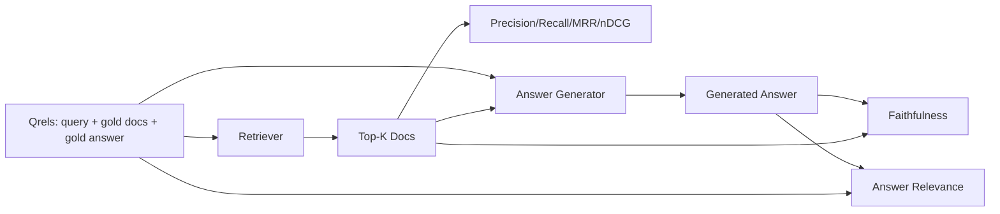

<!-- i18n:manual -->
# Оценка RAG: precision, recall, MRR, nDCG, faithfulness, answer relevance

> Если вы не умеете одновременно оценивать поиск и ответ, систему выкатывать нельзя. Это разные метрики, и один и тот же промпт проваливается по разным осям.

**Type:** Build
**Languages:** Python
**Prerequisites:** Phase 11 lessons 06 (RAG), 10 (evaluation); Phase 19 Track B foundations (lessons 20-29); Phase 19 lessons 64, 65, 66, 67
**Time:** ~90 minutes

## Learning Objectives
- Посчитать четыре метрики поиска по эталонным qrels: precision@k, recall@k, MRR (mean reciprocal rank) и nDCG@k.
- Посчитать две метрики качества ответа: faithfulness (каждое утверждение опирается на найденный контекст) и answer relevance (ответ отвечает на вопрос).
- Собрать файл qrels-фикстуры (запросы, эталонные id документов, эталонный текст ответа), который оценка читает от начала до конца.
- Читать значения метрик, чтобы понять, где именно ломается пайплайн: поиск, ранжирование, генерация или опора на источник.

## The Problem

У RAG-системы как минимум четыре подвижных части: чанкер, ретривер, реранкер, генератор. Причиной неверного ответа может быть любая из них. Без метрик по стадиям вы летите вслепую.

Пользователь пожаловался на неверный ответ. Это чанкер разрезал фрагмент с ответом? Или ретривер не вытащил нужный чанк в top-k? Или реранкер сдвинул правильный чанк ниже первой позиции? Или генератор проигнорировал чанк и всё выдумал? По одному ответу этого не понять. Вам нужны:

- Метрики поиска, чтобы оценить то, что выдал ретривер.
- Метрики ранжирования, чтобы оценить, на каком месте оказался правильный чанк.
- Faithfulness, чтобы оценить, остался ли генератор внутри найденного контекста.
- Answer relevance, чтобы оценить, отвечает ли ответ на вопрос вообще.

В этом уроке мы строим все шесть поверх файла qrels-фикстуры. Оценка офлайновая и детерминированная; в проде вы меняете мок-судью на настоящую LLM.

> 🎒 **На пальцах.** Четыре стадии — четыре подозреваемых, и без метрик вы допрашиваете всех сразу. Это как искать причину, почему в квартире нет света: перегорела лампочка, выбило автомат, оборвало провод или отключили весь дом. Одна проверка в нужной точке отвечает на вопрос за секунду, а гадание по одному «свет не горит» — никогда.

## The Concept



### Precision@k

Какая доля из top-k документов, вернувшихся из ретривера, входит в эталонный набор? Если эталон содержит три документа, а top-3 вернул два из них и один посторонний, precision@3 равна 2 / 3. Берите precision, когда посторонний найденный чанк дорого обходится (генератор тратит на него токены или чанк отравляет ответ).

> 🎒 **На пальцах.** Precision меряет «сколько мусора вы принесли». Из трёх принесённых документов два правильных: 2/3 ≈ 0.67. Это как принести из магазина три продукта по списку из трёх, но один оказался не тем: чек оплачен полностью, а полезного — две трети.

### Recall@k

Какая доля эталонных документов попала в top-k? Если эталон содержит три документа и все три есть в top-5, recall@5 равен 1.0. Берите recall, когда дорого обходится пропущенный ответ (лучше увидеть один лишний неверный чанк, чем вовсе потерять чанк с ответом).

> 🎒 **На пальцах.** Recall меряет «сколько нужного вы не потеряли». Те же три эталонных документа: если в top-5 попали все три — recall 3/3 = 1.0, если два — 0.67. Заметьте, что precision и recall считаются по одной выдаче, но в разные стороны: precision делит на 3 принесённых, recall — на 3 эталонных.

В продакшен-RAG обычно называют именно recall@k. Генерация легко отбрасывает нерелевантные чанки, а вот выдумать ответ из чанка, которого она никогда не видела, не может.

> 🎒 **На пальцах.** Это правило асимметрии, и оно решает, какую метрику вы оптимизируете. Лишний чанк стоит вам нескольких сотен токенов и небольшой доли внимания модели. Пропущенный чанк стоит вам всего ответа. Поэтому в проде почти всегда достают top-20 и отдают модели top-5, а не наоборот.

### MRR (Mean Reciprocal Rank)

Для каждого запроса находим позицию первого релевантного документа в ранжированном списке. Обратный ранг равен 1 / позиция. Усредняем по набору запросов. MRR — сводка одним числом о том, насколько хорошо ретривер выносит лучший ответ наверх.

MRR сильно взвешивает первую позицию. Запрос, где эталонный документ на ранге 1, вносит 1.0. Ранг 2 вносит 0.5. Ранг 10 вносит 0.1. Метрику определяет верхушка списка.

> 🎒 **На пальцах.** Посчитайте на трёх запросах с рангами 1, 2 и 10: MRR = (1.0 + 0.5 + 0.1) / 3 = 0.53. Теперь поднимите третий запрос с ранга 10 на ранг 3: (1.0 + 0.5 + 0.33) / 3 = 0.61. Семь позиций подъёма дали +0.08, а сдвиг одного запроса с ранга 2 на ранг 1 дал бы +0.17. Вот что значит «метрику определяет верхушка».

### nDCG@k

Normalized Discounted Cumulative Gain. Полная формула назначает каждому найденному документу выигрыш (часто 1 за релевантный и 0 за нерелевантный), дисконтирует его логарифмом позиции, суммирует и делит на идеальный DCG (тот DCG, который получился бы при идеальном ранжировании). Диапазон от 0 до 1.

nDCG умеет работать со ступенчатой релевантностью: эталон может сказать «документ A — 3, документ B — 2, документ C — 1». MRR и recall@k схлопывают всё до «да/нет». Берите nDCG, когда на один запрос в корпусе приходится несколько частично релевантных документов.

> 🎒 **На пальцах.** Деление на идеальный DCG — это как оценка «сколько баллов из максимально возможных». Если вы набрали 2.13, а идеальный порядок дал бы 2.63, то nDCG = 0.81. Логарифмический дисконт означает, что документ на второй позиции считается с весом 1/log2(3) ≈ 0.63, на третьей — 0.5: чем ниже, тем меньше его вклад.

### Faithfulness

Для каждого утверждения в сгенерированном ответе проверяем, поддержано ли оно найденным контекстом. Стандартная реализация использует LLM-судью с промптом, который принимает пару (утверждение, контекст) и отвечает «да» или «нет». Метрика — доля утверждений, прошедших проверку.

Faithfulness ловит поломку генератора, когда модель выдумывает содержимое. Даже если ретривер вернул правильные чанки, генератор с галлюцинациями сломан. Faithfulness ещё называют groundedness, support, attribution.

> 🎒 **На пальцах.** Ответ разбивается на утверждения, и каждое проверяется отдельно. Если в ответе четыре предложения и три из них нашли опору в контексте, faithfulness = 3/4 = 0.75. Это как проверять реферат по списку литературы: три абзаца ссылаются на источники, а четвёртый школьник придумал сам.

В этом уроке faithfulness реализована детерминированным мок-судьёй, который проверяет, пересекаются ли токены каждого утверждения с найденным контекстом выше порога. В проде вы переключаетесь на настоящий вызов модели. Форма метрики при этом та же.

### Answer relevance

Отвечает ли ответ на заданный вопрос? Faithfulness спрашивает «опирается ли ответ на контекст?». Answer relevance спрашивает «опирается ли ответ на вопрос?». Верный по источникам, но не по теме ответ получает высокий faithfulness и низкую relevance. Короткий ответ по теме, игнорирующий контекст, получает высокую relevance и низкий faithfulness.

Стандартная реализация тоже использует LLM-судью: берём пару (вопрос, ответ) и спрашиваем, отвечает ли ответ на вопрос. В этом уроке роль судьи играет связка «пересечение токенов плюс судья».

> 🎒 **На пальцах.** Две метрики ловят два разных вида вранья, и их легко перепутать. «В документации сказано, что бакеты создаются командой mb» — правда из контекста, но на вопрос про лимиты загрузки не отвечает: faithfulness 1.0, relevance низкая. «Лимит — три попытки» без опоры на контекст: relevance высокая, faithfulness 0. Хорошая система должна пройти обе.

## The fixture qrels

```python
{
  "qid": "q1",
  "query": "what is the abort threshold for multipart uploads",
  "gold_doc_ids": ["d1", "d3"],
  "gold_answer_substring": "three failed parts",
  "graded_relevance": {"d1": 3, "d3": 2},
}
```

К каждому запросу прилагаются:
- строка запроса,
- набор эталонных id документов (для precision / recall / MRR),
- словарь ступенчатой релевантности (для nDCG),
- эталонная подстрока ответа (хранится как справочные метаданные при каждом qrel; faithfulness в этом уроке считается сравнением извлечённых утверждений с найденным контекстом, а не с этой подстрокой).

В проде вы размечаете это сами. В уроке идёт готовая фикстура, сделанная руками, чтобы оценка запускалась из коробки.

> 🎒 **На пальцах.** Посмотрите на `graded_relevance`: {"d1": 3, "d3": 2}. Документ d1 отвечает на вопрос прямо, d3 — только частично, и nDCG это различает. А для precision, recall и MRR оба одинаково «эталонные», потому что `gold_doc_ids` — это просто список. Одна и та же разметка кормит метрики разной чувствительности.

```figure
ci-rag-metric-ladder
```

## Build It

`code/main.py` реализует:

- `precision_at_k(retrieved, gold, k)` — определение в лоб.
- `recall_at_k(retrieved, gold, k)` — определение в лоб.
- `mean_reciprocal_rank(retrieved_list_of_lists, gold_list)` — среднее по запросам.
- `ndcg_at_k(retrieved, graded_relevance, k)` — DCG / IDCG с бинарным или ступенчатым выигрышем.
- `extract_claims(answer)` — режет ответ на утверждения размером с предложение.
- `faithfulness(claims, context_texts, judge)` — доля утверждений, признанных подтверждёнными.
- `answer_relevance(question, answer, judge)` — суждение о том, отвечает ли ответ на вопрос.
- `MockJudge` — детерминированный судья по пересечению токенов, чтобы оценка работала офлайн.
- `evaluate_pipeline(pipeline_fn, qrels, ks)` — оркестратор, который гоняет все метрики.
- Демо, которое прогоняет три варианта пайплайна (базовый чанкер, гибридный поиск, гибрид плюс переранжирование) по qrels и печатает таблицу метрик.

> 🎒 **На пальцах.** Обратите внимание, что первые четыре функции не знают ни про LLM, ни про эмбеддинги: это чистая арифметика над списками id. Их можно проверить руками на бумажке за минуту, и именно поэтому баги обычно живут не в них, а в разметке qrels и в судье.

Запускаем:

```bash
python3 code/main.py
```

На выходе — precision@k, recall@k, MRR, nDCG@k, faithfulness и answer relevance по каждому варианту в одной таблице метрик. Строка гибридного поиска обгоняет базовый чанкер по recall; строка с переранжированием обгоняет гибрид по MRR.

> 🎒 **На пальцах.** Эти две победы разной природы, и это главный урок таблицы. Гибридный поиск поднимает recall, потому что приносит документы, которых раньше не было в выдаче. Реранкер recall не меняет вообще — он переставляет то же самое, — зато поднимает MRR, двигая правильный документ на первое место.

## Reading the metrics to diagnose failures

| Symptom | Likely cause | What to fix |
|---------|-------------|-------------|
| Низкий recall@k, низкий precision@k | Чанкер разрезал ответ или ретривер не может его найти | Границы чанков (урок 64) или модальность поиска (урок 65) |
| Нормальный recall@k, низкий MRR | Правильный чанк есть в top-k, но не на первой позиции | Реранкер (урок 66) |
| Высокий MRR, низкий faithfulness | Генератор выдумывает содержимое несмотря на правильный контекст | Промпт генерации; заставить цитировать или отказываться |
| Высокий faithfulness, низкая relevance | Ответ опирается на источник, но не по теме | Переписыватель запроса (урок 67) или промпт генерации |
| Все четыре высокие, пользователи всё равно жалуются | Набор для оценки нерепрезентативен | Расширить qrels настоящими запросами пользователей |

> 🎒 **На пальцах.** Эта таблица — диагностический определитель, читайте её слева направо. Каждая строка привязывает наблюдаемую комбинацию чисел к одному конкретному уроку курса. Последняя строка самая коварная: метрики зелёные, а люди недовольны — значит сломана линейка, а не система.

## Failure modes the demo will hide

**LLM-as-judge bias.** Модель оценивает собственные выходы как более достоверные, чем они есть. Берите для судьи другое семейство моделей, чем для генератора, или проверяйте выборку руками.

> 🎒 **На пальцах.** Модель-судья узнаёт свой собственный стиль и мягче к нему относится — примерно как учитель, проверяющий работу собственного ученика. Правило простое: генератор и судья из разных семейств. Если генерирует Claude, судит GPT или Gemini, и наоборот.

**Qrels rot.** Эталонные ответы устаревают вместе с корпусом. Документ, бывший эталоном для q1 в январе 2024 года, в октябре 2024 года уже не правильный ответ, потому что команда переименовала функцию. Заведите ежеквартальный пересмотр qrels.

**Faithfulness micro-checks miss macro-claims.** Пофразовая проверка faithfulness может пройти, хотя структура ответа в целом вводит в заблуждение. Добавьте поверх автоматической метрики выборочный качественный разбор.

**Recall@k masks per-query failures.** Средний recall в 90% может прятать то, что один класс запросов промахивается всегда. Режьте qrels по классам запросов (буквальные, перефразированные, многотемные) и отчитывайтесь по срезам.

> 🎒 **На пальцах.** Разберите эти 90% на числах: если из 100 запросов 80 буквальных дают recall 1.0, а 20 многотемных — 0.5, среднее выходит ровно 0.9. Красивая цифра, за которой каждый пятый пользователь не получает ответа. Срез по классам показывает провал сразу, среднее — никогда.

## Use It

Продакшен-приёмы:

- Гоняйте оценку на каждое изменение ретривера или генератора. Относитесь к регрессии recall@k как к упавшему тесту.
- Сохраняйте трассу метрик по каждому запросу. Когда пользователь жалуется, найдите подходящую запись в qrels и посмотрите, поймали бы вы это заранее.
- Разложите qrels по уровням: дымовой набор из 20 запросов гоняется в CI; регрессионный из 200 — каждую ночь; глубокий из 2000 — раз в неделю.

## Ship It

Урок 69 связывает весь пайплайн (чанкер, ретривер, реранкер, генератор) и прогоняет эту оценку по сквозной системе.

## Exercises

1. Добавьте пятую метрику поиска: hit-rate@k. Сравните её с recall@k. Объясните, когда они расходятся.
2. Реализуйте ступенчатый faithfulness: 0 (не подтверждено), 1 (подтверждено частично), 2 (подтверждено полностью). Обновите метрику соответственно.
3. Замените мок-судью на настоящий вызов модели. Померьте расхождение между моком и настоящим судьёй на фикстуре.
4. Добавьте срез по классам запросов («буквальные», «перефразированные», «многотемные»). Отчитайтесь по метрикам каждого среза.
5. Добавьте метрику «длина ответа» и посчитайте её корреляцию с faithfulness. Постройте кривую.

> 🎒 **На пальцах.** Задание 1 сразу вскрывает разницу метрик. Hit-rate@k отвечает «нашёлся ли хоть один эталонный документ» — это 0 или 1. Recall@k отвечает «какая доля эталонных нашлась». На запросе с тремя эталонами, где нашёлся один, hit-rate = 1.0, а recall = 0.33: одна метрика говорит «всё хорошо», вторая — «две трети потеряно».

## Key Terms

| Term | What people say | What it actually means |
|------|-----------------|------------------------|
| Precision@k | «Доля попаданий среди найденного» | Какая часть top-k входит в эталон |
| Recall@k | «Доля попаданий среди эталона» | Какая часть эталона попала в top-k |
| MRR | «Позиция первого попадания» | Среднее от 1 / ранг первого релевантного документа |
| nDCG@k | «Качество ранжирования со ступенями» | DCG по top-k, делённый на идеальный DCG |
| Faithfulness | «Опора на источник» | Доля утверждений ответа, подтверждённых найденным контекстом |
| Answer relevance | «А на вопрос-то ответили?» | Соответствует ли ответ тому, о чём спрашивали |
| Qrels | «Эталонная разметка» | Размеченный набор запросов с их эталонными документами и ответами |

## Further Reading

- Buckley, Voorhees, "Evaluating Evaluation Measure Stability", SIGIR 2000 — каноническая работа про метрики ранжирования
- Jarvelin, Kekalainen, "Cumulated Gain-based Evaluation of IR Techniques" — статья, вводящая nDCG
- [Ragas: Automated Evaluation of RAG Pipelines](https://docs.ragas.io)
- [Anthropic, Evaluating RAG](https://www.anthropic.com/news/evaluating-rag)
- Phase 11 lesson 10 — основы фреймворка оценки
- Phase 19 lessons 64-67 — компоненты, которые здесь оцениваются
- Phase 19 lesson 69 — сквозной пайплайн, который эта оценка проверяет
