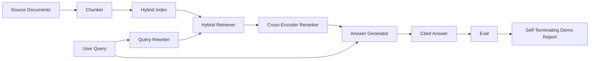

<!-- i18n:manual -->
# Сквозная RAG-система

> Шесть уроков компонентов. Один пайплайн. Один цикл оценки. Одно самозавершающееся демо. Вот эту систему вы и выкатываете.

**Type:** Build
**Languages:** Python
**Prerequisites:** Phase 11 lessons 06 (RAG), 10 (evaluation); Phase 19 Track B foundations (lessons 20-29); Phase 19 lessons 64, 65, 66, 67, 68
**Time:** ~90 minutes

## Learning Objectives
- Собрать чанкер, гибридный ретривер, переписыватель запроса, cross-encoder-реранкер и генератор ответа в один сквозной пайплайн.
- Реализовать генератор ответа, который цитирует свои утверждения якорями чанков и умеет отказываться при низкой уверенности.
- Прогнать оценку из урока 68 по собранному пайплайну и доказать, что поэтапная сборка выигрывает по каждой метрике у тех же компонентов по отдельности.
- Собрать самозавершающееся CLI-демо, которое загружает корпус-фикстуру, прогоняет фиксированный набор запросов и выходит с нулевым кодом и итоговым отчётом.

## The Problem

Шесть компонентов по отдельности не доказывают ничего. Чанкер может выиграть по recall@5 на корпусе и проиграть по системному recall@5, потому что ретривер не умеет ранжировать то, что чанкер выдаёт. Реранкер может поднять MRR на синтетическом наборе кандидатов и провалиться на настоящих кандидатах от bi-encoder, потому что полнота bi-encoder на бюджете переранжирования слишком мала. Переписыватель запроса может вывести эталонный документ наверх на одном запросе и сломаться на следующем, потому что мок-LLM вернул вырожденную гипотезу.

Интеграционный тест — это весь пайплайн, прогнанный от начала до конца по тем же qrels-фикстурам, той же метрикой, одним файлом-оркестратором, который связывает всё вместе. Именно это мы и строим в этом уроке. Если метрики интегрированного пайплайна бьют метрики изолированного демо каждой стадии, вы доказали, что система работает.

> 🎒 **На пальцах.** Каждая стадия хороша на своём стенде и может сломаться на стыке. Это как собирать велосипед из деталей, каждая из которых прошла проверку: колесо круглое, рама прочная, цепь целая — но цепь не той длины под эту звёздочку. Проверка сборки ловит то, чего не ловит ни одна проверка детали.

## The Concept



> 🎒 **На пальцах.** Проследите путь по схеме: документы идут вниз в индекс один раз при загрузке, а запрос идёт слева направо на каждый вопрос. Пересекаются они ровно в одной точке — в ретривере. Всё, что левее и правее, можно менять независимо, и в этом смысл разделения на стадии.

### Wiring choices

Пайплайн — это маленький граф. Каждая стадия — функция с понятной сигнатурой.

| Stage | Input | Output |
|-------|-------|--------|
| Чанкер | Текст документа | Список записей Chunk |
| Ретривер | Строка запроса | Top-N записей Chunk |
| Переписыватель (необязательный) | Строка запроса | Список переписываний плюс гипотеза |
| Реранкер | Запрос, кандидаты | Top-K записей Chunk с кросс-баллами |
| Генератор | Запрос, top-K записей Chunk | Строка ответа с цитатами |

Композиция получается простой, когда каждая сигнатура стабильна. Класс `Pipeline` из этого урока держит пять стадий и метод `query`, который прогоняет их по порядку. Каждая стадия заменяема: передайте другой чанкер, ретривер, переписыватель, реранкер или генератор — пайплайн всё равно заработает.

> 🎒 **На пальцах.** Посмотрите на таблицу как на систему разъёмов: выход одной строки должен подходить ко входу следующей. Chunk на выходе чанкера, Chunk на входе реранкера, Chunk на входе генератора — одна и та же запись проходит через весь конвейер. Пока разъём один, любую деталь можно вынуть и вставить другую, как лампочку в патрон.

### Answer generator with citations

Генератор — последняя стадия и самая ломкая. В уроке идёт детерминированный мок-генератор, который:

1. Берёт top-K переранжированных чанков.
2. Выбирает до двух чанков, чей текст даёт наибольшее пересечение значимых токенов с запросом.
3. Выдаёт ответ, склеенный из одного предложения от каждого выбранного чанка, где за каждым предложением идёт якорь `[doc_id:chunk_index]`.
4. Если ни у одного чанка пересечение не выше порога отказа, выдаёт «I do not know» без цитат.

> 🎒 **На пальцах.** Заметьте цифру «до двух чанков»: даже если реранкер отдал десять, в ответ попадут максимум два. Это дисциплина против воды — два предложения с двумя якорями вместо десяти абзацев неизвестного происхождения. И якорь вида `[d3:2]` означает буквально «документ d3, чанк номер 2», то есть читатель может открыть источник и проверить.

В проде вы меняете мок на настоящий вызов LLM с таким шаблоном промпта:

```
You are answering a question using only the snippets below.
Cite every claim with the anchor in parentheses.
If the snippets do not answer the question, say "I do not know".

Question: {query}

Snippets:
{enumerated chunks with anchors}

Answer:
```

> 🎒 **На пальцах.** В промпте три жёстких правила, и каждое закрывает свою дыру: «only the snippets below» запрещает отвечать из памяти модели, «cite every claim» делает враньё заметным, «say I do not know» даёт легальный выход вместо выдумывания. Уберите третью строку — и модель начнёт сочинять, потому что молчание для неё хуже, чем неправильный ответ.

Путь «отказ при низкой уверенности» — это и есть причина, по которой логируется cross-encoder-балл первой позиции. Если он ниже порога, заданного для корпуса, генератор отказывается отвечать. Это предохранитель против галлюцинаций.

> 🎒 **На пальцах.** Порог отказа — это выключатель между «не знаю» и выдуманным ответом. Если лучший кандидат набрал 0.12 при пороге 0.35, значит в корпусе просто нет ответа, и честное «I do not know» стоит дешевле уверенной чепухи. В поддержке клиентов один такой отказ обходится в один тикет, а одна уверенная выдумка — в потерянного клиента.

### The self-terminating demo

Демо прогоняет всё от начала до конца. Оно печатает разбор одного запроса по стадиям, гоняет оценку по четырём qrels-фикстурам, печатает таблицу метрик и выходит с нулевым кодом, если все метрики из урока 68 укладываются в пороги, заданные в демо. Если хоть одна метрика ниже порога, демо выходит с ненулевым кодом и сообщением, называющим провалившуюся метрику.

Такую форму принимает дымовой тест в CI. Пайплайн работает офлайн, быстро, детерминированно. Пороги на фикстуре намеренно жёсткие, чтобы регрессия в любом из шести уроков роняла демо.

> 🎒 **На пальцах.** Код выхода — это язык, на котором демо разговаривает с CI: ноль значит «влить можно», не ноль — «остановись». Именно поэтому демо само себя завершает, а не ждёт, пока человек посмотрит на цифры. Ровно как светофор: не «вот данные о трафике», а «стой» или «езжай».

```figure
rag-pipeline-flow
```

## Build It

`code/main.py` реализует:

- `Chunk` — запись, которая проходит через все стадии (расширяет форму из урока 64 полями chunk_index и doc_id источника).
- `Chunker` — выбирает стратегию из урока 64 (по умолчанию рекурсивное разбиение).
- `HybridIndex` — связывает BM25, плотный поиск и RRF из урока 65.
- `Rewriter` (необязательный) — выбирает HyDE, multi-query или декомпозицию из урока 67 по длине запроса и наличию союзов.
- `Reranker` — обученный cross-encoder из урока 66 с уменьшенным обучающим набором-фикстурой, чтобы он сходился за секунды.
- `Generator` — детерминированный мок-генератор с цитатами и отказом при низкой уверенности.
- `Pipeline` — собирает пять стадий и даёт метод `query(question)`, возвращающий `Result(answer, top_k, latency_ms_per_stage)`.
- `run_demo()` — загружает корпус, прогоняет три запроса-фикстуры, гоняет оценку, печатает результаты, выставляет код выхода по порогам.

> 🎒 **На пальцах.** Восемь имён на весь файл, и шесть из них — просто обёртки над предыдущими шестью уроками. Новой логики здесь почти нет: `Pipeline` и `run_demo` — это склейка. Так и выглядит хорошая архитектура: файл-оркестратор читается за пять минут, потому что вся сложность осталась в компонентах.

Запускаем:

```bash
python3 code/main.py
```

На выходе — одна распечатанная трасса запроса, полная таблица оценки и итоговый статус pass/fail. На фикстуре возвращает код выхода 0.

## Failure modes the demo will hide

**Chunker boundary drift.** Если между разметкой qrels для оценки и запуском демо поменять стратегию чанкера, эталонные id документов перестанут совпадать. Зафиксируйте стратегию чанкера в файле qrels. В демо есть заголовок, который называет чанкер.

> 🎒 **На пальцах.** Смена стратегии чанкера меняет границы кусков, а значит и их номера: то, что было чанком d3:2, после пересборки может стать d3:1 или вообще двумя чанками. Эталон указывает на старый номер, метрики падают, а виноват будто бы ретривер. Это как переставить книги на полках и продолжать пользоваться старым каталогом.

**Reranker training set leaks into the eval.** Четырнадцать обучающих троек из урока 66 включают запросы, похожие на оценочные. В проде оценочные запросы нужно строго держать в стороне. Оценочные запросы в демо намеренно не пересекаются с обучающим набором реранкера.

> 🎒 **На пальцах.** Утечка обучающего набора в оценку — это как решать на контрольной те же задачи, что были в домашке с ответами. Балл получится отличный, а знания непроверенными. Поэтому 14 обучающих троек и оценочные запросы в демо намеренно разведены: пересечение хотя бы в одном запросе уже завышает MRR.

**Mock generator hides hallucination risk.** Мок не умеет галлюцинировать, потому что выдаёт только текст из найденных чанков. Урок отмечает это и указывает путь замены на настоящую модель для прода.

**No streaming.** Пайплайн возвращает полный ответ в конце каждой стадии. Продакшен-система стримила бы выход генератора. Стриминг вне рамок урока; метрики качества ответа в любом случае работают по итоговой строке.

**Latency is offline.** Вызовы мок-LLM отрабатывают за постоянное время. Настоящие вызовы LLM всё определяют. Планируйте бюджет задержки в масштабе запроса; тайминги по стадиям в уроке меряют только работу процессора.

> 🎒 **На пальцах.** Сложите реальный бюджет: чанкинг и поиск дают десятки миллисекунд, реранкер на 50 кандидатах — сотню, а вызов LLM — секунду-две. То есть тайминги демо показывают вам примерно 10% настоящей картины. Оптимизировать по ним поиск — всё равно что экономить копейки в счёте, где основная строка стоит рубли.

## Use It

Продакшен-приёмы:

- Держите файл пайплайна одним оркестратором с явными интерфейсами стадий. Не размазывайте обвязку по репозиторию.
- Гоняйте оценку перед каждым вливанием, которое трогает стадию. Если оценка просела, вливание не проходит.
- Сохраняйте трассу метрик по каждому прогону CI, чтобы уметь привязать регрессию к конкретной замене стадии.
- Добавьте дымовой набор из 20 запросов (подмножество регрессионного), который отрабатывает меньше чем за 30 секунд; полный регрессионный набор гоняется ночью.

> 🎒 **На пальцах.** «Меньше 30 секунд» — это не красивая цифра, а граница терпения. Проверка, которая идёт полминуты, остаётся в каждом PR; проверка на десять минут через месяц окажется отключённой «на время». Поэтому дымовой набор режут до 20 запросов, а всё остальное уносят в ночной прогон.

## Ship It

Файл пайплайна из этого урока — та форма, на которую опираются остальные уроки трека F девятнадцатой фазы. Дальше поверх него добавляются автоматизация загрузки, инкрементальная переиндексация, телеметрия и слой отдачи. Половины про поиск, переранжирование, переписывание и оценку здесь уже закончены.

## Exercises

1. Добавьте выбор стратегии под каждый запрос внутри переписывателя: эвристики из урока 67 (длина, союзы, доля жаргона) выбирают HyDE, multi-query или декомпозицию.
2. Добавьте настоящий вызов LLM для генератора за флагом окружения. По умолчанию оставьте мок. Померьте разницу в задержке.
3. Расширьте демо флагом `--corpus path`, который загружает настоящий корпус. Перезапустите оценку и проверку порогов.
4. Добавьте чанкеру флаг `--strategy`. Померьте вклад каждой стратегии в сквозную полноту поиска.
5. Добавьте интерфейс стримящего генератора и заведите его в оценку. Убедитесь, что faithfulness считается по итоговой строке, а не по стримовому префиксу.

> 🎒 **На пальцах.** Задание 5 звучит скучно, но ловит настоящий баг. Если считать faithfulness по префиксу, который уже пришёл, метрика оценит половину предложения и решит, что опоры нет. Правило простое: метрики качества ответа считаются после последнего токена, а не по дороге.

## Key Terms

| Term | What people say | What it actually means |
|------|-----------------|------------------------|
| Pipeline | «RAG-пайплайн» | Собранные вместе стадии от загрузки до ответа с цитатами |
| Citation anchor | «Ссылка на источник» | Ссылка вида (doc_id, chunk_index), прикреплённая к каждому утверждению |
| Refuse-on-low-confidence | «Я не знаю» | Генератор не даёт ответа, когда балл первой позиции от реранкера ниже порога |
| Smoke set | «Оценка в CI» | Минимальное подмножество qrels, которое гоняется в каждой проверке PR |
| Stage interface | «Сигнатура функции» | Стабильные типы входа и выхода каждой стадии пайплайна |

## Further Reading

- [Anthropic, Building search and retrieval](https://www.anthropic.com/news/contextual-retrieval)
- [Pinterest, MCP internal search](https://medium.com/pinterest-engineering) — образцовая продакшен-архитектура
- [Ragas: Automated Evaluation of RAG Pipelines](https://docs.ragas.io)
- Phase 11 lesson 06 — основы RAG
- Phase 19 lessons 64-68 — компоненты, собранные здесь вместе
