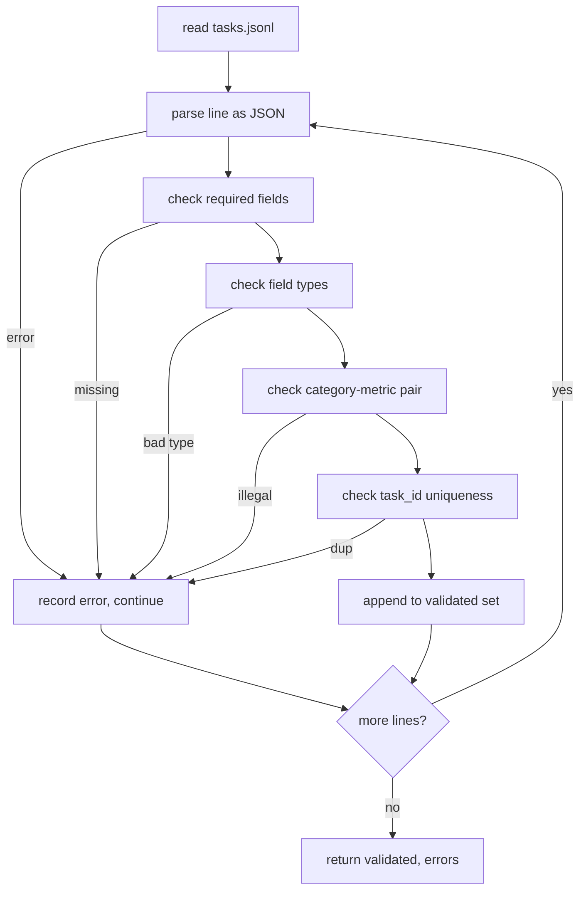

<!-- i18n:manual -->
# Формат спецификации задачи

> Eval-харнесс хорош ровно настолько, насколько строг контракт, которому подчиняются его задачи. Зафиксируйте форму JSONL и словарь имён метрик до того, как напишете первую функцию оценивания.

**Type:** Build
**Languages:** Python
**Prerequisites:** Phase 19 Track B foundations
**Time:** ~90 min

## Learning objectives

- Описать схему JSONL-записи задачи, которая укладывает в одну форму арифметику, вопросы с выбором ответа, исполнение кода, классификацию и свободную суммаризацию.
- Зафиксировать закрытый словарь имён метрик, чтобы следующие уроки (71-73) переключались по одному-единственному полю.
- Задать few-shot примеры и правила пост-обработки внутри задачи, а не внутри раннера, чтобы один и тот же промпт давал одну и ту же цель на любой модели.
- Реализовать строгий валидатор, который отбрасывает кривые записи до того, как они дойдут до раннера.
- Собрать набор из 10 задач-фикстур, задевающий каждую ветку спецификации, чтобы валидатору было на чём работать.

```figure
ci-task-spec-gate
```

> 🎒 **На пальцах.** Спецификация задачи — это как бланк заявления в поликлинике: пока все пишут в одни и те же графы, регистратура работает. Здесь граф ровно шесть обязательных плюс две необязательные, и пять категорий задач (арифметика, выбор ответа, исполнение кода, классификация, суммаризация) укладываются в один и тот же бланк.

## Why a frozen spec

Исследовательский код набирает eval-скрипты быстрее, чем тесты. Через полгода у каждого ноутбука своя форма JSON, каждая метрика написана дважды, и сравнивать прогоны между собой невозможно. Лечение скучное. Выберите схему. Напишите валидатор. Всё остальное отклоняйте. Ровно этим и занят этот урок.

Форма записи заимствует идеи у BIG-bench, HELM и харнессов в стиле lm-eval, но имена полей — наши. У каждого поля один владелец. Раннер читает задачу. Метрика читает targets. Шаг пост-обработки нормализует генерацию. Ни одно поле не меняется по ходу конвейера.

> 🎒 **На пальцах.** «Один владелец у поля» — это как в квартире: за плиту отвечает один человек, и никто больше её не крутит. Если бы метрика тоже правила `prompt`, а раннер лез в `targets`, то при странном результате вы бы не поняли, кто именно испортил данные. Здесь же на каждое поле ровно один подозреваемый.

> 🎒 **На пальцах.** Полгода без схемы — это буквально: 20 ноутбуков, в каждом свой ключ для правильного ответа (`answer`, `gold`, `label`, `target`), и чтобы построить одну сводную таблицу, нужно написать 20 разных парсеров. Валидатор, который отклоняет всё, кроме одной формы, стоит вам один день работы и экономит эти двадцать парсеров.

## The record shape

Задача — это JSON-объект в одну строку. Харнесс читает `tasks.jsonl` и проверяет каждую строку независимо. Плохая строка обрушивает эту запись, а не весь прогон.

```json
{
  "task_id": "arith_001",
  "category": "arithmetic",
  "prompt": "Compute the result. Question: 17 + 24\nAnswer:",
  "targets": ["41"],
  "metric_name": "exact_match",
  "few_shot_examples": [
    {"prompt": "Question: 2 + 2\nAnswer:", "completion": "4"}
  ],
  "post_process": "strip_whitespace",
  "metadata": {"difficulty": "easy"}
}
```

Обязательные поля: `task_id`, `category`, `prompt`, `targets`, `metric_name`, `post_process`. Поля `few_shot_examples` и `metadata` необязательны. Неизвестные поля верхнего уровня валидацию не проходят.

> 🎒 **На пальцах.** Посмотрите на пример выше: задача `arith_001` спрашивает «17 + 24», а в `targets` лежит строка `"41"` — именно строка, а не число, потому что модель возвращает текст. Метрика `exact_match` сравнит текст с текстом, а `post_process: strip_whitespace` заранее срежет пробелы, чтобы ответ «41 » тоже засчитался.

> 🎒 **На пальцах.** «Плохая строка обрушивает запись, а не прогон» — это как контрольная, где неразборчивый почерк в третьей задаче не отменяет остальные девять. Из 10 фикстур одна кривая даст 9 валидных записей и 1 ошибку, а не ноль результатов и стектрейс.

## Field rules

`task_id` — строка без пробелов. Валидатор следит, чтобы идентификаторы не повторялись в пределах файла.

`category` — одно из `arithmetic`, `mcq`, `code_exec`, `classification`, `summary`. Категория ограничивает, какая пара «метрика плюс пост-обработка» вообще законна. Задача `code_exec` обязана использовать `metric_name = code_exec`, а задача `mcq` — `metric_name = exact_match` против цели из одной буквы.

> 🎒 **На пальцах.** Категория работает как класс билета: с плацкартным вы не сядете в СВ. Если написать `category: mcq` и `metric_name: bleu_4`, валидатор откажет — считать BLEU по ответу из одной буквы «C» бессмысленно, там всего одна n-грамма. Запрет ловит эту глупость до прогона, а не после.

`prompt` — непустая строка. Валидатор запрещает пробелы в конце и отклоняет записи, где few-shot блок уже вшит в тело промпта. Отрисовка few-shot происходит в раннере, а не в голове автора задачи.

> 🎒 **На пальцах.** Пробел в конце промпта — не мелочь: токенизатор превратит `"Answer:"` и `"Answer: "` в разные последовательности токенов, и модель может ответить по-разному. Запрет на хвостовой пробел — это одна строка в валидаторе, которая снимает целый класс необъяснимых расхождений между прогонами.

`targets` — непустой список строк. Для `exact_match` засчитывается совпадение с любым элементом. Для `f1` и `rouge_l` побеждает цель с наибольшей оценкой. Для `mcq` в списке ровно один элемент.

> 🎒 **На пальцах.** Несколько целей нужны там, где верных формулировок много: на вопрос «столица Франции» подойдут и «Paris», и «Париж». Если целей три, метрика считается трижды, и в зачёт идёт лучший результат — то есть модель наказывается только тогда, когда не попала ни в один из вариантов.

`metric_name` — одно из `exact_match`, `f1`, `bleu_4`, `rouge_l`, `accuracy`, `code_exec`. Словарь закрыт. Новая метрика требует нового урока и новой записи здесь.

`few_shot_examples` — список пар `{prompt, completion}`. Валидатор ограничивает список восемью элементами, чтобы промпты не разрастались.

`post_process` — одно из `none`, `strip_whitespace`, `lower`, `extract_letter`, `extract_code_block`, `extract_first_line`. У каждого правила ровно одно детерминированное поведение. Комбинировать правила валидатор запрещает.

> 🎒 **На пальцах.** Потолок в восемь примеров — это про деньги и контекст. Если один пример занимает 40 токенов, восемь дадут 320 токенов перед каждым вопросом; на 500 задачах это 160 000 лишних токенов за прогон. Без потолка кто-нибудь однажды положит туда тридцать примеров, и стоимость прогона вырастет вчетверо незаметно для всех.

## Validator behaviour



Валидатор возвращает два списка: проверенные записи и записи с ошибками, где указана провинившаяся строка, нарушенное правило и поле-виновник. Раннер отказывается стартовать, если список ошибок непуст, — если только явно не выставлен флаг `--allow-bad-tasks`.

> 🎒 **На пальцах.** Проследите путь по схеме: строка проходит разбор JSON, проверку обязательных полей, проверку типов, проверку пары «категория-метрика» и проверку уникальности `task_id`. Пять ворот подряд, и на любом строка уходит в список ошибок, а цикл продолжается со следующей. Флаг `--allow-bad-tasks` существует ровно для отладки — в обычном прогоне одна ошибка означает «не стартуем».

## Few-shot rendering

Раннер приклеивает few-shot примеры перед промптом, разделяя их пустой строкой. Один и тот же путь кода отрабатывает для каждой модели, поэтому единственный источник различий — сама модель. Автор пишет примеры один раз, а не по разу на провайдера.

```python
def render(task):
    parts = []
    for ex in task.get("few_shot_examples", []):
        parts.append(ex["prompt"] + " " + ex["completion"])
    parts.append(task["prompt"])
    return "\n\n".join(parts)
```

> 🎒 **На пальцах.** Функция `render` просто собирает список кусков и склеивает через `"\n\n"`. Для задачи `arith_001` с одним примером получится: «Question: 2 + 2 Answer: 4», пустая строка, затем сам вопрос про 17 + 24. Две строки кода — и у всех моделей формат промпта побайтово одинаковый.

## Post-process rules

Шаг пост-обработки выполняется после генерации и до метрики. Он детерминированный и без состояния.

- `none` возвращает строку без изменений.
- `strip_whitespace` срезает пробелы в начале и в конце.
- `lower` приводит строку к нижнему регистру.
- `extract_letter` возвращает первый символ, попадающий в `[A-E]`, — используется для задач с выбором ответа.
- `extract_code_block` возвращает тело первого блока в тройных обратных кавычках — используется для исполнения кода.
- `extract_first_line` возвращает первую непустую строку — используется для классификации и суммаризации.

Задача, которой нужно правило вне этого списка, относится к другому уроку.

> 🎒 **На пальцах.** Возьмите ответ модели «Хм, думаю, это вариант C, потому что...». Метрика exact_match против цели `"C"` даст 0. Правило `extract_letter` вытащит первую букву из диапазона A-E — это `C` — и та же самая пара превратится в 1.0. Пост-обработка не улучшает модель, она убирает шум формата.

> 🎒 **На пальцах.** «Детерминированный и без состояния» значит: одна и та же входная строка всегда даёт один и тот же результат, независимо от того, какая задача была до неё. Поэтому и запрещено комбинировать правила: `lower` плюс `extract_letter` в разном порядке дали бы разный результат для ответа «c», и вы бы неделю искали, почему числа не воспроизводятся.

## What this lesson does not do

Он не считает оценки. Он не вызывает модель. Он не запускает код. Это будет в уроках 71, 72 и 75. Этот урок замораживает контракт, который они все соблюдают.

Набор из 10 фикстур покрывает две арифметические задачи, две задачи с выбором ответа, две на исполнение кода, две на классификацию и две на суммаризацию. Валидатор проходит все 10. Отдельная фикстура (`tasks_bad.jsonl`) нарушает каждое правило, и валидатор возвращает ровно столько ошибок.

> 🎒 **На пальцах.** Две фикстуры — это как два ключа к замку: один должен подходить, другой обязан не подходить. Файл на 10 хороших задач проверяет, что валидатор никого не отвергает зря, а `tasks_bad.jsonl` проверяет, что он вообще умеет отказывать. Тест, который только на хороших данных зелёный, ничего не доказывает: пустая функция `return True` его тоже пройдёт.

## How to read the code

`main.py` определяет `TaskSpec`, `validate_task`, `validate_file` и точку входа для командной строки. Загрузчик фикстур — `load_fixtures`. Помощники для отрисовки и пост-обработки лежат рядом с валидацией, чтобы раннер из урока 75 импортировал один-единственный модуль.

Читайте `main.py` сверху вниз. Потом читайте `code/tests/test_spec.py`. Тесты фиксируют каждое правило валидации и каждое поведение пост-обработки. Демо в конце `main.py` проверяет вложенную фикстуру и печатает сводку.

> 🎒 **На пальцах.** Порядок чтения выбран не случайно: сначала контракт (`TaskSpec`), потом проверка одной записи (`validate_task`), потом проверка файла (`validate_file`). Это как учить дорожные знаки, потом сдавать площадку, потом выезжать в город — каждый следующий уровень опирается на предыдущий и добавляет ровно одну новую вещь.

## Going further

Настоящие наборы evals обрастают категориями так же, как схемы баз данных обрастают колонками. Трезвый ход — отказываться добавлять категорию, пока к ней не добавлены метрика, правило пост-обработки и хотя бы одна задача-фикстура. Относитесь к спецификации как к миграции базы данных. Каждое изменение проходит ревью, версионируется и сопровождается тестами. Валидатор из этого урока и есть те самые ворота.

> 🎒 **На пальцах.** Правило «категория плюс метрика плюс правило плюс фикстура» — это цена входа из четырёх пунктов, и она специально высокая. Добавить в enum шестую категорию — минута работы; поддерживать шесть категорий, из которых у двух нет ни одного теста, — полгода головной боли. Дешевле заплатить сразу.
