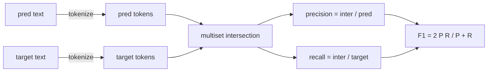
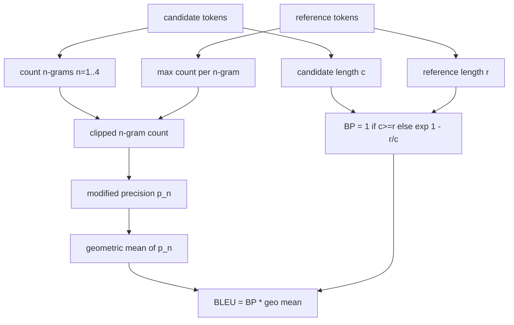

<!-- i18n:manual -->
# Классические метрики

> BLEU, ROUGE-L, F1, exact match, accuracy. Пять метрик, на которых до сих пор держится большая часть опубликованных чисел по оценке LLM. Напишите каждую с нуля, чтобы понимать, что означает результат.

**Type:** Build
**Languages:** Python
**Prerequisites:** Phase 19 Track B foundations, lesson 70
**Time:** ~90 min

## Learning objectives

- Реализовать exact match, F1 и accuracy на уровне токенов с явно заданными правилами токенизации.
- Реализовать BLEU-4 с самого низа: модифицированная точность по n-граммам, среднее геометрическое по n от 1 до 4, штраф за краткость.
- Реализовать ROUGE-L через наибольшую общую подпоследовательность, с комбинированием точности и полноты по формуле F-beta.
- Переключаться по полю metric_name из урока 70, чтобы раннер оставался безразличен к метрикам.
- Зафиксировать поведение эталонными векторами, посчитанными вручную, а не взятыми из сторонней библиотеки.

```figure
cd-bleu-overlap
```

> 🎒 **На пальцах.** Пять метрик — это пять разных линеек для одного и того же ответа. Exact match спрашивает «совпало ли слово в слово», F1 — «сколько слов пересеклось», BLEU — «сколько совпало цепочек из 2, 3 и 4 слов», ROUGE-L — «сохранился ли порядок слов». Одна и та же пара текстов легко даёт 0.0 по первой линейке и 0.83 по последней.

## Why reimplement

Вы прочитаете статью, где BLEU равен 28.3, и другую, где BLEU равен 0.283. Вы наткнётесь на оценки ROUGE-L, различающиеся на десять пунктов между двумя библиотеками, потому что одна приводит текст к нижнему регистру, а другая нет. Быстрее всего перестать путаться так: написать метрики самому, а потом ткнуть пальцем в строку, где выбран токенизатор, и в строку, где применено сглаживание. После этого сравнение чисел из разных статей превращается в чтение настроек метрики, а не в спор о библиотеках.

Хватит стандартной библиотеки плюс numpy. BLEU — это подсчёт и обрезание. ROUGE-L — динамическое программирование. F1 — пересечение множеств токенов. Самое трудное — выбрать токенизатор и больше его не трогать.

> 🎒 **На пальцах.** 28.3 и 0.283 — это одно и то же число, просто одна статья умножила на 100, а другая нет. Проверяйте это первым делом: если у вас BLEU 0.28, а в статье 28.3, вы не отстаёте в сто раз, вы просто печатаете в другой шкале.

> 🎒 **На пальцах.** Разница в десять пунктов ROUGE-L между библиотеками — не мистика. Одна привела всё к нижнему регистру, и «Paris» совпало с «paris», у другой это два разных токена. На тексте из десяти слов одно расхождение — это уже 10% разницы в LCS, отсюда и десять пунктов.

## Tokenisation

Токенизатор — это `re.findall(r"\w+", text.lower())`. Нижний регистр, куски из букв и цифр, пунктуация выбрасывается. Каждая метрика в этом уроке использует ровно этот токенизатор. Раннеру выбор не даётся. Поменяли токенизатор — вы прогоняете уже другой бенчмарк.

```python
TOKEN_RE = re.compile(r"\w+", re.UNICODE)
def tokenize(text):
    return TOKEN_RE.findall(text.lower())
```

Это сознательное упрощение. Продакшен-настройки будут заботиться про CJK, сокращения с апострофом и идентификаторы в коде. Смысл урока в том, что токенизатор — это контракт, а не ручка, которую можно крутить.

> 🎒 **На пальцах.** Прогоните через этот токенизатор строку «Hello, World!» — получится `["hello", "world"]`: запятая и восклицательный знак исчезли, регистр упал. Значит «Hello, World!» и «hello world» дадут F1 ровно 1.0, хотя как строки они разные. Все дальнейшие числа урока живут внутри этого решения. Токенизатор здесь — как размер футбольного поля: пока он один и тот же, счёт матчей сравним.

## Exact match

```python
def exact_match(pred, targets):
    return float(any(pred.strip() == t.strip() for t in targets))
```

Возвращает 1.0 или 0.0 на задачу. Агрегат по датасету — это среднее. Рабочая лошадка для арифметики, вопросов с выбором ответа и коротких задач классификации.

> 🎒 **На пальцах.** Заметьте `any(...)` внутри: достаточно совпасть с одной целью из списка. Если целей две — `"41"` и `"41.0"` — то ответ модели «41.0» даст 1.0. А среднее по датасету из 200 задач, где совпало 174, — это ровно 0.87, то есть та самая «точность 87%», которую печатают в отчётах.

## Token-level F1

Строим мультимножество токенов для предсказания и для цели. Точность — это пересечение мультимножеств, делённое на мультимножество предсказания. Полнота — то же пересечение, делённое на мультимножество цели. F1 — их гармоническое среднее. Реализация обрабатывает граничные случаи пустого предсказания и пустой цели.



Для задач с несколькими целями мы берём лучший F1 по списку целей. Это соответствует поведению в стиле SQuAD, широко описанному в литературе.

> 🎒 **На пальцах.** Посчитаем руками. Предсказание «the cat sat», цель «cat sat down»: пересечение — два слова, точность 2/3 ≈ 0.67, полнота 2/3 ≈ 0.67, F1 = 0.67. Exact match на этой же паре дал бы жёсткий ноль. F1 — это способ сказать «две трети правильно» там, где exact match умеет говорить только «нет».

> 🎒 **На пальцах.** Мультимножество, а не множество, — важная деталь. Если модель ответила «cat cat cat», а в цели «cat» одно, то множество дало бы пересечение 1 и полноту 1.0, а мультимножество ограничит совпадение одним «cat» и уронит точность до 1/3. Так метрика перестаёт вознаграждать повторы.

## BLEU-4

BLEU — каноническая метрика машинного перевода, и она до сих пор всплывает в работах по суммаризации. Мы используем формулировку BLEU-4 на уровне корпуса со стандартным штрафом за краткость и сглаживанием «плюс один» на модифицированных счётчиках n-грамм, чтобы одна недостающая 4-грамма не обнуляла оценку.

Для каждой пары «кандидат-эталон» мы считаем модифицированную точность по n-граммам для n равного 1, 2, 3, 4. Модифицированная точность обрезает счётчик n-граммы кандидата по максимальному счётчику этой n-граммы в любом из эталонов, чтобы кандидат не мог накрутить оценку повторением одной фразы. Среднее геометрическое по четырём точностям оборачивается штрафом за краткость.



Правило сглаживания — то самое, которое Lin и Och назвали методом 1: прибавить единицу к числителю и знаменателю каждой точности по n-граммам перед взятием логарифма. Это спасает от `log 0`, когда у эталона нет ни одной совпадающей 4-граммы, и почти не меняет значение на длинных кандидатах.

> 🎒 **На пальцах.** Обрезание счётчиков ловит вот такой трюк. Кандидат «the the the the the», эталон «the cat sat on the mat». Без обрезания все пять униграмм совпали, точность 5/5 = 1.0. С обрезанием совпадение ограничено двумя «the» из эталона, и точность падает до 2/5 = 0.4. Метрика перестаёт награждать бессмысленный повтор.

> 🎒 **На пальцах.** Штраф за краткость наказывает за лень. Кандидат в 5 слов против эталона в 10 даёт BP = exp(1 − 10/5) = exp(−1) ≈ 0.37, то есть итоговый BLEU режется почти втрое. Без этого штрафа выгоднее всего было бы отвечать одним самым частым словом: точность высокая, а сказать по делу нечего.

> 🎒 **На пальцах.** Зачем сглаживание: среднее геометрическое умножает четыре точности, и один ноль убивает произведение целиком. Если у кандидата не совпала ни одна 4-грамма, p_4 = 0 и BLEU = 0, даже когда все слова и все пары слов на месте. Плюс один превращает 0/7 в 1/8 = 0.125 — оценка низкая, но честно ненулевая.

## ROUGE-L

ROUGE-L сравнивает наибольшую общую подпоследовательность последовательностей токенов кандидата и эталона. LCS схватывает порядок слов, не требуя, чтобы они шли подряд, — поэтому она и стала метрикой суммаризации по умолчанию. Мы считаем длину LCS обычной таблицей динамического программирования, затем выводим полноту как `lcs / reference length`, точность как `lcs / candidate length` и объединяем их через F-beta, где beta равна единице для симметричной формы F1.

```python
def lcs_length(a, b):
    n, m = len(a), len(b)
    dp = numpy.zeros((n + 1, m + 1), dtype=int)
    for i in range(n):
        for j in range(m):
            if a[i] == b[j]:
                dp[i+1, j+1] = dp[i, j] + 1
            else:
                dp[i+1, j+1] = max(dp[i+1, j], dp[i, j+1])
    return int(dp[n, m])
```

Таблица на numpy делает реализацию читаемой; обычные списки Python тоже подошли бы. Задачи, которые выбирают ROUGE-L, платят за это стоимостью O(n m) на задачу. Для типичной длины саммари это остаётся меньше миллисекунды.

> 🎒 **На пальцах.** Возьмите кандидата «the cat sat on the mat» и эталон «the cat is on the mat». Общая подпоследовательность — «the cat on the mat», это 5 слов, при длине обоих текстов 6. Значит точность 5/6, полнота 5/6, ROUGE-L ≈ 0.83. Слова идут не подряд — между «cat» и «on» вклинилось разное, — и метрика это спокойно допускает.

> 🎒 **На пальцах.** O(n·m) звучит страшно, но подставьте числа: саммари в 50 слов против эталона в 50 слов — это таблица 51 на 51, около 2600 ячеек. Современный процессор проходит её за доли миллисекунды. Проблемой это станет только на текстах в тысячи токенов, где 2000 × 2000 = 4 миллиона ячеек на каждую задачу.

## Accuracy

Для задач классификации с несколькими целями accuracy сводится к exact match против одной нормализованной цели. Мы выносим её в отдельную функцию, чтобы диспетчер мог переключаться по `metric_name`, не пробираясь через сравнения строк внутри раннера.

> 🎒 **На пальцах.** По сути accuracy здесь — тот же exact match, только под другим именем, и это нормально. Отдельное имя нужно не математике, а диспетчеру: в таблице переключения `accuracy` и `exact_match` — две разные строки, поэтому потом можно поменять реализацию одной, не трогая другую.

## Dispatch contract

Единственная точка входа — `score(metric_name, prediction, targets)`. Она возвращает число с плавающей точкой в отрезке `[0, 1]`. Раннер не ветвится по имени метрики. Он передаёт вызов дальше и записывает результат. Именно к этой поверхности урок 75 приклеит спецификацию задачи из урока 70.

```python
def score(metric_name, pred, targets):
    if metric_name == "exact_match":
        return exact_match(pred, targets)
    if metric_name == "f1":
        return max(f1_score(pred, t) for t in targets)
    if metric_name == "bleu_4":
        return max(bleu4(pred, t) for t in targets)
    if metric_name == "rouge_l":
        return max(rouge_l(pred, t) for t in targets)
    if metric_name == "accuracy":
        return accuracy(pred, targets)
    raise ValueError(f"unknown metric_name: {metric_name}")
```

`code_exec` разбирается в уроке 72 и вставляется в диспетчер там же.

> 🎒 **На пальцах.** Обратите внимание на `max(...)` в ветках f1, bleu_4 и rouge_l: по каждой цели метрика считается отдельно, и берётся лучшее число. А в конце — `raise ValueError` на незнакомое имя: опечатка `rouge-l` вместо `rouge_l` уронит прогон сразу, а не тихо запишет ноль во все строки отчёта.

## What this lesson does not do

Он не вызывает модель. Он не нормализует генерации сверх того, что уже сделали правила пост-обработки из урока 70. Он не считает доверительные интервалы. Он не делает BLEURT и BERTScore — им нужна модель, и живут они в другом уроке. Смысл в том, чтобы задать пол: пять метрик, один токенизатор, одна таблица переключения.

## How to read the code

`main.py` определяет каждую метрику как свободную функцию плюс диспетчер. Эталонные векторы лежат в блоке `_reference_examples` в конце файла. Демо прогоняет диспетчер по восьми примерам и печатает оценки по каждой метрике. Тесты в `code/tests/test_metrics.py` фиксируют эталонные векторы и продавливают каждый граничный случай (пустое предсказание, пустой эталон, ни одного общего токена, точное совпадение, обрезание повторяющейся фразы).

Читайте `main.py` сверху вниз. Функции отсортированы по сложности. exact_match и accuracy — по одной строке каждая. F1 — шесть строк. BLEU и ROUGE-L — тяжёлая часть, и в них есть подробные комментарии про правило сглаживания и рекуррентное соотношение LCS.

> 🎒 **На пальцах.** «Эталонные векторы, посчитанные вручную, а не взятые из библиотеки» — это принципиально. Если списать ожидаемое число у чужой библиотеки, ваш тест будет проверять, что вы повторили её ошибки. Посчитанный на бумаге ROUGE-L = 5/6 — независимая правда, и он поймает опечатку в вашей таблице DP.

## Going further

Классические метрики необходимы, но недостаточны. Они награждают за поверхностное пересечение и не видят смысла. Лечится это надстройкой метрик на основе моделей (BLEURT, BERTScore, GEval) — но только после того, как вы доверяете классическому полу. Это тема более позднего урока. Пока задача такая: заставить работать эти пять, зафиксировать их тестами, и у вас на руках стек метрик, который можно проверить, который быстр и который воспроизводим.

> 🎒 **На пальцах.** «Поверхностное пересечение» видно на примере: «Париж — столица Франции» и «Столица Франции — Париж» по смыслу одно и то же, а BLEU-4 между ними будет низким, потому что ни одна 4-грамма не совпала. Поэтому классические метрики — это пол, а не потолок: они ловят грубые провалы дёшево, а тонкие различия оставляют метрикам на основе моделей.
