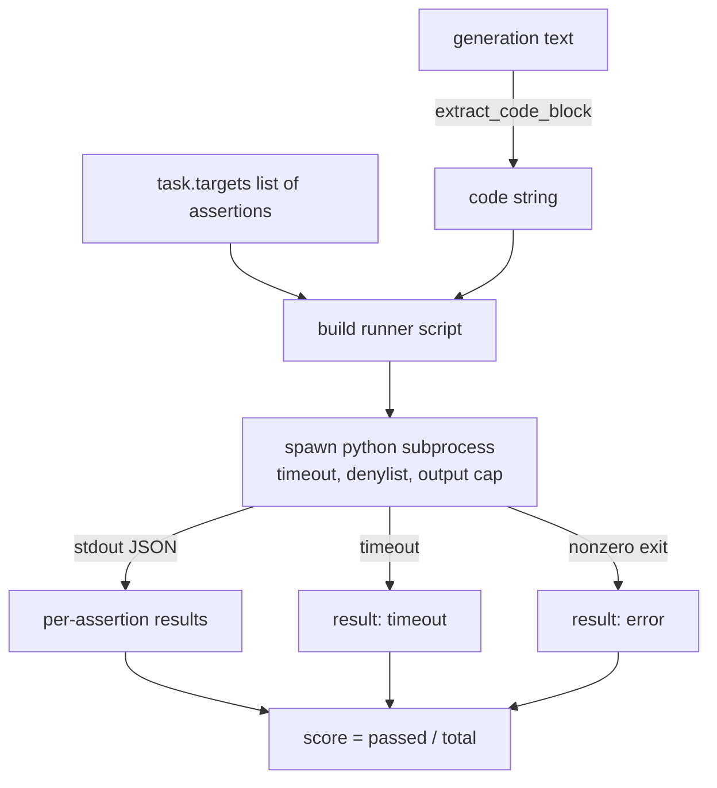
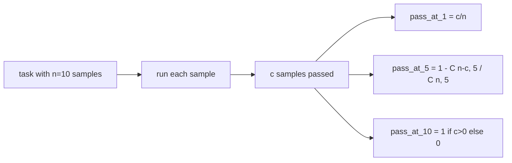

<!-- i18n:manual -->
# Метрика исполнения кода

> Сгенерированный код верен тогда, когда он проходит тесты. Eval-харнесс обязан вытащить код, запустить его, не уронив хост-процесс, и честно посчитать долю прошедших. Этот урок строит такую поверхность.

**Type:** Build
**Languages:** Python
**Prerequisites:** Phase 19 Track B foundations, lessons 70 and 71
**Time:** ~90 min

## Learning objectives

- Вытаскивать блок кода из свободной генерации так, чтобы это совпадало с правилом пост-обработки из урока 70.
- Запускать код-кандидат в изолированном подпроцессе с таймаутом по реальным часам, ограничением на объём вывода и чёрным списком импортов.
- Оценивать задачу как долю переданных строк-ассертов, которые прошли против кода-кандидата.
- Считать pass@k для задач, где от одной модели сэмплируется несколько генераций.
- Считать падения песочницы, синтаксические ошибки и таймауты полноправными режимами отказа с отдельными кодами выхода, которые раннер может залогировать.

```figure
sandbox-runner
```

> 🎒 **На пальцах.** Все прошлые метрики сравнивали текст с текстом. Эта сравнивает поведение: код либо проходит проверки, либо нет. Разница как между «пересказал рецепт похоже» и «блюдо получилось съедобным» — и второе проверяется только на кухне, то есть запуском.

## Why an isolated subprocess

Прямой `exec` — это дыра и в безопасности, и в стабильности. Сгенерированный `while True: pass` вешает прогон навсегда. Сгенерированный `import shutil; shutil.rmtree('/')` ровно настолько катастрофичен, насколько выглядит. Лечение: поднимать свежий интерпретатор Python на каждого кандидата, передавать код через stdin, писать результаты ассертов в stdout и убивать процесс, если он вышел за отведённое время. Хост-процесс оценки продолжает жить.

Настоящие evals вроде HumanEval, MBPP, BigCodeBench и LiveCodeBench — все используют песочницу на подпроцессе. Некоторые кладут сверху Docker. Мы останавливаемся на подпроцессе не случайно: он переносим, он есть в стандартной библиотеке и он ловит те режимы отказа, которые важны для учебной оценки. Продакшен-развёртывания добавляют seccomp, сетевую изоляцию и файловую систему только на чтение. Следующий урок про упрочнение живёт за пределами этого трека.

> 🎒 **На пальцах.** Подпроцесс — это как готовить в отдельной комнате с дверью, которую можно закрыть. Если модель сгенерировала `while True: pass`, вы просто убиваете эту комнату через 3 секунды и идёте дальше. При прямом `exec` вешается сам харнесс, и прогон на 500 задачах останавливается на 17-й.

> 🎒 **На пальцах.** Обратите внимание на список: HumanEval, MBPP, BigCodeBench, LiveCodeBench — четыре самых цитируемых бенчмарка по коду, и все четыре делают одно и то же. Когда четыре независимые команды приходят к одинаковому решению, это не мода, а обязательный минимум.

## The shape of a code-exec task

Задача `code_exec` несёт строки-ассерты в поле `targets`. Раннер вытаскивает из генерации блок кода в тройных кавычках, строит вокруг него тестовую обвязку и запускает результат.



Оценка — это доля в отрезке `[0, 1]`. Задача с тремя ассертами, где прошли два, получает 0.667. Раннер возвращает одну и ту же форму, что бы ни сломалось: падения подпроцесса отображаются в нормализованный код ошибки, а не всплывают наверх питоновским стектрейсом.

> 🎒 **На пальцах.** Смотрите, как всё сходится в один узел на схеме: и удачные ассерты, и таймаут, и ненулевой код выхода ведут к одному и тому же полю score. Два ассерта из трёх — это 2/3 ≈ 0.667, таймаут — это 0.0, но форма записи в отчёте одинаковая. Именно поэтому сводную таблицу потом можно строить, не разбирая частные случаи.

> 🎒 **На пальцах.** Частичная оценка честнее, чем «прошёл или нет». Функция, которая правильно считает обычные числа и падает на нуле, — это 2 из 3, а не полный ноль. Видя 0.667, вы понимаете, что почти получилось; видя 0.0, вы бы решили, что модель не справилась вообще.

## The denylist

Чёрный список работает на уровне импортов. Перед запуском кода-кандидата скрипт-раннер подменяет импорты опасных модулей на заглушку, которая бросает `ImportError("denied")`. Список намеренно консервативный: `os.system`, `subprocess`, `socket`, `requests`, `urllib`, `urllib.request`, `urllib.error`, `urllib.parse`, `ctypes`, `shutil`, `http.client`, `asyncio.subprocess`.

Мы не притворяемся, что это непробиваемо. Целеустремлённый враждебный код сбежит из любой внутрипроцессной песочницы на Python. Чёрный список — это подстраховка. Несущие конструкции здесь — таймаут по реальным часам и ограничение на объём вывода.

```python
DENIED = {
    "os.system": True,
    "subprocess": True,
    "socket": True,
    "shutil": True,
    "requests": True,
    "urllib": True,
    "ctypes": True,
}
```

Мы оборачиваем кандидата, дописывая перед ним `import sys` и защиту, которая подменяет `os.system` на функцию, бросающую исключение. Полный шаблон лежит в `main.py`.

> 🎒 **На пальцах.** Логика списка простая: в нём модули, через которые код дотягивается наружу — до файловой системы (`shutil`), до сети (`socket`, `requests`, `urllib`), до других процессов (`subprocess`). Задаче на переворот строки ни один из них не нужен, так что цена запрета нулевая, а выигрыш — отсутствие удалённой файловой системы.

> 🎒 **На пальцах.** «Несущие конструкции — таймаут и ограничение вывода» стоит понять буквально. Чёрный список обходится в одну строку через `__import__("os")`, а вот убитый через 3 секунды процесс обойти нельзя никак: решение принимает родитель, а не код-кандидат. Защита работает снаружи, а не изнутри.

## Wall-clock timeout

Каждый подпроцесс получает по умолчанию бюджет в три секунды реального времени. Раннер использует `subprocess.run(..., timeout=t)`. Если таймаут сработал, раннер ловит `TimeoutExpired`, убивает процесс и записывает для задачи причину выхода `timeout`. Оценка за такую задачу — ноль. Раннер идёт дальше.

Таймаут настраивается для каждой задачи через `task.metadata.timeout_s`. Долгие юнит-тесты могут попросить больше; валидатор из урока 70 ограничивает значение тридцатью секундами, чтобы набор оставался конечным.

> 🎒 **На пальцах.** Посчитайте худший случай. 500 задач, каждая зависла и была убита по таймауту в 3 секунды: прогон займёт 25 минут и всё равно завершится. Уберите таймаут — и первая же зависшая задача превратит эти 25 минут в бесконечность. Верхняя граница в 30 секунд нужна ровно за тем же: чтобы кто-нибудь не выставил 600 и не превратил прогон в ночную смену.

## Output cap

Подпроцесс может залить stdout и съесть память хоста. Раннер льёт stdout в буфер и убивает потомка сразу, как только накопленный объём переваливает за 256 КБ. Результат записывается как `exit_code = error` с деталью `"output overflow"`. На практике это всплывает, когда генерация случайно написала бесконечный цикл с печатью.

> 🎒 **На пальцах.** Цикл `while True: print("hello")` пишет примерно 6 байт за итерацию, то есть 256 КБ набегают примерно за 45 000 итераций — доли секунды. Таймаут в 3 секунды тут не спасёт: память кончится раньше. Поэтому ограничений два, и они закрывают разные способы умереть — по времени и по объёму.

## Pass-at-k

Pass@k — это несмещённая оценка, которой пользуются HumanEval и его родственники. Если на задачу приходится `n` независимых сэмплов и `c` из них прошли, то вероятность того, что выборка размера `k` из этих `n` содержит хотя бы одно проходящее решение, равна:

```
pass_at_k(n, c, k) = 1 - C(n - c, k) / C(n, k)
```

Когда `n - c < k`, числитель не определён, и значение равно `1`. Реализация обрабатывает этот граничный случай напрямую. Мы выставляем наружу `pass_at_k(n, c, k)` для слоя таблицы результатов из урока 74.



> 🎒 **На пальцах.** Подставим числа: n = 10 сэмплов, прошли c = 3. Тогда pass@1 = 3/10 = 0.3, а pass@5 = 1 − C(7,5)/C(10,5) = 1 − 21/252 ≈ 0.92. То есть если разрешить модели пять попыток, шанс получить хотя бы одно рабочее решение вырастает с 30% до 92%. Одна и та же модель, разные правила игры.

> 🎒 **На пальцах.** Отсюда видно, зачем публикуют сразу pass@1 и pass@10. pass@1 — это «сколько раз модель попадает с первой попытки», то есть режим автопилота. pass@10 при c > 0 всегда равен 1 — это «есть ли верное решение вообще среди попыток», то есть режим, когда рядом сидит человек и выбирает. Разрыв между этими двумя числами и говорит, насколько модель шумит.

## Exit codes

Раннер возвращает на задачу один из пяти исходов:

- `pass`, когда прошли все ассерты.
- `assertion_fail`, когда код отработал, но провалился хотя бы один ассерт.
- `syntax_error`, когда код не импортировался или содержал SyntaxError.
- `timeout`, когда истекли реальные часы.
- `error` на любое другое падение, включая срабатывание чёрного списка и переполнение вывода (переполнение всплывает с деталью `"output overflow"`).

Оценка при этом остаётся долей. Код выхода — это метаданные. Следующие уроки сами решат, считать таймаут нулём или пропущенными данными.

> 🎒 **На пальцах.** Пять кодов различают вещи, которые голая оценка 0.0 слепляет в одно. `assertion_fail` — модель написала работающий, но неправильный код. `syntax_error` — модель не смогла даже в синтаксис. `timeout` — возможно, виноват ваш бюджет, а не модель. Если в отчёте 40% нулей, то из них 35% с `syntax_error` и 35% с `timeout` — это два совершенно разных диагноза и два разных исправления.

## What this lesson does not do

Он не даёт вам настоящей песочницы. Он не запускает недоверенный код из открытого интернета. Он не работает с задачами, у которых есть состояние: файловый ввод-вывод, сетевые вызовы. Для такого нужен контейнер или микро-виртуалка. Смысл урока — в контракте: изолированный подпроцесс, чёрный список, таймаут, ограничение вывода, чистый словарь кодов выхода и математика pass@k.

> 🎒 **На пальцах.** Формулировка «не даёт настоящей песочницы» — это не скромность, а предупреждение. То, что вы построите, годится для оценки кода, который написала ваша же модель на ваших же задачах. Как только на вход попадает код из интернета, нужен контейнер: подпроцесс делит с вами файловую систему и сеть, и никакой список запретов этого не отменяет.

## How to read the code

`main.py` определяет `extract_code`, `run_candidate`, `score_code_exec` и `pass_at_k`. Скрипт-раннер для подпроцесса собирается строкой и передаётся через `-c` в свежий интерпретатор Python. Тесты в `code/tests/test_exec.py` прогоняют все четыре кода выхода плюс pass@k против разобранных примеров в стиле HumanEval.

Читайте `main.py` сверху вниз. Шаблон раннера — несущий элемент. Смотрите на цикл по ассертам, пока не сможете предсказать, какой JSON-конверт он отпишет обратно родительскому процессу.

> 🎒 **На пальцах.** «Предсказать JSON-конверт» — это конкретное упражнение, а не фигура речи. Возьмите задачу с тремя ассертами, где второй падает, и напишите на бумаге, что окажется в stdout: список из трёх результатов, из них два `true` и один `false`, и код выхода `assertion_fail`. Если ваш прогноз сошёлся с реальностью, вы поняли контракт.

## Going further

Как только форма с подпроцессом заработает, следующая забота — переносимость. Разные версии Python по-разному обходятся с SIGKILL на Windows. Самое чистое лечение — положить раннер в Docker-образ. Следующий шаг после этого — заменить строки-ассерты настоящими файлами юнит-тестов, чтобы оценка совпадала с тем, что делает продакшен-CI. С этого момента перестаньте называть строки-ассерты тестами: это игрушечные тесты, и отказывают они по-игрушечному.

> 🎒 **На пальцах.** Чем плохи строки-ассерты: в них нет фикстур, нет setup и teardown, нет параметризации и нормальных сообщений об ошибке. Три строки `assert f(2) == 4` проверяют ровно три точки, а настоящий тестовый файл проверил бы граничные случаи и типы. Поэтому оценка 1.0 по трём ассертам означает «не провалился на трёх примерах», а не «код правильный».
