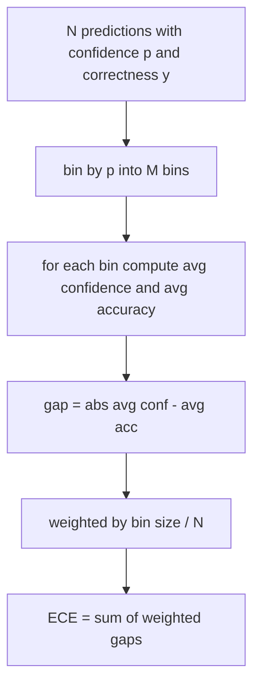
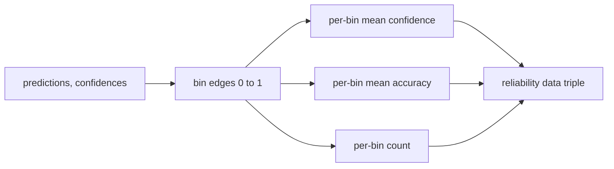

<!-- i18n:manual -->
# Перплексия и калибровка

> Если модель на тысяче ответов говорит «уверена на 90 процентов», а угадывает шестьсот, то откалибрована она плохо. Калибровка — половина честной оценки. Вторая половина — перплексия (perplexity): она говорит, считает ли модель отложенный текст вообще правдоподобным.

**Type:** Build
**Languages:** Python
**Prerequisites:** Phase 19 Track B foundations, lessons 70 and 71
**Time:** ~90 min

## Learning objectives

- Считать перплексию на уровне токенов по отложенному корпусу, беря отрицательные логарифмы вероятностей токенов у адаптера модели.
- Считать expected calibration error (ECE) для классификатора или eval с выбором ответа по предсказанным вероятностям, разложенным по корзинам.
- Считать Brier score (среднеквадратичную ошибку относительно индикатора правильности) и объяснять, когда он показывает то, чего не показывает ECE.
- Готовить данные для reliability diagram — кривой «уверенность против точности».
- Встроить все три числа в eval harness, чтобы раннер мог приложить `perplexity`, `ece` и `brier` к отчёту по модели.

```figure
cd-reliability-diagram
```

> 🎒 **На пальцах.** Калибровка — это про честность прогноза, а не про его правильность. Синоптик, который сто раз сказал «дождь с вероятностью 90%», должен получить примерно 90 дождливых дней; если их 60, он врёт про свою уверенность. Ровно это и есть пример из эпиграфа: 90% уверенности при 600 попаданиях из 1000 — разрыв в 30 пунктов.

## What perplexity tells you

Перплексия — это экспонента от среднего отрицательного логарифма правдоподобия на токен. Меньше — лучше. Перплексия, равная единице, означает, что модель даёт вероятность 1 каждому реальному токену. Перплексия, равная размеру словаря, означает, что модель равномерна и не выучила ничего. Реальные числа лежат между: сильная базовая модель 2026 года на WikiText-103 держится в районе восьми-двенадцати. Плохая на том же тексте — за пятьдесят.

Harness не считает логарифмы вероятностей сам. Они приходят от адаптера модели. Harness только агрегирует: берёт список логарифмов вероятностей по токенам, список числа токенов в каждой последовательности и возвращает перплексию по корпусу.

```python
def perplexity(neg_log_probs, token_counts):
    total_nll = sum(neg_log_probs)
    total_tokens = sum(token_counts)
    return math.exp(total_nll / total_tokens)
```

> 🎒 **На пальцах.** Перплексия — это «из скольких вариантов модель как будто выбирает на каждом шаге». Восьмёрка значит, что модель мечется примерно между восемью словами, пятьдесят — между полусотней. Разрыв между хорошей моделью (8-12) и плохой (50+) — это в четыре-шесть раз больше неопределённости на каждом токене.

Реализация обрабатывает случай нулевого числа токенов и проверяет, что отрицательные логарифмы вероятностей неотрицательны. Частая ошибка — забыть минус: адаптер, который возвращает `log p` вместо `-log p`, даёт перплексию меньше единицы, а это невозможно. Функция ловит это как нарушение контракта.

> 🎒 **На пальцах.** Проверка на минус спасает больше отладочных часов, чем кажется. Вероятность всегда не больше 1, значит `log p` всегда не больше нуля, а `-log p` — не меньше нуля. Если у вас на выходе перплексия 0,7, вы не обучили гениальную модель, вы просто потеряли знак.

## What ECE measures

Expected calibration error раскладывает предсказания по уверенности в фиксированное число корзин, а потом меряет средний разрыв между уверенностью и точностью по корзинам, взвешивая по размеру корзины.



Стандартная формулировка использует десять корзин равной ширины на `[0, 1]`. Реализация поддерживает любое положительное целое число. Мы выносим параметр `bins` наружу, чтобы раннер мог выбирать между конвенцией для публикации (10) и конвенцией для сравнений (15).

> 🎒 **На пальцах.** Представьте, что вы раскладываете ответы по десяти ящикам: «уверенность 0-10%», «10-20%» и так далее. В ящике «80-90%» лежит 200 ответов, средняя уверенность 0,85, а верных 150, то есть точность 0,75. Разрыв 0,10, и он войдёт в ECE с весом 200 делить на общее число ответов.

ECE смещён из-за числа корзин и размера выборки. С десятью корзинами и сотней предсказаний вы не отличите ECE 0,02 от случайного шума. Реализация возвращает вместе с ECE ещё и число непустых корзин, чтобы раннер мог отказаться выдавать одно число на слишком маленькой выборке.

> 🎒 **На пальцах.** Сто предсказаний на десять корзин — это в среднем по десять штук в каждой, и точность внутри корзины скачет шагом 0,1 просто от одного изменившегося ответа. Поэтому число `populated_bins` важнее, чем кажется: если непустых корзин три, ваш красивый ECE 0,02 посчитан почти ни по чему.

## What Brier score does that ECE does not

ECE волнует только средний разрыв. Модель, которая переоценивает себя в половине корзин и недооценивает в другой половине, может иметь низкий ECE и при этом быть откалиброванной отвратительно на местах. Brier score меряет квадрат ошибки относительно истинного исхода на каждом предсказании, поэтому он штрафует разброс напрямую.

Для бинарных исходов Brier — это `mean((p_i - y_i)^2)`. Он раскладывается на reliability, resolution и uncertainty. Мы считаем и сам балл, и разложение. Раннер выводит скаляр, а разложение пишет в лог для дашборда.

```python
def brier(p, y):
    return float(np.mean((p - y) ** 2))
```

> 🎒 **На пальцах.** Вот как ECE обманывается: в одной корзине модель завысила уверенность на 0,2, в другой занизила на 0,2. Средний разрыв по модулю ECE посчитает честно, но если кто-то сложит ошибки со знаком, они взаимно уничтожатся и получится ноль. Brier так не умеет: он возводит каждую ошибку в квадрат, поэтому 0,2 и −0,2 обе дают по 0,04 и складываются.

## Reliability diagram data

Reliability diagram рисует предсказанную уверенность против эмпирической точности в каждой корзине. Диагональ — идеальная калибровка. Функция возвращает три массива: средняя уверенность в корзине, средняя точность в корзине и число элементов в корзине. Код отрисовки живёт дальше по конвейеру, а этот урок заканчивается на форме данных.



Возвращаемый кортеж — это ровно то, что нужно вызывающему слою, чтобы нарисовать график или посчитать свой вариант ECE (adaptive ECE, sweep ECE и прочие). Мы возвращаем массивы numpy, чтобы код ниже не занимался конвертацией.

> 🎒 **На пальцах.** Диаграмма читается за секунду: точка выше диагонали — модель скромничает, ниже — хвастается. Если в корзине «уверенность 0,9» реальная точность 0,7, точка провалилась на 0,2 ниже диагонали, и это та самая переуверенность. Три массива — уверенность, точность и счётчик — это и есть координаты x, y и размер точки.

## Confidence sources

Harness не предполагает, что уверенность приходит из softmax. Он принимает любое число в `[0, 1]` на каждое предсказание. Для задач с выбором ответа естественная уверенность — это `softmax over option log-likelihoods`. Для свободного текста естественная уверенность — самооценённая вероятность модели или экспонента от среднего логарифма правдоподобия. Eval просто потребляет число. Откуда оно взялось — забота адаптера.

> 🎒 **На пальцах.** Это как принимать оценку от любого учителя, лишь бы она была по пятибалльной шкале: harness не спрашивает, как вы её вывели. Для теста с четырьмя вариантами уверенность берут из softmax по логарифмам правдоподобия вариантов, для свободного текста — из средней вероятности сгенерированных токенов. Число разное по природе, а контракт один: `[0, 1]`.

## Edge cases

- Все предсказания неверны: ECE равен средней уверенности, Brier высокий, а перплексия — это просто то, что модель думает про текст.
- Все предсказания верны при высокой уверенности: ECE около нуля, Brier около нуля.
- Идеально неуверенный предсказатель при p=0.5: ECE — это 0,5 минус точность, Brier — 0,25 минус поправочный член.
- Пустой вход: ECE, Brier и reliability возвращают `0.0` (или массивы из нулей). Перплексия для случая с нулём токенов возвращает `NaN`. Ни один из этих путей не печатает предупреждение; раннер сам смотрит на значения и решает, выводить их или пропустить.

Эти случаи зашиты в тесты. Настоящая модель на настоящем бенчмарке в них не попадёт, а вот кривой адаптер или крошечная выборка попадут, и раннер не должен от этого падать.

> 🎒 **На пальцах.** Разберём строчку про p=0.5. Модель на каждый вопрос говорит «уверена на 50%», а угадывает 30% — значит ECE = 0,5 − 0,3 = 0,2. Brier же для постоянных 0,5 равен 0,25 всегда, независимо от точности: (0,5 − 1)² и (0,5 − 0)² обе дают 0,25. Именно поэтому две метрики держат рядом.

## Dispatch

Калибровка — не метрика на задачу, как F1. Это отчёт на модель. Раннер копит пары `(confidence, correct)` по всему eval и считает ECE, Brier и данные для reliability один раз. Перплексия считается по отложенному текстовому корпусу, отдельно от позадачного оценивания.

Интерфейс такой:

```python
report = CalibrationReport.from_predictions(confidences, correct)
report.ece          # float
report.brier        # float
report.reliability  # tuple of three numpy arrays
report.populated_bins  # int
```

`PerplexityResult.from_token_nll(neg_log_probs, token_counts)` возвращает перплексию и средний отрицательный логарифм правдоподобия на токен.

> 🎒 **На пальцах.** Разница как между оценкой за контрольную и характеристикой ученика за год. F1 считается на каждой задаче отдельно, а калибровка имеет смысл только на всей пачке: по одному ответу нельзя сказать, завышает человек свою уверенность или нет. Поэтому буфер пар `(confidence, correct)` копится через весь прогон и схлопывается в числа один раз в конце.

## What this lesson does not do

Он не вызывает модель. Он не реализует softmax. Он не оценивает уверенность по выходным токенам — это работа адаптера. Он не делает temperature scaling или Platt scaling: это постфактумные починки, и живут они в другом уроке. Смысл этого урока — сделать три числа (перплексия, ECE, Brier) заслуживающими доверия и воспроизводимыми.

> 🎒 **На пальцах.** Temperature scaling — это как поделить все уверенности модели на общий коэффициент, чтобы они перестали быть завышенными: было 0,95, стало 0,8. Штука полезная, но пока вы не умеете честно измерять ECE, вы не поймёте, помогла она или нет. Сначала градусник, потом лечение.

## How to read the code

`main.py` определяет `perplexity`, `expected_calibration_error`, `brier_score`, `reliability_diagram` и датаклассы `CalibrationReport` / `PerplexityResult`. Демо гоняется на синтетических предсказаниях, где истина известна: хорошо откалиброванная модель, переуверенная и недоуверенная. Тесты в `code/tests/test_calibration.py` фиксируют каждый граничный случай плюс эталонные значения для синтетических предсказателей.

Читайте `main.py` сверху вниз. Порядок функций идёт от скаляра к вектору и дальше к отчёту. У каждой функции короткий docstring с математикой и контрактом.

> 🎒 **На пальцах.** Три синтетические модели в демо — это ваш эталонный термометр. У откалиброванной ECE будет около нуля, у переуверенной — заметно больше нуля при высокой средней уверенности, у недоуверенной — тоже больше нуля, но с точностью выше заявленной. Если ваш код даёт что-то другое на этих трёх, ошибка в коде, а не в модели.

## Going further

Калибровка — самая игнорируемая ось в публикуемых evals. Большинство лидербордов выводит одно число точности и на этом останавливается. Модель, которая выигрывает по точности и проигрывает по Brier, в продакшене хуже модели, которая набрала на пару пунктов меньше, но честно сообщает о своей неуверенности. Как только обвязка для калибровки готова, добавьте temperature scaling на отложенном валидационном срезе, пересчитайте ECE и посмотрите, как разрыв сжимается. Это отдельный урок, но фундамент лежит здесь.

> 🎒 **На пальцах.** Почему честная неуверенность стоит нескольких пунктов точности: система с точностью 0,80 и хорошей калибровкой умеет сказать «тут я не уверена» и передать вопрос человеку, а система с 0,83 и плохой калибровкой уверенно ошибается. На тысяче запросов первая отдаст людям, скажем, двести спорных и ошибётся почти только в них, вторая раскидает свои 170 ошибок незаметно по всему потоку.
