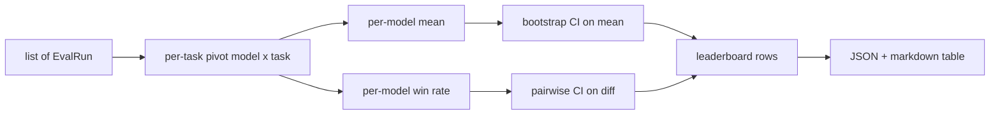
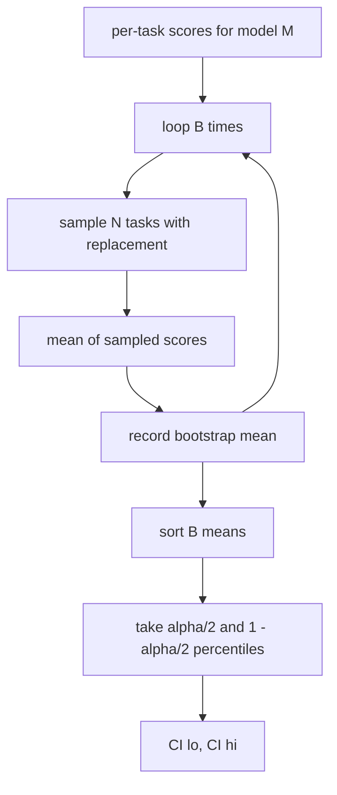

<!-- i18n:manual -->
# Агрегация лидерборда

> Баллы по одной задаче — это легко. Ранжирование моделей по разнородным задачам — уже сложнее. А статистическую значимость на лидерборде из тысячи предсказаний пропускают вообще все. Этот урок её не пропускает.

**Type:** Build
**Languages:** Python
**Prerequisites:** Phase 19 Track B foundations, lessons 70, 71, 73
**Time:** ~90 min

## Learning objectives

- Агрегировать позадачные баллы по нескольким моделям и нескольким задачам в аккуратную строку на модель.
- Нормировать разнородные баллы, чтобы pass rate и значения BLEU не перетягивали агрегат на себя.
- Ранжировать модели по среднему и по win-rate и объяснять, когда какая сводка уместна.
- Считать бутстрап-доверительные интервалы для среднего балла модели и для попарных разностей.
- Выдавать лидерборд как JSON-отчёт и как markdown-таблицу, которую раннер из урока 75 вставит в комментарий CI.

```figure
ci-leaderboard-ci
```

> 🎒 **На пальцах.** Лидерборд без доверительных интервалов — это турнирная таблица, где не написано, сколько матчей сыграно. Модель со средним 0,78 и модель со средним 0,75 выглядят как первое и второе место, но если интервалы у них 0,74-0,82 и 0,71-0,79, то они пересекаются больше чем наполовину, и порядок мест — вопрос везения.

## The shape of input

Агрегатор потребляет список записей `EvalRun`:

```python
@dataclass
class EvalRun:
    model_id: str
    task_id: str
    metric_name: str
    score: float          # in [0, 1]
    category: str
```

Раннер из урока 75 выдаёт по одной записи на каждую пару `(model, task)`. Агрегатору всё равно, как был получен балл. Он рассчитывает, что нормировка уже произошла: каждый балл лежит в `[0, 1]`.

> 🎒 **На пальцах.** Пять полей — это минимум, по которому можно собрать любую сводку: кто отвечал, на какой задаче, какой метрикой мерили, сколько получилось и к какой категории задача относится. Три модели на двенадцати задачах дадут 36 таких записей — плоский список, который потом разворачивается в таблицу.

## The output

На выходе три таблицы:



Строка лидерборда содержит: `model_id`, `mean_score`, `mean_ci_lo`, `mean_ci_hi`, `win_rate`, `tasks_completed` и необязательную карту `categories` со средним по категориям.

> 🎒 **На пальцах.** Проследите схему слева направо: плоский список записей сначала разворачивается в сводную таблицу «модель × задача», и уже из неё растут две ветки — среднее и win-rate. Каждая ветка получает свой бутстрап, и обе сходятся в одни и те же строки лидерборда. Так одно и то же исходное число попадает в отчёт двумя разными способами.

## Normalisation

Если одна задача даёт баллы в `[0, 1]`, а другая в `[0, 100]`, вторая молча задавит среднее. Агрегатор проверяет, что каждый входящий балл лежит в `[0, 1]`, и иначе отказывается принимать прогон. Чинить это надо выше по конвейеру: метрика должна сразу возвращать долю. Уроки с 71 по 73 закрепляют этот контракт.

> 🎒 **На пальцах.** Посчитайте, что будет без проверки. Задача A даёт 0,9, задача B даёт 90 по стобалльной шкале — среднее выйдет 45,45, и это число вообще ни о чём. Хуже того, оно почти целиком определяется задачей B: подвинь её на один пункт, и среднее прыгнет на 0,5, тогда как задача A может меняться от 0 до 1 и сдвинет всего на 0,5 тоже. Одна задача весит как сто.

## Mean and win-rate

Две схемы ранжирования служат разным целям.

Средний балл — это среднее позадачных баллов одной модели. Именно его лидерборды выносят в заголовок. Он чувствителен к выбросам и к перекосу в составе задач.

Win-rate считает, как часто модель обыгрывает все остальные модели на одной и той же задаче. На каждой задаче побеждает модель с наибольшим баллом (ничьи делятся). Win-rate равен числу побед, делённому на число задач, где у модели есть балл. Он менее чувствителен к выбросам и к разнице масштабов, но теряет информацию.

```python
def win_rate(model_id, runs_by_task, all_models):
    wins, total = 0, 0
    for task_id, runs in runs_by_task.items():
        scores = {r.model_id: r.score for r in runs if r.model_id in all_models}
        if model_id not in scores:
            continue
        total += 1
        best = max(scores.values())
        if scores[model_id] >= best:
            wins += 1
    return wins / total if total else 0.0
```

> 🎒 **На пальцах.** Разница видна на примере. Пусть на девяти задачах модель A выигрывает на волосок, а на десятой проваливается с 0,9 до 0,1. Win-rate у неё 0,9 — почти идеально, а среднее просядет примерно на 0,08 и может уступить сопернице. Что «правильнее», зависит от вас: если один провал в продакшене стоит дорого, смотрите на среднее; если важно быть лучшим чаще всех, смотрите на win-rate.

Harness выводит оба числа. Раннер из урока 75 по умолчанию ранжирует по среднему, а колонка win-rate в markdown уже стоит рядом на случай, если пользователю ближе она.

> 🎒 **На пальцах.** Обратите внимание на строчку `if scores[model_id] >= best` — знак «больше либо равно» означает, что при ничьей победу засчитывают всем участникам ничьей. Поэтому сумма win-rate по всем моделям может оказаться больше единицы: если три модели на задаче набрали одинаковые 0,5, победа достанется всем трём.

## Bootstrap confidence intervals

Средние по моделям идут вместе с доверительным интервалом, оценённым бутстрап-пересэмплированием по задачам. Мы берём идентификаторы задач с возвращением, считаем среднее по полученному набору, повторяем `B` раз и берём процентильный интервал на уровне `alpha`.



> 🎒 **На пальцах.** Бутстрап — это способ спросить «а что было бы, попадись мне другой набор задач», не собирая новый набор. Из ваших 12 задач вы 1000 раз тянете 12 штук с возвращением (какие-то попадут дважды, какие-то ни разу), каждый раз считаете среднее, сортируете эту тысячу и отрезаете по 2,5% с краёв. Остаток от 25-го до 975-го значения и есть 95-процентный интервал.

Для попарных сравнений мы бутстрапим позадачную разность `score_A - score_B`, берём процентильный интервал и выводим его. Пользователь смотрит, исключает ли интервал ноль. Если исключает, разница значима на уровне alpha. Если нет, лидерборд считает модели равными.

> 🎒 **На пальцах.** «Интервал исключает ноль» звучит заумно, а проверяется глазами. Интервал [0,02; 0,09] весь справа от нуля — модель A действительно лучше. Интервал [−0,03; 0,07] содержит ноль — значит бывали пересэмплы, где выигрывала B, и объявлять победителя рано.

Низкоуровневые помощники (`bootstrap_mean_ci`, `bootstrap_pairwise_diff`) по умолчанию берут `B=1000`; публичные агрегаторы (`aggregate`, `pairwise_diffs`) по умолчанию берут `b=500`, чтобы демо и тесты оставались быстрыми. Alpha по умолчанию 0,05. Урок держит бутстрап на чистом numpy, без scipy.

## Categories

Если поле `EvalRun.category` заполнено, агрегатор дополнительно выводит среднее по категориям. Это та самая колонка на каждом лидерборде, где написано `math`, `reasoning`, `code`, `safety`. Она позволяет раннеру заметить, что модель хороша в целом, но слаба в коде, — а заголовочное среднее это скрывает.

> 🎒 **На пальцах.** Это как средний балл аттестата против оценок по предметам: 4,5 в среднем может означать пятёрки везде и тройку по математике. Если из двенадцати задач четыре про код и модель проваливает их все, общее среднее упадёт всего на треть от размера провала, а в разбивке по категориям вы увидите ноль напротив `code` сразу.

## Markdown rendering

Лидерборд рендерится как markdown-таблица:

```text
| Rank | Model | Mean | 95% CI | Win rate | Tasks |
|------|-------|------|--------|----------|-------|
| 1    | gpt   | 0.78 | 0.74-0.82 | 0.62 | 50 |
| 2    | claude| 0.75 | 0.71-0.79 | 0.34 | 50 |
| 3    | random| 0.10 | 0.07-0.13 | 0.04 | 50 |
```

Таблица отсортирована по среднему баллу. Доверительный интервал рендерится до двух знаков после запятой. Длинные идентификаторы моделей обрезаются до двадцати символов.

> 🎒 **На пальцах.** Посмотрите на строчки выше: gpt 0,78 и claude 0,75 стоят первым и вторым, но их интервалы 0,74-0,82 и 0,71-0,79 перекрываются, то есть разрыв недостоверен. А вот random с 0,10 и интервалом 0,07-0,13 отстал по-настоящему — его интервал не касается чужих. Один и тот же столбец CI разом отвечает на оба вопроса.

## What this lesson does not do

Он не запускает модели. Он не вызывает слой метрик. Он не реализует adaptive ECE и другие варианты калибровки — это урок 73. Он не реализует взвешивание задач. Здесь каждая задача весит одинаково. Продакшен-лидерборды взвешивают задачи; мы оставляем крючок в виде поля `weight`, но в агрегаторе его игнорируем. Если вам нужно взвешивание, добавьте его следующим уроком.

> 🎒 **На пальцах.** Равный вес — это осознанное упрощение, а не забывчивость. Если в наборе восемь задач по математике и две по безопасности, то математика заранее решает 80% итогового балла, хотя провал по безопасности вам дороже. Поле `weight` уже лежит в структуре именно для того дня, когда вы решите это чинить.

## How to read the code

`main.py` определяет `EvalRun`, `LeaderboardRow`, `aggregate`, `bootstrap_mean_ci`, `bootstrap_pairwise_diff` и `render_markdown`. Демо собирает синтетический набор из трёх моделей и двенадцати задач, агрегирует его и печатает лидерборд плюс таблицу попарных разностей. Тесты в `code/tests/test_leaderboard.py` фиксируют бутстрап, рендеринг markdown, граничные случаи win-rate и поведение на пустом входе.

Читайте `main.py` сверху вниз. Сначала идут структуры данных (EvalRun, LeaderboardRow), потом агрегатор, третьим бутстрап, последним рендеринг. У каждой функции узкий контракт.

> 🎒 **На пальцах.** Порядок чтения повторяет путь одного числа: балл рождается в `EvalRun`, попадает в `aggregate`, обрастает интервалом в `bootstrap_mean_ci` и заканчивает жизнь ячейкой markdown-таблицы. Если что-то в отчёте выглядит странно, идите по этой же цепочке в обратную сторону — сломанное звено найдётся за четыре шага.

## Going further

Естественный следующий шаг — парная проверка значимости вместо непарного бутстрапа. Если модели A и B обе прогнались на одних и тех же ста задачах, правильный тест — парный бутстрап по позадачным разностям, и мы его реализуем. Дальше вам понадобится иерархический бутстрап, который уважает семейства задач (задачи по математике не независимы друг от друга: одна ошибка в арифметике портит сразу десяток). Это на потом. Смысл этого урока — заложить фундамент так, чтобы eval выдавал число, которое вы сможете защитить.

> 🎒 **На пальцах.** Разница между парным и непарным бутстрапом такая же, как между «сравнить средние двух классов» и «сравнить каждого ученика с самим собой до и после». Если обе модели решали ровно те же сто задач, вы знаете разность на каждой задаче, и это гораздо более точный сигнал: общий шум сложности задач вычитается сам. Непарный бутстрап эту информацию выбрасывает.
