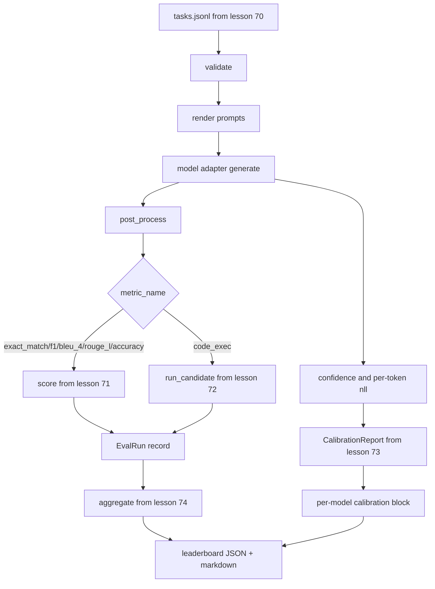

<!-- i18n:manual -->
# Сквозной eval-раннер

> Пять уроков обвязки и один урок, чтобы всё склеить. Раннер читает спецификацию задач из урока 70, зовёт модель через адаптер, оценивает уроками 71 и 72, прикладывает отчёт о калибровке из урока 73 и выдаёт лидерборд из урока 74. Демо завершается само.

**Type:** Build
**Languages:** Python
**Prerequisites:** Phase 19 Track B foundations, lessons 70 through 74
**Time:** ~90 min

## Learning objectives

- Определить интерфейс `ModelAdapter`, которому небольшим набором методов удовлетворит любая модель — мок, локальная или через API.
- Прогонять eval по файлу-фикстуре JSONL, выполняя задачи параллельно на пуле воркеров.
- Соединить слой метрик (exact_match, F1, BLEU-4, ROUGE-L, code_exec) со слоем калибровки за один проход.
- Выдавать записи `EvalRun` по каждой модели и подавать их прямо в агрегатор лидерборда.
- Печатать и JSON-отчёт, и markdown-таблицу; завершаться самому с кодом ноль при чистом прогоне и с ненулевым — при ошибке валидации или выполнения.

```figure
eval-grid
```

> 🎒 **На пальцах.** Этот урок — как финальная сборка автомобиля: двигатель, тормоза и приборная панель уже собраны в предыдущих цехах, здесь их только соединяют. Отсюда и правило раннера: он ничего не считает сам, а импортирует пять готовых модулей. Если вам захотелось скопировать сюда формулу F1 — вы сворачиваете не туда.

## The pipeline



Раннер — точка интеграции. Каждый урок с 70 по 74 владеет одним модулем, который раннер соединяет с остальными. Раннер не дублирует логику этих модулей: он их импортирует.

> 🎒 **На пальцах.** На схеме видно развилку `metric_name`: обычные метрики уходят в код из урока 71, а задачи с исполнением кода — в песочницу из урока 72. Обе ветки сходятся обратно в одну запись `EvalRun`. Заодно от вызова модели отходит вторая линия — уверенность и логарифмы правдоподобия по токенам, — и она идёт мимо метрик прямо в отчёт о калибровке.

## The adapter interface

Адаптер — это шов между раннером и любой моделью. Интерфейс намеренно маленький.

```python
class ModelAdapter:
    model_id: str

    def generate(self, prompt: str, task: TaskSpec) -> Generation: ...
```

`Generation` — это датакласс со следующими полями:

- `text`: свободный текстовый выход модели
- `confidence`: число с плавающей точкой в `[0, 1]`, самооценённая вероятность модели для этого ответа
- `token_nll`: необязательная сумма отрицательных логарифмов правдоподобия по сгенерированным токенам
- `token_count`: необязательное число сгенерированных токенов

> 🎒 **На пальцах.** Одно поле `model_id` и один метод `generate` — вот и весь контракт. Это как розетка: чайнику всё равно, откуда электричество, лишь бы вилка подошла. Именно поэтому мок, локальная модель и платный API подключаются к раннеру одинаково, и переезд с одного на другой не трогает ни метрики, ни лидерборд.

Моки-адаптеры в раннере бывают трёх сортов: `RuleBasedAdapter` (детерминированный, почти безошибочный), `NoisyAdapter` (переуверенный, часто неправ) и `BiasedAdapter` (хорош в одной категории, ужасен в другой). Демо гоняет все три по фикстуре из урока 70.

> 🎒 **На пальцах.** Три мока — это ваш набор эталонных гирь для проверки весов. Если лидерборд не поставил `RuleBasedAdapter` заметно выше `NoisyAdapter`, сломан лидерборд, а не модель. А `BiasedAdapter` проверяет разбивку по категориям: у него общее среднее должно выглядеть средненько, а в разрезе по категориям — резкий контраст между сильной и слабой.

## Parallel execution

Раннер использует `concurrent.futures.ThreadPoolExecutor`, чтобы гонять задачи параллельно для каждой модели. Число воркеров по умолчанию — меньшее из восьми и числа задач. Потоков хватает, потому что узкое место при настоящих вызовах модели — сетевой ввод-вывод. Путь с исполнением кода порождает свой подпроцесс внутри задачи, а исполнитель только планирует ожидание.

> 🎒 **На пальцах.** Потоки в Python не ускоряют вычисления, но прекрасно ускоряют ожидание. Вызов API длится секунду, из которой 99% — ожидание ответа сети, поэтому восемь потоков превращают 10 задач по секунде примерно в две секунды вместо десяти. Если бы задачи были счётными, GIL всё бы испортил и понадобились бы процессы.

Для детерминированных тестов раннер выставляет наружу `run_eval(adapters, tasks, parallel=False)`, чтобы тесты могли зафиксировать порядок выполнения.

> 🎒 **На пальцах.** Параллельность и воспроизводимость дружат плохо: при восьми потоках порядок записей в отчёте меняется от запуска к запуску, и тест начинает мигать. Флаг `parallel=False` даёт тестам ровно тот же результат по числам, но в предсказуемом порядке. В продакшене вы его не трогаете — он существует ради тестов.

## The single-pass scoring loop

Для каждой задачи:

1. Отрендерить промпт (few-shot префикс плюс тело промпта).
2. Вызвать адаптер и замерить время вызова.
3. Постобработать генерацию по правилу задачи.
4. Отправить результат в слой метрик.
5. Собрать запись `EvalRun` с баллом и метаданными метрики.
6. Дописать пару `(confidence, correct)` в буфер калибровки.

Сигнал `correct` — это `score >= 1.0` для метрик в духе exact_match (`exact_match`, `accuracy`, `code_exec`) и `score >= 0.5` для метрик с частичным зачётом. Порог живёт в `_correct_from_score`, и раннер не даёт публичного способа его переопределить.

> 🎒 **На пальцах.** «За один проход» значит, что модель дёргают ровно один раз на задачу, а её ответ обслуживает сразу двух потребителей: метрику и калибровку. Второй вызов ради калибровки удвоил бы счёт за токены и при этом дал бы другой ответ. Отсюда и шаг 6 в списке — не отдельный прогон, а строчка в буфер.

> 🎒 **На пальцах.** Два порога не прихоть. У exact_match балл бывает только 0 или 1, поэтому «верно» — это ровно 1,0. А у ROUGE-L балл непрерывный, и ответ с 0,6 — это уже в основном правильный текст, поэтому граница 0,5. Если бы порог был один на всех, все задачи с частичным зачётом считались бы провалом и калибровка поехала бы.

## Aggregation

После того как у каждой задачи есть результат, раннер вызывает `aggregate` и `pairwise_diffs` из урока 74 и `CalibrationReport.from_predictions` из урока 73. На выходе один JSON-конверт:

```json
{
  "leaderboard": [...],
  "pairwise": [...],
  "calibration": {
    "model_id_a": {"ece": 0.04, "brier": 0.10, "populated_bins": 8, ...},
    ...
  },
  "summary": {
    "tasks": 10,
    "models": 3,
    "wall_seconds": 1.2
  }
}
```

Ещё раннер печатает markdown-таблицу в stdout, чтобы пользователь мог вставить результат в ревью пул-реквеста.

> 🎒 **На пальцах.** Один конверт вместо четырёх файлов — это чтобы результат прогона нельзя было раскомплектовать. В нём лидерборд, попарные разности, калибровка по каждой модели и сводка: 10 задач, 3 модели, 1,2 секунды. Такой JSON можно положить в артефакты CI и через месяц сравнить с новым — все числа одного прогона лежат вместе и относятся к одному моменту.

## Self-terminating demo

Демо гоняет три мок-адаптера по десяти задачам-фикстурам из урока 70. Время по часам должно уложиться в десять секунд. Код возврата при чистом прогоне — ноль.

Критерии чистого прогона такие:

- Каждая задача прошла валидацию по уроку 70.
- Каждая задача оценена по урокам 71 и 72.
- Отчёт о калибровке собран по уроку 73 без ошибок.
- Лидерборд поставил адаптер на правилах строго выше случайного адаптера.

Если что-то из этого ломается, раннер завершается с ненулевым кодом и структурированной ошибкой в JSON-конверте.

> 🎒 **На пальцах.** Последний критерий — самопроверка всей цепочки одним движением. Мы точно знаем, что адаптер на правилах лучше случайного; если лидерборд этого не показал, значит сломан кто-то из пятерых участников, и выяснять надо до того, как вы поверите числам по настоящей модели. Это как проверить весы гирей в килограмм перед взвешиванием.

> 🎒 **На пальцах.** «Завершается само» и «ненулевой код возврата» — это про CI, а не про красоту. Оболочка смотрит только на код: ноль — галочка зелёная, не ноль — сборка красная. Поэтому раннер обязан упасть громко, а не напечатать предупреждение и выйти с нулём, иначе сломанный eval месяцами будет выглядеть здоровым.

## What this lesson does not do

Он не вызывает настоящую модель. Он не реализует работу с API-ключами и обработку rate limit. Он не реализует стриминг и частичную генерацию: адаптер возвращает одну генерацию на вызов. Он не делает ретраи и кэширование. Эти заботы живут на уровне адаптера; раннер не знает ни про метрики, ни про провайдеров.

> 🎒 **На пальцах.** Обратите внимание, куда именно сложены все «взрослые» проблемы: ретраи, ключи, лимиты запросов — всё за адаптером. Это значит, что подключение второго провайдера не заставит вас трогать ни строчки в метриках или лидерборде. Граница проведена один раз и держит всю остальную систему простой.

## How to read the code

`main.py` — это интеграция. Он импортирует из пяти модулей других уроков через маленький помощник `_load_sibling`, который находит их по относительному пути. Датаклассы `Generation`, `EvalReport` и `ModelAdapter` определены здесь же. Моки-адаптеры лежат в самом низу файла.

Читайте `main.py` сверху вниз. Пробегите импорты, потом посмотрите `run_eval`, потом `_score_one`, потом адаптеры. Демо в конце — это точка входа.

Тесты в `code/tests/test_runner.py` фиксируют интерфейс адаптера, однопроходный цикл, эквивалентность параллельного и последовательного режимов, буфер калибровки и форму JSON-конверта.

> 🎒 **На пальцах.** Самый ценный тест здесь — про эквивалентность параллельного и последовательного режимов. Он прогоняет один и тот же набор дважды и требует одинаковых чисел: если они разошлись, значит потоки где-то делят общее состояние и портят его. Такой баг иначе ловится месяцами, потому что проявляется раз в двадцать запусков.

## Going further

Этот раннер — фундамент. Продакшен-система оценки добавляет к нему: кэш результатов по ключу `(task_id, model_id, model_version)`, книгу расходов, которая считает доллары и токены на прогон, слой ретраев с отступом при упирании в rate limit, политику сэмплирования для задач с pass-at-k и потоковый формат вывода для длинных наборов. Каждая из этих вещей — одна отдельная забота, которая оборачивает раннер, не меняя слои метрик и агрегации. Ради этого разделения контракт и придуман.

Добавьте адаптер настоящего провайдера после того, как заработают моки. Возьмите провайдера с бесплатным тарифом, напишите тридцать строк склейки и посмотрите, как оживёт лидерборд. Потом добавьте второго провайдера и дайте harness работать самому.

> 🎒 **На пальцах.** Кэш из этого списка окупается первым. Прогон по 500 задачам на трёх моделях — это 1500 вызовов, и если вы поменяли одну метрику, платить за них заново незачем: ключ `(task_id, model_id, model_version)` вернёт вчерашние ответы бесплатно. Дальше по пользе идёт книга расходов — без неё вы узнаете цену eval только из счёта в конце месяца.
