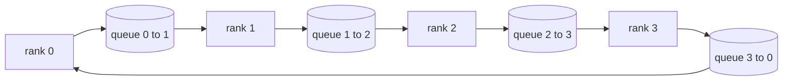

<!-- i18n:manual -->
# Коллективные операции с нуля

> Распределённое обучение держится на четырёх коллективных операциях: allreduce, broadcast, allgather и reduce_scatter. Любой другой примитив обучающего фреймворка — обёртка вокруг этих четырёх. Напишите их один раз поверх сетки из `multiprocessing.Queue`, сверьте с эталонной реализацией — и весь остальной трек превратится в сантехнику.

**Type:** Build
**Languages:** Python
**Prerequisites:** Phase 19 Track C lessons 42-49
**Time:** ~90 min

## Learning Objectives

- Реализовать ring allreduce в два прохода (сначала reduce-scatter, потом allgather) и доказать, что объём обмена на ранг равен 2(N-1)/N байт на элемент.
- Построить broadcast, allgather и reduce_scatter поверх точка-точка отправок через `multiprocessing.Queue`.
- Сверить каждый примитив с эталоном `torch.distributed` на бэкенде gloo при том же входе.
- Обосновать выбор между кольцом и деревом исходя из формы кластера, пола по задержке и потолка по пропускной способности.

## The Problem

Наивный allreduce на N рангах шлёт тензор N раз в корень и N раз рассылает обратно. Трафик на ранг растёт как O(N), корень становится бутылочным горлышком, а нижняя граница по времени — самый медленный канал, умноженный на N. Ring allreduce размазывает это на 2(N-1) шагов кусками размера T/N, и байты на ранг падают до 2T(N-1)/N — независимо от размера кластера. Tree allreduce выигрывает при малом N и каналах с большой задержкой, потому что глубина там log2(N) прыжков вместо 2(N-1). Выберете топологию не под форму кластера — и время шага начнёт диктовать самая медленная GPU.

> 🎒 **На пальцах.** Наивная схема — это очередь в единственную кассу: чем больше народу, тем дольше стоит каждый. Возьмите тензор на 100 МБ и 4 ранга: корень принимает 400 МБ и столько же рассылает обратно, а кольцо гоняет по 2·100·3/4 = 150 МБ на ранг. Самое приятное — при 64 рангах кольцо даст 197 МБ, то есть почти столько же, а наивная схема — 6400 МБ.

Каждый фреймворк распределённого обучения, который вы встретите в этом треке, стоит на этих четырёх примитивах. PyTorch DDP синхронизирует градиенты одним allreduce на каждый бакет параметров. ZeRO шардирует состояние оптимизатора через reduce_scatter и рассылает обновлённые параметры через allgather. FSDP превращает полный прямой проход в allgather плюс reduce_scatter. Pipeline parallel нужен broadcast активаций между группами стадий. Если вы не умеете реализовать четыре коллективные операции, вы не сможете рассуждать о том, почему обучение встало, почему расхождение градиентов вылезло именно на ранге 3 и почему пузырь в конвейере удвоился после смены топологии.

> 🎒 **На пальцах.** Эти четыре операции — как четыре арифметических действия: выучив их, вы читаете любой фреймворк, а не заучиваете каждый заново. Обратите внимание на пример с рангом 3 из абзаца выше: расхождение градиента вылезает на конкретном ранге именно потому, что коллективная операция — единственное место, где ранги вообще друг с другом разговаривают.

## The Concept



> 🎒 **На пальцах.** Схема — это карта односторонних дорог: у каждого ранга ровно один сосед справа, куда он шлёт, и один слева, откуда принимает. Четырём рангам нужно четыре очереди, а не двенадцать, как при связи каждого с каждым. При 64 рангах кольцу хватит 64 каналов, а полному графу понадобится 4032.

### Ring allreduce in two passes

Разрежьте тензор на N равных кусков с индексами 0..N-1. Каждый ранг владеет куском, чей индекс равен его рангу. Проход 1, reduce-scatter, идёт N-1 шагов. На шаге s ранг r отправляет кусок (r - s) mod N рангу (r + 1) mod N и принимает кусок (r - s - 1) mod N от ранга (r - 1) mod N, прибавляя принятый кусок к своей локальной копии. После N-1 шагов ранг r владеет полной суммой по куску r. Проход 2, allgather, идёт ещё N-1 шагов и прокручивает готовые куски по кольцу, пока у каждого ранга не окажется полная сумма по каждому куску.

> 🎒 **На пальцах.** Разберите на числах: N = 4, тензор из 8 элементов, значит четыре куска по 2 элемента. Первый проход — 3 шага, после них у ранга 0 лежит полная сумма по куску 0, у ранга 1 — по куску 1 и так далее. Второй проход — ещё 3 шага, и готовые куски просто едут по кругу, пока у всех не соберётся весь тензор. Итого 6 шагов, ровно 2(N-1).

| Primitive | Per-rank bytes | Steps | When to use |
|-----------|---------------|-------|-------------|
| Ring allreduce | 2T(N-1)/N | 2(N-1) | Большое T, однородный кластер с толстыми каналами |
| Tree allreduce | T log2(N) | 2 log2(N) | Маленькое T или каналы с большой задержкой |
| Broadcast | T | log2(N) tree | Инициализация параметров, скалярный конфиг |
| Allgather | T(N-1)/N | N-1 | Прямой проход по шардам, разворачивание в ZeRO |
| Reduce_scatter | T(N-1)/N | N-1 | Шардирование градиентов в ZeRO |

> 🎒 **На пальцах.** Таблица отвечает на один вопрос: что вам дороже — байты или прыжки. При N = 4 кольцо шлёт 1,5T, а дерево 2T, и кольцо впереди. При N = 16 кольцо шлёт 1,875T против 4T у дерева, но платит 30 шагами против 8. На мелких сообщениях эти 30 шагов и есть вся цена, поэтому там выигрывает дерево.

### Queue mesh as a stand-in for NCCL

NCCL работает поверх PCIe и NVLink, где редукция выгружена в железо. На CPU такого нет. Одна `multiprocessing.Queue` на каждое ребро кольца даёт вам упорядоченную доставку точка-точка с единственным писателем и единственным читателем. Редукция при этом считается в пользовательском коде, то есть вы платите накладными расходами Python, но рисунок обмена по проводу ровно тот же, что у ring allreduce в NCCL. Разберитесь с корректностью на версии с очередями — и поведение кластера будет следовать из неё.

> 🎒 **На пальцах.** `multiprocessing.Queue` — это труба между двумя процессами: один кладёт с одного конца, другой забирает с другого, и порядок не перепутается. Скорость смешная, зато рисунок обмена буква в букву совпадает с NCCL, а значит и все ошибки логики вылезут здесь же, на ноутбуке, а не на арендованных за деньги восьми GPU.

### Verify against gloo

Каждый примитив приезжает вместе с юнит-тестом, который сравнивает его выход с `torch.distributed`, поднятым на бэкенде gloo, на том же тензоре и при том же world size. Если ваш ring allreduce разошёлся с gloo больше, чем на epsilon float32, тест падает. Сверка с эталонной реализацией не обсуждается: без неё примитив выглядит корректным ровно до шага 10000 настоящего обучения.

> 🎒 **На пальцах.** Epsilon у float32 — примерно 1,2e-7, и именно с таким допуском вас сверяют с gloo. Соблазн пропустить эталон понятен: своя реализация «вроде считает». Но ошибка на один индекс в формуле (r - s - 1) mod N даёт правильную сумму при N = 2 и мусор при N = 4 — такое ловится только сравнением с чужой корректной реализацией.

```figure
ci-ring-allreduce
```

## Build It

`code/main.py` реализует:

- Класс `Mesh`, который сплетает N экземпляров `multiprocessing.Queue` в кольцо и даёт каждому рангу `send(dst, tensor)` и `recv(src)`.
- `ring_allreduce(mesh, rank, world_size, tensor)` — двухпроходный алгоритм.
- `broadcast(mesh, rank, world_size, tensor, src)` по логарифмическому дереву.
- `allgather(mesh, rank, world_size, tensor)` через N-1 прокруток.
- `reduce_scatter(mesh, rank, world_size, tensor)` — первая половина allreduce.
- `_gloo_reference(op, world_size, tensor)` — тот же вход, прогнанный через `torch.distributed` с gloo, для побайтового сравнения.

> 🎒 **На пальцах.** Заметьте, что `reduce_scatter` в списке — это буквально первая половина `ring_allreduce`, а `allgather` — вторая. Отсюда важное равенство, которое пригодится в уроке 78: allreduce = reduce_scatter + allgather. Шесть функций в списке — это на самом деле два независимых куска кода и четыре способа их скомбинировать.

Запустите:

```bash
python3 code/main.py
```

Вывод: таблица сверки по каждому примитиву, где рядом стоят результаты сетки на очередях и gloo, а следом — поранговый счётчик байт, который подтверждает масштабирование 2T(N-1)/N.

> 🎒 **На пальцах.** Счётчик байт нужен, чтобы формула перестала быть верой. Для 4 рангов и тензора на 1 МБ он обязан показать примерно 1,5 МБ на ранг: 2·1·3/4. Увидите 2 МБ — значит один из проходов гоняет полный тензор вместо куска T/N, и ошибку видно сразу, без всякой профилировки.

## Production patterns in the wild

Три приёма доводят примитивы до состояния, в котором их не стыдно отгружать.

**Bucket gradients before allreduce.** У модели на 1B параметров десятки тысяч тензоров градиентов. Один allreduce на тензор платит пол по задержке столько же раз. DDP собирает градиенты в бакеты примерно по 25 МБ и делает один allreduce на бакет; мелкие тензоры едут на спине крупных. Без бакетирования накладные расходы на задержку съедают шаг целиком.

> 🎒 **На пальцах.** Задержка платится за каждый вызов отдельно, независимо от размера посылки. У модели на 1B параметров в fp16 градиенты весят 2 ГБ; бакетами по 25 МБ это 80 вызовов вместо десятков тысяч. Это как отправлять 80 посылок вместо 30 000 конвертов: вес груза тот же, а на почту вы ходите в триста раз реже.

**Overlap communication with computation.** Обратный проход считает градиенты слой за слоем в обратном порядке. Как только готов градиент последнего слоя, запускайте для него allreduce, пока следующий слой продолжает считаться. PyTorch DDP делает это через хуки готовности бакета. Перекрытие вдвое сокращает видимое время обмена, когда в сети есть запас.

> 🎒 **На пальцах.** Перекрытие — это стиральная машина, которая крутится, пока вы моете посуду: общее время равно не сумме, а максимуму. Градиент последнего слоя готов раньше всех, поэтому его allreduce успевает пройти по проводу за то время, пока backward доползает до первого слоя. Если сеть не забита, видимое время обмена падает примерно вдвое.

**Pick ring or tree by message size, not religion.** В NCCL встроен детектор топологии: для сообщений больше примерно 1 МБ он берёт кольцо, для меньших — дерево. Точка перелома — это спор пропускной способности с задержкой: выше 1 МБ доминирует член 2T(N-1)/N и побеждает кольцо, ниже 1 МБ побеждает число прыжков log2(N). Зашить одну топологию намертво — значит потерять пропускную способность на неподходящем размере сообщения.

> 🎒 **На пальцах.** Порог около 1 МБ берётся из простой арифметики: время = задержка · шаги + байты / пропускная способность. На тензоре в 1 КБ байты пролетают мгновенно и всё решают 30 шагов кольца против 8 шагов дерева. На тензоре в 16 МБ всё наоборот: там дерево гоняет 4T против 1,875T у кольца, и никакие шаги этого не спасут.

## Use It

Продакшен-паттерны:

- **PyTorch DDP.** Зовёт `dist.all_reduce` на забакетированных градиентах после обратного прохода. Размер бакета настраивается; дефолтные 25 МБ разумны для Ethernet на 100 Гбит.
- **DeepSpeed ZeRO.** Делает reduce_scatter, чтобы шардировать градиенты, и allgather, чтобы восстановить полные параметры перед прямым проходом. Примитивы этого урока — ровно те вызовы, которые делает ZeRO.
- **FSDP.** Прямой проход начинается с allgather, который разворачивает слой, дальше идёт вычисление, затем reduce_scatter и выброс развёрнутых весов. Те же примитивы, другое расписание.

> 🎒 **На пальцах.** Посмотрите на три пункта вместе: DDP — это allreduce, ZeRO — это reduce_scatter плюс allgather, FSDP — то же самое, но по слоям. А поскольку allreduce и есть reduce_scatter плюс allgather, все три по проводу гоняют одинаковый объём. Отличается только то, что каждый из них хранит в памяти между вызовами.

## Ship It

Примитивы на очередях используются в уроках 77-81. Урок 77 подключает allreduce к DDP. Урок 78 подключает reduce_scatter к ZeRO. Урок 79 подключает broadcast к активациям конвейера. Урок 81 собирает все четыре в сквозное демо.

## Exercises

1. Добавьте вариант с tree allreduce и переключайтесь между кольцом и деревом по размеру сообщения. Замерьте точку перелома.
2. Добавьте `recv_timeout_ms`, чтобы застрявший ранг выдавал ошибку дедлайна, а не висел вечно.
3. Замените `multiprocessing.Queue` на TCP-сокеты во всех четырёх примитивах. Тесты те же, провод настоящий.
4. Добавьте хук инструментации пропускной способности, чтобы поранговый счётчик байт писался в JSONL.
5. Сравните время по часам для кольца и дерева на 4 рангах при тензорах размера 1 КБ, 1 МБ и 16 МБ. Обоснуйте точку перелома эмпирически.

> 🎒 **На пальцах.** Начните со второго задания — оно спасает нервы. Распределённый прогон без таймаута не падает, а молча висит: один ранг ждёт `recv`, который никогда не придёт, и вы смотрите на замерший прогресс-бар. Строчка с дедлайном превращает вечное ожидание в понятное сообщение об ошибке с номером ранга.

## Key Terms

| Term | What people say | What it actually means |
|------|----------------|------------------------|
| Allreduce | «Сложи по рангам» | После вызова у каждого ранга лежит один и тот же свёрнутый тензор |
| Ring | «Быстрая топология» | N-1 кусков размера T/N дважды проходят по циклу |
| Tree | «Логарифмическая топология» | Редукция идёт по бинарному дереву; глубина — log2(N) прыжков |
| Allgather | «Склей шарды» | У каждого ранга в итоге лежат шарды всех остальных |
| Reduce_scatter | «Разрежь сумму» | Каждый ранг получает сумму только по одному куску |
| Bucket | «Слей мелкие тензоры» | Объединить N мелких allreduce в один крупный |

## Further Reading

- [PyTorch Distributed: NCCL collectives](https://pytorch.org/docs/stable/distributed.html#collective-functions)
- [Horovod ring allreduce paper](https://arxiv.org/abs/1802.05799)
- [NCCL topology and algorithm selection](https://docs.nvidia.com/deeplearning/nccl/user-guide/docs/index.html)
- [Patarasuk and Yuan, Bandwidth optimal allreduce algorithms](https://www.cs.fsu.edu/~xyuan/paper/09jpdc.pdf)
- Phase 10 Lesson 05 — обзор распределённого обучения
- Phase 19 Lesson 77 — DDP, собранный поверх этих примитивов
