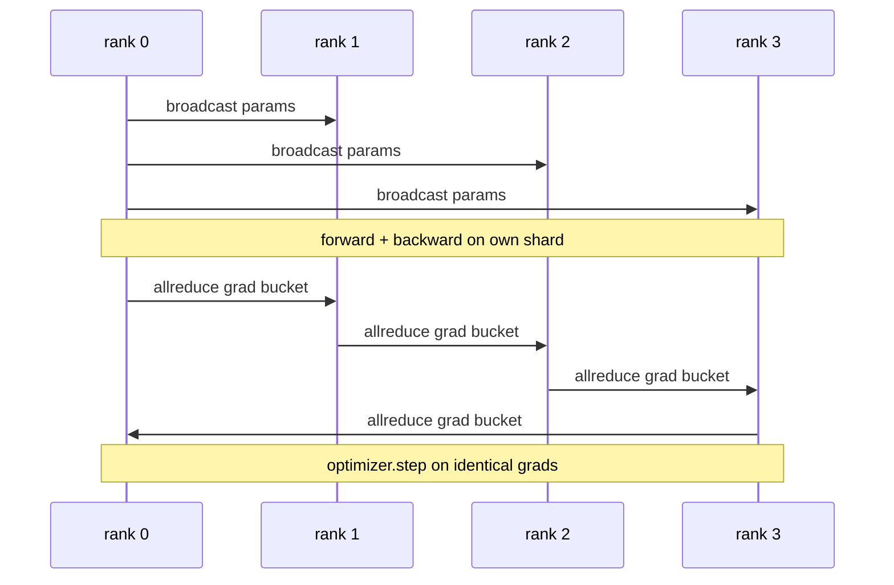

<!-- i18n:manual -->
# Data Parallel DDP с нуля

> DistributedDataParallel — это хук поверх allreduce. Оберните модель, разошлите начальные параметры с ранга 0, чтобы все ранги стартовали одинаково, повесьте на каждый параметр backward-хук, который делает allreduce его градиента, — а дальше обычный градиентный спуск. Весь паттерн укладывается в 200 строк.

**Type:** Build
**Languages:** Python
**Prerequisites:** Phase 19 Track C lessons 42-49
**Time:** ~90 min

## Learning Objectives

- Собрать обёртку в форме `DistributedDataParallel`, которая рассылает начальные параметры и делает allreduce градиентов после обратного прохода.
- Породить N CPU-рангов через `torch.multiprocessing.spawn` на бэкенде gloo с рандеву через файл.
- Доказать корректность синхронизации градиентов: обучить ту же модель на тех же данных последовательно и показать совпадение параметров на каждом шаге.
- Обосновать бакеты (слияние градиентов) и перекрытие (обмен во время обратного прохода) как те два изменения, которые превращают работающий DDP в продакшен-DDP.

## The Problem

Модель на миллиард параметров с 12 ГБ активаций не влезает в одну потребительскую GPU. Даже когда влезает, обучение занимает недели. Data parallel делит батч между N рангами, каждый ранг считает прямой и обратный проход на своём куске, и на каждом шаге градиенты всех рангов складываются, чтобы все N копий оставались одинаковыми. Именно по суммарному градиенту делает шаг оптимизатор.

> 🎒 **На пальцах.** Разделить батч — значит разделить работу: батч на 256 примеров при 4 рангах превращается в 64 примера на ранг, и шаг идёт вчетверо быстрее. Но выигрыш держится только на одном условии — все четыре копии модели обязаны остаться побитово одинаковыми, иначе вы обучаете уже не одну модель.

Без синхронизации градиентов N реплик расходятся уже на шаге 2. Это больше не «одна модель, обученная на большем количестве данных», это N отдельных моделей, у которых случайно совпали начальные веса. При плохой синхронизации (один allreduce на параметр, без перекрытия, без бакетов) узким местом становится сеть, и GPU простаивают в ожидании провода. Мастерство в DDP — сделать синхронизацию градиентов почти бесплатной на фоне вычислений. Канонический PyTorch DDP добивается этого бакетированием градиентов, перекрытием allreduce с обратным проходом следующего слоя и использованием NCCL поверх NVLink. Все три вещи можно проделать на CPU с gloo и вынести ровно те же уроки.

> 🎒 **На пальцах.** «Расходятся на шаге 2» — считайте сами: на шаге 1 веса ещё общие, но градиенты у рангов разные, потому что данные разные; без сложения каждый ранг применит свой градиент и к шагу 2 веса уже четыре разных. Дальше расхождение только растёт, а ошибок в логах при этом ноль.

## The Concept



> 🎒 **На пальцах.** Читайте диаграмму сверху вниз как сценарий одного шага: сначала ранг 0 раздаёт веса трём остальным, потом каждый считает свой кусок батча, потом бакет градиентов обходит кольцо, и только после этого все четыре ранга делают `optimizer.step` на одинаковых числах. Одинаковый вход плюс одинаковая формула — одинаковый выход, вот и вся синхронность.

### The three operations DDP needs

| Stage | Collective | Why |
|-------|-----------|-----|
| Init | broadcast from rank 0 | Все ранги стартуют с одинаковыми параметрами |
| After backward | allreduce of each grad | Оптимизатор шагает по среднему градиенту |
| Sometimes | broadcast of buffers | Скользящие статистики батчнорма остаются синхронными |

> 🎒 **На пальцах.** Третья строка — самая коварная. Скользящее среднее батчнорма не параметр, у него нет градиента, поэтому allreduce его не трогает: обучение идёт нормально, а на инференсе четыре ранга дают четыре разных ответа. Правило простое: рассылать надо всё состояние модели, а не только то, что видит оптимизатор.

### Why mean and not sum

Allreduce-SUM, делённый на world_size, даёт средний градиент. Среднее не зависит от world_size: learning rate, подобранный на одном ранге, работает и на четырёх, потому что величина градиента на шаге не меняется. Allreduce-SUM без деления заставит вас переподбирать learning rate каждый раз, когда меняется размер кластера. DDP оборачивает SUM и делит; в уроке делайте так же.

> 🎒 **На пальцах.** Забыть деление — то же самое, что молча умножить learning rate на число рангов. Пусть на каждом ранге норма градиента примерно 2: сумма по 4 рангам даст 8, а среднее — те же 2. С lr = 0.01 и суммой вы фактически шагаете как с lr = 0.04, и на 8 рангах прогон разойдётся, хотя на 4 «работало».

### Why bucket gradients

У трансформера тысячи тензоров параметров. Один allreduce на тензор платит пол по задержке gloo тысячи раз. DDP группирует градиенты в бакеты примерно по 25 МБ и делает один allreduce на бакет. По проводу едет то же количество байт, но задержка размазывается по всему бакету. Для крошечной модели из урока мы кладём всё в один бакет; важна структура, а не размер.

> 🎒 **На пальцах.** Пусть один вызов стоит 200 микросекунд накладных расходов независимо от размера. Три тысячи тензоров — это 0,6 секунды на пустом месте на каждом шаге. Сложите их в 40 бакетов — и накладные расходы упадут до 8 миллисекунд, а байт по проводу проедет ровно столько же.

### Why pin the seed

Каждый ранг обязан звать `torch.manual_seed(seed + rank)` для перемешивания и `torch.manual_seed(seed)` для инициализации параметров. Один общий сид означает, что все ранги видят один и тот же порядок батчей — data parallel обесценивается. Поранговый сид для параметров означает, что начальные веса разъезжаются на epsilon float, и синхронизация градиентов больше не делает реплики одинаковыми. Не выстроите схему с сидами — тест на совпадение параметров упадёт на первом же шаге.

> 🎒 **На пальцах.** Два сида решают две противоположные задачи: веса должны совпасть, данные — нет. Если сид общий везде, четыре ранга обработают один и тот же батч из 64 примеров, и вы просто в четыре раза дороже посчитали то же самое. Если сид поранговый везде, веса разойдутся на 1e-8 уже при инициализации, и «побитово одинаковых» реплик не получится никогда.

```figure
ci-ddp-grad-sync
```

## Build It

`code/main.py` реализует:

- `MiniMLP` — трёхслойный MLP, достаточно маленький, чтобы сойтись за секунды, и достаточно большой, чтобы вся проводка была видна.
- `DistributedDataParallel(model, world_size)` — рассылает параметры при создании и возвращает обёртку, чей `sync_grads` делит накопленные суммой градиенты на world_size.
- `worker(rank, world_size, ...)` — полный цикл обучения: инициализация `torch.distributed` на gloo, прямой проход, обратный, синхронизация, шаг.
- `_reference_single_process_loop(...)` — обучает ту же модель на тех же данных последовательно на одном ранге; тест использует его для побайтовой сверки параметров после каждого шага.

> 🎒 **На пальцах.** Обратите внимание на `_reference_single_process_loop`: это не лишний код, а весь смысл урока. Распределённая ошибка не проявляется как исключение — она проявляется как чуть другая кривая loss, которую глазом не отличить. Эталонный однопроцессный прогон превращает «вроде похоже» в «совпадает до седьмого знака или тест красный».

Запустите:

```bash
python3 code/main.py
```

Вывод: пошаговая таблица обучения, где рядом стоят loss и контрольная сумма параметров однопроцессного прогона и прогона DDP на 4 рангах. Оба пути дают одинаковые кривые loss с точностью до epsilon float — это и есть доказательство корректности синхронизации градиентов.

> 🎒 **На пальцах.** Контрольная сумма параметров — это просто сумма всех весов одним числом; её удобно печатать и сравнивать. Ждите совпадения примерно до 1e-7 при float32: расхождение в последнем бите нормально, потому что складывать четыре числа можно в разном порядке. А вот расхождение в третьем знаке означает, что где-то потерялось деление на world_size.

## Production patterns in the wild

Три приёма доводят DDP до состояния, в котором его не стыдно отгружать.

**Find unused parameters.** Некоторые ветки прямого прохода пропускают параметры по условию (ранний выход, роутер в mixture-of-experts). У пропущенных параметров нет градиента, но хук готовности бакета в DDP всё равно их ждёт — и allreduce встаёт намертво. `find_unused_parameters=True` велит DDP сначала посмотреть, у каких параметров появились градиенты, и только потом сворачивать. Цена — обход графа на каждом шаге, поэтому не включайте, если в прямом проходе нет ветвлений.

> 🎒 **На пальцах.** Дедлок здесь буквально как в игре «ждём последнего»: три ранга получили градиент по всем 200 параметрам, а четвёртый ушёл в ранний выход и отдал только 190. Коллективная операция стартует, когда её позвали все, поэтому 199 готовых тензоров ждут одного несуществующего вечно. Флаг просто разрешает пересчитать список участников перед стартом.

**Static graph optimisation.** Когда прямой проход одинаков на всех шагах, `static_graph=True` позволяет DDP заранее посчитать расписание бакетов. На масштабе оптимизация имеет значение: предвычисление экономит несколько миллисекунд на шаге, а они складываются на 10000 шагов.

> 🎒 **На пальцах.** Пара миллисекунд звучит смешно, пока не умножишь: 3 мс на шаг при 10 000 шагов — это полминуты, а при 500 000 шагов большого прогона — уже 25 минут чистого времени аренды. Условие тоже стоит запомнить: флаг честен только если граф не меняется, то есть никаких ветвлений «раз в сто шагов считаем иначе».

**Gradient accumulation needs care.** Накопление градиентов по K микробатчам без синхронизации каждого микробатча даёт десятикратный выигрыш по пропускной способности. DDP предоставляет `no_sync()` — контекстный менеджер, который приостанавливает allreduce после обратного прохода. Забудете менеджер — сделаете K allreduce впустую, и пропускная способность рухнет на пол.

> 🎒 **На пальцах.** Смысл `no_sync` виден на числах: при K = 8 микробатчах без него вы гоняете градиенты по сети 8 раз за один шаг оптимизатора, хотя первые семь результатов никто не использует. С ним обмен ровно один — перед шагом. Аналогия: не бежать в банк после каждой купюры, а сходить один раз, собрав всю выручку за день.

## Use It

Продакшен-паттерны:

- **PyTorch DDP.** Каноническая реализация. `torch.nn.parallel.DistributedDataParallel(model)` подключает бакетирование, перекрытие и контекст no_sync.
- **HuggingFace Accelerate.** Добавляет лаунчер, который разбирается с переменными окружения `torchrun` и оборачивает модель. Под капотом тот же DDP.
- **Megatron-LM data parallel.** Комбинирует DDP с tensor parallel для больших моделей; сама data-parallel часть — тот же паттерн «allreduce после обратного прохода».

> 🎒 **На пальцах.** Все три строки — это одна и та же обёртка на разной глубине упаковки: Accelerate прячет от вас `torchrun`, Megatron добавляет вторую ось параллелизма, но `broadcast` на старте и `allreduce` после backward никуда не деваются. Поэтому, разобрав 200 строк из этого урока, вы фактически читаете исходники всех трёх.

## Ship It

Урок 78 (шардирование ZeRO) заменяет allreduce на каждый параметр на reduce_scatter, чтобы каждый ранг хранил только свой шард состояния оптимизатора. Урок 81 собирает DDP и ZeRO в сквозное демо.

## Exercises

1. Добавьте бакеты градиентов настраиваемого размера и замерьте ускорение относительно схемы «один allreduce на параметр» на более глубокой модели.
2. Реализуйте `no_sync()` как контекстный менеджер и убедитесь, что накопление градиентов совпадает с однопроцессным эталоном по K микробатчам.
3. Добавьте режим `find_unused_parameters`, в котором прямой проход иногда пропускает один из слоёв MLP; без флага прогон должен встать в дедлок.
4. Замените gloo на синхронизацию только через `torch.distributed.barrier()`, чтобы почувствовать разницу между синхронизацией на allreduce и на барьерах.
5. Замерьте накладные расходы на синхронизацию градиентов как долю времени шага для батчей 1, 16 и 256 и объясните масштабирование.

> 🎒 **На пальцах.** Пятое задание объясняет больше всех: обмен зависит от числа параметров, а вычисление — от размера батча. При батче 1 модель считает миллисекунды, а гоняет по сети те же мегабайты, и синхронизация съедает большую часть шага. При батче 256 вычисление вырастает в 256 раз, обмен не меняется вовсе — и его доля падает до единиц процентов.

## Key Terms

| Term | What people say | What it actually means |
|------|----------------|------------------------|
| DDP | «Data parallel» | Обёртка, которая рассылает параметры и делает allreduce градиентов на каждом шаге |
| Bucket | «Склей градиенты» | Собрать N мелких allreduce в один крупный |
| Overlap | «Спрячь обмен» | Запустить allreduce, пока следующие слои ещё считают обратный проход |
| no_sync | «Копим» | Пропустить allreduce после обратного прохода ради накопления градиентов |
| find_unused | «Ветвистый forward» | Найти параметры без градиента до того, как начнётся свёртка |

## Further Reading

- [PyTorch DistributedDataParallel docs](https://pytorch.org/docs/stable/generated/torch.nn.parallel.DistributedDataParallel.html)
- [PyTorch DDP internals tutorial](https://pytorch.org/tutorials/intermediate/ddp_tutorial.html)
- [Li et al, PyTorch Distributed: Experiences on Accelerating Data Parallel Training](https://arxiv.org/abs/2006.15704)
- Phase 19 Lesson 76 — коллективные операции, на которых стоит DDP
- Phase 19 Lesson 78 — шардирование ZeRO заменяет попараметрный allreduce на reduce_scatter
