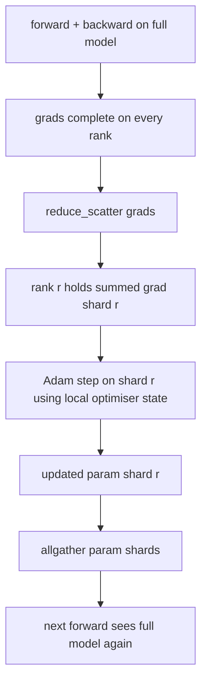

<!-- i18n:manual -->
# Шардирование состояния оптимизатора в ZeRO

> Adam хранит на каждый параметр две оценки момента, обе в float32. Модель на 7B параметров тащит 56 ГБ состояния оптимизатора. ZeRO стадии 1 режет это на N рангов: каждый ранг владеет 1/N оптимизатора. После локального шага обновлённые шарды параметров разлетаются обратно, каждый ранг восстанавливает полную модель — и начинается следующий шаг. Выигрыш — линейное падение памяти на самом крупном куске всей обучающей конструкции.

**Type:** Build
**Languages:** Python
**Prerequisites:** Phase 19 Track C lessons 42-49
**Time:** ~90 min

## Learning Objectives

- Разрезать состояние оптимизатора (первый момент, второй момент, мастер-копию в fp32) на N рангов так, чтобы каждый владел 1/N.
- Через reduce_scatter доставлять каждому рангу только сумму градиентов его шарда, а потом через allgather рассылать обновлённые шарды параметров обратно.
- Посчитать таблицу экономии памяти для стадий 1, 2 и 3 в сравнении с ванильным DDP.
- Обосновать выбор между стадиями 1, 2 и 3 исходя из размера модели и бюджета пропускной способности.

## The Problem

Ванильный DDP дублирует всё: параметры, градиенты и состояние оптимизатора лежат целиком на каждом ранге. Для модели на 7B параметров в fp16 это 14 ГБ параметров, 14 ГБ градиентов и 28 ГБ состояния оптимизатора на каждый ранг. Состояние оптимизатора — самый крупный член и самый удобный для шардирования, потому что к нему обращаются только на шаге, а не на прямом или обратном проходе.

> 🎒 **На пальцах.** Сложите три числа: 14 + 14 + 28 = 56 ГБ на каждой карте, и это ещё без активаций. Обратите внимание, какая доля тут лишняя: параметры и градиенты нужны всем рангам постоянно, а состояние оптимизатора трогается ровно один раз за шаг. Хранить его в восьми экземплярах — то же самое, что держать восемь одинаковых бухгалтерских книг, которые открывают раз в день.

ZeRO стадии 1 шардирует состояние оптимизатора. Каждый ранг держит 1/N моментов Adam. После обратного прохода вместо allreduce полного градиента с последующим локальным шагом ZeRO делает reduce_scatter, и каждый ранг получает сумму градиентов только по своему шарду. Ранг применяет шаг оптимизатора к своему куску мастер-параметров. Затем обновлённые шарды параметров разлетаются через allgather, и у каждого ранга снова есть полная модель для следующего прямого прохода. Память под оптимизатор падает в N раз. Трафик по проводу на шаг такой же, как у DDP: один reduce_scatter плюс один allgather по объёму равны одному allreduce. Память выигрываем, пропускную способность сохраняем.

> 🎒 **На пальцах.** Ключевое равенство урока — allreduce = reduce_scatter + allgather, вы собирали его руками в уроке 76. Отсюда фокус ZeRO: вы не добавляете обмена, вы просто вставляете шаг оптимизатора в середину между двумя половинками. При 8 рангах 28 ГБ моментов Adam превращаются в 3,5 ГБ на ранг, а по сети едет ровно столько же байт, сколько ехало вчера.

## The Concept



> 🎒 **На пальцах.** Схема — это конвейер из восьми коробок, и главное в нём происходит между C и G. До C всё как в DDP: полная модель, полные градиенты. На C градиенты разлетаются по владельцам, на E каждый обновляет только свой кусок, на G куски снова склеиваются в целую модель. Ранг 3 из четырёх никогда не видит моментов Adam для чужих трёх четвертей параметров — их у него просто нет в памяти.

### Stages of ZeRO

| Stage | What is sharded | Memory per rank | Comm per step |
|-------|----------------|------------------|---------------|
| DDP | ничего | params + grads + optim | 1x allreduce |
| ZeRO-1 | состояние оптимизатора | params + grads + optim/N | 1x reduce_scatter + 1x allgather |
| ZeRO-2 | оптимизатор + градиенты | params + grads/N + optim/N | 1x reduce_scatter + 1x allgather |
| ZeRO-3 | оптимизатор + градиенты + параметры | params/N + grads/N + optim/N | 1x allgather на слой + 1x reduce_scatter на слой |

> 🎒 **На пальцах.** Смотрите на последнюю колонку: у стадий 1 и 2 обмен ровно один за шаг, а у стадии 3 — по два на каждый слой. У модели с 32 слоями это 64 коллективные операции против двух. Вот почему стадии 1 и 2 называют бесплатными, а стадию 3 включают только тогда, когда параметры физически не влезают.

Стадия 1 — самый дешёвый выигрыш, потому что состояние оптимизатора доминирует в бюджете. Стадии 2 нужна логика накопления градиентов по шардам, но пропускная способность та же. Стадия 3 (FSDP) платит обменом на каждый слой при каждом прямом и обратном проходе, зато получает падение памяти под параметры. Урок реализует стадию 1 целиком.

> 🎒 **На пальцах.** «Доминирует в бюджете» — это не фигура речи, а 28 ГБ из 56 для семи миллиардов параметров, то есть ровно половина. Шардирование половины на 8 рангов срезает 24,5 ГБ на каждой карте, а стоит одной замены вызова: `all_reduce` на `reduce_scatter`. Такое соотношение цены и результата в инженерии встречается редко.

### The memory math, real numbers

Для модели с P параметрами, обучаемой Adam в смешанной точности:

| Term | Vanilla | ZeRO-1 | Why |
|------|---------|--------|-----|
| fp16 params | 2P bytes | 2P bytes | нужны для прямого прохода |
| fp16 grads | 2P bytes | 2P bytes | нужны для обратного прохода |
| fp32 master copy | 4P bytes | 4P/N bytes | ей пользуется только оптимизатор |
| fp32 first moment | 4P bytes | 4P/N bytes | им пользуется только оптимизатор |
| fp32 second moment | 4P bytes | 4P/N bytes | им пользуется только оптимизатор |
| Total | 16P bytes | 4P + 12P/N bytes |   |

> 🎒 **На пальцах.** Проверьте арифметику построчно: 2 + 2 + 4 + 4 + 4 = 16 байт на каждый параметр, и только 4 из них живут на всех рангах постоянно. Отсюда и формула 4P + 12P/N — четыре байта неделимых плюс двенадцать, делённых на число рангов. Для модели на 7B ванильные 16P — это 112 ГБ, что не влезает ни в одну существующую карту.

При N=8: ванильно 16P, ZeRO-1 5,5P — падение на 65%. При N=64: ванильно 16P, ZeRO-1 4,19P — падение на 74%.

> 🎒 **На пальцах.** Подставьте сами: 4 + 12/8 = 5,5, и 4 + 12/64 = 4,19. Заметьте, где кривая упирается в стену: между 8 и 64 рангами вы выигрываете всего 1,3P, потому что четвёрка в формуле не делится никогда. Это и есть граница стадии 1 — дальше резать надо уже параметры и градиенты, то есть переходить на стадии 2 и 3.

### Why reduce_scatter beats allreduce-then-shard

Allreduce отдаёт каждому рангу полную сумму градиентов. Если вам нужен только шард r, то (N-1)/N свёрнутого градиента на ранге r пропадают зря. Reduce_scatter доставляет ровно тот шард, которым ранг владеет; байт на ранг столько же, сколько у allreduce (ведь allreduce и есть reduce_scatter плюс allgather), но вторая половина заменяется на более поздний allgather шардов параметров. По проводу выходит то же, что у DDP, а память поделена.

> 🎒 **На пальцах.** При 4 рангах allreduce отдаёт каждому все 100% градиента, из которых 75% ранг тут же выбросит — он всё равно обновляет только свою четверть. Reduce_scatter присылает сразу нужные 25%, и вторая половина обмена не пропадает, а переезжает в конец шага, где рассылает уже обновлённые веса. Байты те же, мусора нет.

```figure
cd-zero-shard
```

## Build It

`code/main.py` реализует:

- `flatten_params(module)` и `unflatten_into(module, flat)` — упаковывают параметры модели в один непрерывный тензор и распаковывают обратно. Именно плоская раскладка превращает шардирование по рангам в обычный срез.
- `ZeroOptimizer(model, world_size, rank, lr)` — владеет шардом мастер-копии и моментов Adam, принадлежащим этому рангу.
- `step()` — делает reduce_scatter плоского градиента, применяет Adam к шарду этого ранга и через allgather собирает обновлённые параметры обратно.
- Демо, которое обучает трёхслойный MLP 20 шагов и печатает пошаговый бюджет памяти рядом с базовой линией ванильного DDP.

> 🎒 **На пальцах.** Зачем плоский тензор: у модели десятки отдельных матриц разного размера, и «отдать рангу 2 его четверть» по ним не разложить. Склейте всё в один вектор на, скажем, 1 000 000 чисел — и шард ранга 2 это просто срез `[500000:750000]`. Одна строчка вместо цикла по слоям с ручной бухгалтерией.

Запустите:

```bash
python3 code/main.py
```

Вывод: пошаговый loss и таблица памяти, которая показывает, что ZeRO-1 держит на каждом ранге 1/N состояния оптимизатора против полной копии у DDP.

> 🎒 **На пальцах.** Сверяйте не только память, но и loss: кривая обязана совпасть с DDP, ведь математика шага не поменялась ни на бит — поменялось лишь то, кто какую часть считает. Если loss у ZeRO пошёл иначе, ищите ошибку в границах срезов, а не в Adam.

## Production patterns in the wild

Три приёма доводят ZeRO до состояния, в котором его не стыдно отгружать.

**Sharded checkpointing matters.** Состояние оптимизатора в ZeRO-1 размазано по рангам; чекпоинт обязан записать, какой ранг чем владеет. Урок 80 строит манифест шардированного чекпоинта, который позволяет продолжить прогон ZeRO на том же world size. Без него сохранённое состояние невозможно прочитать при перезапуске.

> 🎒 **На пальцах.** Наивное «сохраню состояние оптимизатора с ранга 0» даст файл, в котором честная только первая четверть, а остальные три четверти — свежие нули. Прогон после такого перезапуска не упадёт: Adam просто забудет всю накопленную историю моментов, loss дёрнется вверх, и вы будете неделю искать причину не там.

**Mixed precision is the point.** ZeRO — это техника смешанной точности; шардируется именно мастер-копия в fp32. Запускать ZeRO без смешанной точности — платить налог памяти за fp32-мастер, не получая взамен выигрыша от прямого прохода в fp16. Продакшен-прогоны всегда сочетают ZeRO с autocast или весами в bf16.

> 🎒 **На пальцах.** Логика такая: мастер-копия в fp32 существует только потому, что fp16 слишком груб для накопления мелких обновлений. Нет fp16-прохода — нет и повода держать вторую копию весов, и вы просто носите лишние 4P байт. По таблице выше это 28 ГБ впустую для модели на 7B.

**Stage 1 is a near-free win.** Обмен по объёму идентичен DDP. Экономия памяти линейна по N. Единственная цена — бухгалтерия вокруг шарда оптимизатора. Продакшен-стеки включают стадию 1 по умолчанию, если только память под шард параметров не стала отдельной проблемой; тогда стадии 2 или 3 меняют обмен на память.

> 🎒 **На пальцах.** «Почти бесплатно» здесь значит буквально: те же байты по сети, та же математика, минус 65% памяти при 8 рангах. Практическое правило — включайте стадию 1 всегда, а на стадию 3 переходите, только когда сами параметры перестали влезать, потому что за неё вы платите десятками дополнительных коллективных операций на каждый шаг.

## Use It

Продакшен-паттерны:

- **DeepSpeed ZeRO.** Эталонная реализация. `deepspeed_config.json` выбирает стадию 1/2/3 и размеры разбиения.
- **PyTorch FSDP.** Родной для PyTorch аналог. `ShardingStrategy.SHARD_GRAD_OP` — это ZeRO-2; `FULL_SHARD` — это ZeRO-3.
- **HuggingFace Accelerate.** Оборачивает и DeepSpeed, и FSDP под единым конфигом.

> 🎒 **На пальцах.** Полезно держать в голове словарь переводов: услышали `FULL_SHARD` — думайте ZeRO-3, услышали `SHARD_GRAD_OP` — думайте ZeRO-2. Это буквально одни и те же стадии из таблицы выше, просто у DeepSpeed они пронумерованы, а у PyTorch названы словами.

## Ship It

Урок 79 (pipeline parallel) — это ортогональная ось шардирования: вместо того чтобы резать состояние оптимизатора одной и той же модели, конвейер режет по рангам сами слои. Урок 81 собирает DDP и ZeRO в сквозное демо.

## Exercises

1. Расширьте до ZeRO-2, шардируя градиенты: каждый ранг хранит градиент только своего шарда, а нешардовая часть обнуляется после обратного прохода.
2. Добавьте профилировщик памяти, который печатает реальное потребление в байтах на ранге 0 рядом с предсказанием формулы.
3. Замерьте время шага по часам у ванильного DDP и у ZeRO-1 и разложите его на прямой проход, обратный и обмен.
4. Реализуйте обрезку градиентов под ZeRO-1: норму L2 придётся считать по всем шардам через allreduce локальных квадратов норм.
5. Реализуйте «наивный ZeRO» с allreduce вместо reduce_scatter, замерьте разницу времени на проводе. Обоснуйте выбор reduce_scatter числами.

> 🎒 **На пальцах.** Четвёртое задание — классическая ловушка. Норма всего градиента не равна сумме норм шардов, но равна корню из суммы их квадратов: если шарды дали 3 и 4, то общая норма 5, а не 7. Поэтому по сети гоняют именно квадраты — их складывать можно, а корень каждый ранг берёт уже сам.

## Key Terms

| Term | What people say | What it actually means |
|------|----------------|------------------------|
| ZeRO-1 | «Шардируем оптимизатор» | Каждый ранг держит 1/N мастер-копии fp32 и моментов Adam |
| ZeRO-2 | «Градиенты тоже режем» | Каждый ранг вдобавок выбрасывает чужие градиенты после reduce_scatter |
| ZeRO-3 | «Режем параметры» | Каждый ранг держит 1/N параметров в fp16; на прямом проходе allgather на каждый слой |
| Master copy | «Веса в fp32» | Высокоточная копия параметров, которую обновляет оптимизатор |
| Reduce_scatter | «Разрежь сумму» | Доставить каждому рангу только сумму градиентов его шарда |

## Further Reading

- [Rajbhandari et al, ZeRO: Memory Optimizations Toward Training Trillion Parameter Models](https://arxiv.org/abs/1910.02054)
- [DeepSpeed ZeRO documentation](https://www.deepspeed.ai/tutorials/zero/)
- [PyTorch FSDP documentation](https://pytorch.org/docs/stable/fsdp.html)
- Phase 19 Lesson 76 — reduce_scatter и allgather, на которых стоит этот урок
- Phase 19 Lesson 80 — шардированные чекпоинты, которыми обязано пользоваться состояние ZeRO
