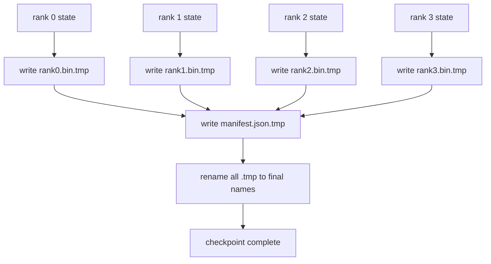

<!-- i18n:manual -->
# Шардированный чекпойнт и атомарное возобновление

> Прогон обучения модели на 70B параметров каждые несколько часов встаёт из-за отказа узла. Формат чекпойнта решает, потеряете вы 30 минут или 30 часов. Шардированный чекпойнт пишет шард каждого ранга параллельно и фиксирует владение в манифесте. Возобновление загружает шард каждого ранга из его собственного файла, восстанавливает состояние на том же размере мира — и оптимизатор шагает дальше как ни в чём не бывало. Атомарная запись не даёт недописанному чекпойнту отравить следующее возобновление.

**Type:** Build
**Languages:** Python
**Prerequisites:** Phase 19 Track C lessons 42-49
**Time:** ~90 min

## Learning Objectives

- Сохранять многоранговый чекпойнт как поранговый файл-шард плюс манифест, в котором записано, какому рангу что принадлежит.
- Применять шаблон атомарной записи (пишем во временный путь, потом переименовываем), чтобы падение посреди записи никогда не оставляло недописанный чекпойнт.
- Возобновляться из манифеста, проверяя побайтовое совпадение состояния и для fp16-параметров, и для состояния оптимизатора ZeRO на каждом ранге.
- Обосновать схему манифеста против трёх сценариев отказа: смена размера мира, несовпадение числа шардов и частичная запись.

## The Problem

Обычный чекпойнт вычитывает все параметры и состояние оптимизатора на ранг 0, собирает их и пишет один файл. Для модели на 70B это 1,1 ТБ состояния через сетевой порт одного-единственного ранга. Запись блокирует все остальные ранги, потому что они простаивают в ожидании сбора. Пропускная способность IO здесь — это сетевой канал самой медленной GPU, а не суммарная. На реальном кластере шаг «собрать и записать» может занять больше, чем предыдущий час обучения, а это значит, что за сутки обучения прогон выдаёт меньше одного чекпойнта.

> 🎒 **На пальцах.** Представьте, что вся команда сдаёт отчёты через одного человека, который печатает их на одном принтере: остальные тридцать сидят и ждут. 1,1 ТБ через один сетевой порт — это буквально так. Скорость упирается не в кластер, а в одну карту, и никакое «добавим ещё узлов» тут не помогает.

Шардированные чекпойнты переворачивают схему: каждый ранг параллельно пишет свой шард в свой файл. Манифест фиксирует, какому рангу принадлежал какой шард, чтобы возобновление положило каждый шард туда, откуда он взялся. Суммарная пропускная способность записи растёт вместе с кластером. Чекпойнт на 1 ТБ, который занимал 4 часа через один ранг, занимает 4 минуты через 64 ранга. Плюс манифест даёт вам контракт на несовместимые возобновления: смена размера мира обнаруживается, частичные записи обнаруживаются, и путь загрузки может упасть громко, а не молча подсунуть протухшие данные.

> 🎒 **На пальцах.** Арифметика простая: 4 часа делим на 64 ранга — получаем примерно 4 минуты. Это та же работа, просто выполненная всеми сразу, а не по очереди через одного. И заметьте вторую половину выигрыша: манифест превращает «загрузилось что-то не то» в честное падение при загрузке.

## The Concept



> 🎒 **На пальцах.** Читайте схему снизу вверх по времени: сначала четыре ранга параллельно пишут четыре файла `.tmp`, потом пишется `manifest.json.tmp`, и только затем всё разом переименовывается. Порядок здесь не декоративный: манифест появляется под финальным именем последним, поэтому чекпойнт «существует» ровно тогда, когда существуют все его части.

### Manifest schema

```json
{
  "world_size": 4,
  "step": 1234,
  "wall_clock_seconds": 4521,
  "shards": [
    {"rank": 0, "path": "rank0.bin", "sha256": "...", "param_shard_offset": 0, "param_shard_numel": 65536},
    {"rank": 1, "path": "rank1.bin", "sha256": "...", "param_shard_offset": 65536, "param_shard_numel": 65536}
  ],
  "schema_version": 1
}
```

Три поля здесь несущие. `world_size` заставляет возобновление на другом размере громко упасть вместо того, чтобы молча всё испортить. `sha256` на каждый шард ловит частичные или испорченные записи. `param_shard_offset` и `param_shard_numel` на каждый шард позволяют загрузчику восстановить плоский тензор параметров в правильной позиции.

> 🎒 **На пальцах.** Посмотрите на два шарда в примере: у первого смещение 0 и длина 65536, у второго смещение 65536 и та же длина. Склеив их подряд, загрузчик получает плоский тензор на 131072 элемента — ровно тот, что был до разрезания. Без смещений это была бы куча кусков без инструкции, в каком порядке их собирать.

### Atomic write

Стандартный шаблон: пишем каждый шард в `<name>.tmp`, пишем манифест в `manifest.json.tmp`, делаем fsync каждому, а потом переименовываем. Переименование в POSIX внутри одной файловой системы атомарно: либо новый файл присутствует целиком, либо остаётся старый. Падение до финального переименования оставляет живым предыдущий чекпойнт. Без атомарной записи падение может оставить частичный шард при уже существующем манифесте, который на него указывает, — и загрузка испортит состояние оптимизатора при возобновлении.

> 🎒 **На пальцах.** Это как не выбрасывать старый черновик, пока новый не дописан до конца. Переименование в POSIX происходит целиком или не происходит вовсе — промежуточного состояния «файл наполовину переименован» не бывает. Поэтому питание может пропасть на любой миллисекунде записи, и на диске всё равно останется корректный чекпойнт, пусть и предыдущий.

### Three failure modes the schema must defend against

| Failure | Symptom | Defence |
|---------|---------|---------|
| World-size change | возобновление на N=8 с манифестом от N=4 | несовпадение world_size в манифесте, падаем громко |
| Shard count mismatch | при возобновлении файлов rank*.bin меньше, чем шардов в манифесте | перечисляем шарды, проверяем существование каждого |
| Partial write | файл шарда обрезан посреди сброса на диск | проверка sha256 при загрузке |

Каждая защита отклоняет плохую загрузку сразу; альтернатива — молчаливое повреждение, которое всплывёт через 100 шагов, когда loss уйдёт в NaN.

> 🎒 **На пальцах.** Все три защиты стоят на одном принципе: лучше не запуститься, чем запуститься неправильно. Сравните цену: несовпадение world_size ловится за миллисекунду при старте, а то же несовпадение, пропущенное внутрь, вы обнаружите через 100 шагов по NaN в логе — и придётся выяснять, откуда он взялся. Проверка sha256 стоит секунд, отладка молчаливого повреждения — дней.

### Why per-rank files, not one big file

Конкурентная запись в один файл через `O_APPEND` в POSIX работает для выровненных по байтам записей, но на практике смещения внутри одного шарда покрывают области размером в мегабайты, и всё съедают блокировки. У поранговых файлов конкуренции нет вообще, и они выигрывают от страйпинга, когда под ними лежит параллельная файловая система (Lustre, GPFS). Продакшен-стеки (DeepSpeed, FSDP, NeMo) используют поранговые файлы именно поэтому.

> 🎒 **На пальцах.** Это разница между одной кассой на весь супермаркет и четырьмя кассами по одной на отдел. Один файл — это одна очередь, где 64 ранга по очереди берут блокировку; 64 файла — это 64 независимых потока, которые параллельная ФС ещё и размажет по разным дискам. Не случайно все три перечисленных фреймворка пришли к одному и тому же решению.

```figure
ci-sharded-checkpoint
```

## Build It

`code/main.py` реализует:

- Датакласс `ShardManifest` со схемой выше плюс `to_json`/`from_json`.
- `save_sharded(state_dict_per_rank, dir, step)` — пишет двоичное состояние каждого ранга в его собственный файл по шаблону «временный файл, затем переименование», а потом пишет манифест.
- `load_sharded(dir, expected_world_size)` — читает манифест, проверяет sha256 каждого шарда и возвращает поранговые словари состояния.
- Тест на круговой обход: собрать поранговое состояние, сохранить, загрузить, убедиться в побайтовом равенстве.

> 🎒 **На пальцах.** Обратите внимание на симметрию: `save_sharded` и `load_sharded` — это одна и та же схема, прочитанная в двух направлениях. Круговой тест здесь не формальность, а единственный честный способ проверить формат: если после сохранения и загрузки хоть один байт разошёлся, ваш «чекпойнт» не чекпойнт.

Запустите:

```bash
python3 code/main.py
```

Вывод: записаны 4 файла шардов плюс манифест, затем всё перечитано с проверкой побайтового равенства.

> 🎒 **На пальцах.** Четыре файла плюс манифест — это ровно то, что вы увидите в директории после запуска: `rank0.bin`, `rank1.bin`, `rank2.bin`, `rank3.bin` и `manifest.json`. Никаких `.tmp` там остаться не должно — если они есть, значит запись не дошла до переименования, и это и есть тот самый недописанный чекпойнт.

## Production patterns in the wild

Три приёма доводят чекпойнт до состояния, в котором его можно выкатывать.

**Async write.** Продакшен-стеки запускают запись чекпойнта в отдельном потоке или процессе, чтобы обучение продолжалось. Барьер стоит на следующем чекпойнте: не начинать следующее сохранение, пока не завершилось предыдущее. Флаг `async_io` у DeepSpeed делает ровно это. В уроке запись оставлена синхронной, чтобы шаги были видны.

> 🎒 **На пальцах.** Без асинхронности каждое сохранение — это пауза в обучении: пишем 4 минуты, значит 4 минуты кластер не учится. Асинхронная запись убирает эту паузу, но взамен требует дисциплины: два одновременных сохранения в одну директорию перепутают друг другу файлы. Отсюда и правило «барьер на следующем чекпойнте».

**Local fast disk first, then async upload.** Пишем на локальный NVMe (быстро), потом асинхронно заливаем в S3 или GCS. Двухуровневая схема оставляет внутрикластерный чекпойнт быстрым для возобновления и при этом отправляет долговечную копию за пределы кластера в архив. Манифест несёт локальный путь; манифест загрузки несёт удалённый путь.

> 🎒 **На пальцах.** Два уровня решают две разные задачи. Локальный NVMe нужен, чтобы после падения узла подняться за минуты, а не качать терабайт из облака. Копия в S3 нужна на случай, когда сгорел весь кластер или прогон закончился и его надо хранить месяцами. Поэтому и манифестов два — у них разные пути и разные сроки жизни.

**Rotation matters.** Продакшен-прогоны держат последние K чекпойнтов (обычно 3-5) и вытесняют самый старый. Без ротации диск заполняется посреди прогона, и следующий чекпойнт падает. С ротацией следующее сохранение сначала удаляет самый старый и тем самым освобождает бюджет.

> 🎒 **На пальцах.** Прикиньте объём: чекпойнт модели на 70B весит около 1,1 ТБ, значит 5 штук — это 5,5 ТБ, и это ваш потолок. Без ротации через двадцать сохранений вы упрётесь в 22 ТБ и получите ошибку записи ровно в тот момент, когда чекпойнт нужнее всего. Порядок операций тоже важен: сначала удалить старый, потом писать новый.

## Use It

Приёмы из продакшена:

- **DeepSpeed checkpointing.** `deepspeed.save_checkpoint(tag=step)` пишет поранговые файлы и файл `latest`, указывающий на активный тег.
- **PyTorch FSDP checkpointing.** `torch.distributed.checkpoint` сохраняет шардированное состояние с `Planner`, который решает, как разложить данные по рангам.
- **NeMo.** Оборачивает DeepSpeed и FSDP единым API `save_to_checkpoint`, добавляющим метаданные.

> 🎒 **На пальцах.** Файл `latest` у DeepSpeed — это тот же трюк с атомарностью, только на уровне директории: сам чекпойнт может писаться сколько угодно, но «активным» он станет, лишь когда на него переключится один маленький указатель. Ваш `manifest.json` играет ту же роль в уроке.

## Ship It

Урок 81 сохраняет шардированный чекпойнт сквозного прогона DDP+ZeRO и перезагружает его на том же размере мира, чтобы доказать, что контракт возобновления держится.

## Exercises

1. Добавьте асинхронную запись: запускайте сохранение в потоке и позволяйте обучению продолжаться. Блокируйте следующее сохранение, пока не завершилось предыдущее.
2. Добавьте ротацию `last_5_steps`: держите 5 самых свежих чекпойнтов, удаляя самый старый перед сохранением нового.
3. Добавьте быстрый путь проверки только по CRC для перезагрузки во внутреннем цикле (ротация делает чекпойнт новым активным без полного sha256).
4. Добавьте загрузку с изменением размера мира: перебалансируйте шарды с N=4 на N=8, прочитав манифест, склеив данные и разрезав заново.
5. Добавьте выгрузку в фейковый S3 (вторая директория) и запишите манифест загрузки. Обоснуйте политику двухуровневого хранения.

> 🎒 **На пальцах.** Четвёртое задание — самое поучительное: именно оно объясняет, зачем в манифесте лежат `param_shard_offset` и `param_shard_numel`. Склеиваете 4 шарда по смещениям в один плоский тензор, потом режете его на 8 равных кусков — и получаете манифест для N=8. Без смещений эта операция была бы невозможна в принципе.

## Key Terms

| Term | What people say | What it actually means |
|------|----------------|------------------------|
| Sharded checkpoint | "Per-rank save" | Каждый ранг параллельно пишет свой файл-шард |
| Manifest | "Index" | JSON-файл, где записаны пути шардов, смещения и sha256 |
| Atomic write | "tmp then rename" | Пишем в .tmp, потом делаем POSIX rename, чтобы падение оставило живым предыдущий файл |
| Partial write | "Truncated shard" | Падение во время записи оставляет испорченный шард; ловится через sha256 |
| Rotation | "Keep last K" | Удаляем самый старый чекпойнт перед записью нового, чтобы ограничить расход диска |

## Further Reading

- [DeepSpeed checkpointing](https://deepspeed.readthedocs.io/en/latest/model-checkpointing.html)
- [PyTorch torch.distributed.checkpoint](https://pytorch.org/docs/stable/distributed.checkpoint.html)
- [POSIX rename atomicity](https://pubs.opengroup.org/onlinepubs/9699919799/functions/rename.html)
- Phase 19 Lesson 78 — состояние ZeRO, под сохранение которого заточен этот чекпойнт
- Phase 19 Lesson 81 — сквозное демо прогоняет сохранённое состояние по кругу
