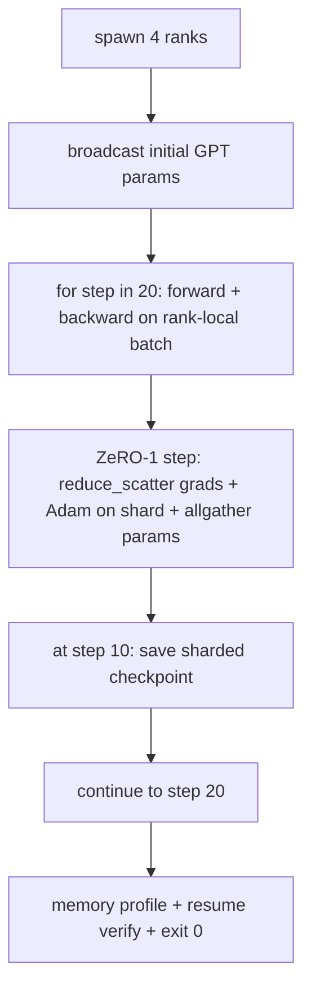

<!-- i18n:manual -->
# Сквозное распределённое обучение

> Уроки с 76 по 80 строили по одной детали каждый. Здесь идёт сборка: крошечный GPT обучается на 4 симулированных рангах с DDP для синхронизации градиентов, ZeRO-1 для шардирования состояния оптимизатора и шардированным чекпойнтом на середине пути. Демо прогоняет 20 шагов, само завершается, печатает кривую лосса плюс профиль памяти и записывает чекпойнт, с которого можно продолжить.

**Type:** Build
**Languages:** Python
**Prerequisites:** Phase 19 Track C lessons 42-49
**Time:** ~90 min

## Learning Objectives

- Собрать DDP (урок 77) плюс ZeRO-1 (урок 78) плюс шардированные чекпойнты (урок 80) в один цикл обучения.
- Обучить двухслойную языковую модель на трансформере на маленьком синтетическом корпусе за 20 шагов на 4 симулированных рангах.
- Напечатать таблицу лосса по шагам, поранговый профиль памяти и манифест чекпойнта, который возобновляется побайтово точно на том же размере мира.
- Обосновать саму композицию: каждая деталь независимо тестируется в предыдущих уроках, а этот урок доказывает, что они складываются вместе.

## The Problem

Капстоун — это доказательство того, что детали стыкуются. Урок 76 реализовал коллективные операции. Урок 77 завернул их в DDP. Урок 78 расшардировал состояние оптимизатора через reduce_scatter. Урок 79 разобрал конвейер. Урок 80 сохранил шардированный чекпойнт. Каждый урок стоял сам по себе и со своим тестом. Настоящий прогон обучения использует все примитивы разом; и если композиция собрана неправильно, лосс разойдётся, чекпойнт откажется возобновляться, а память на ранг вырастет там, где должна была упасть.

> 🎒 **На пальцах.** Пять уроков — это пять деталей, каждая из которых по отдельности проверена и работает. Но детали, которые проходят свои тесты, всё ещё могут не подойти друг к другу — как розетка и вилка из разных стран. Именно поэтому в конце трека стоит один прогон, который включает всё сразу.

Этот урок гоняет сквозное демо и проверяет четыре инварианта: (a) лосс монотонно убывает на протяжении 20 шагов в пределах шума float, (b) на каждом шаге у всех рангов одинаковая норма параметров, (c) память оптимизатора на ранг равна формуле ZeRO-1 в 12P/N байт, и (d) чекпойнт с шага 10 перезагружается побайтово точно при рестарте. Демо само завершается: 20 шагов, одна команда, выход с кодом 0.

> 🎒 **На пальцах.** Каждый инвариант ловит свою поломку. Растущий лосс означает, что градиенты синхронизируются неправильно; разошедшиеся нормы параметров — что ранги разъехались; память не по формуле 12P/N — что ZeRO не шардирует, а только делает вид. Четвёртый инвариант проверяет, что прогон вообще переживёт падение узла.

## The Concept



> 🎒 **На пальцах.** Схема читается как один рабочий день процесса: разбудить 4 ранга, раздать всем одинаковые стартовые веса, 20 раз повторить «посчитал — синхронизировал — шагнул», на десятом шаге сохраниться и в конце отчитаться. Обратите внимание, что сохранение вклинивается прямо в середину цикла, а не приделано в конце: именно так и происходит в реальных прогонах.

### The mini GPT

Модель специально маленькая: 2 блока трансформера, размерность эмбеддинга 32, 4 головы внимания, словарь на 64, длина последовательности 16, батч 4. Несколько тысяч параметров. Достаточно большая, чтобы задействовать каждое решение по проводке (многоголовое внимание идёт по стандартному маскированному пути; у LayerNorm есть веса, которые надо синхронизировать; LM-голова — отдельная линейная проекция обратно в словарь). И достаточно маленькая, чтобы 20 шагов на 4 CPU-рангах закончились за секунды.

> 🎒 **На пальцах.** Крошечный размер тут — сознательное инженерное решение, а не экономия. Считайте: словарь 64 и эмбеддинг 32 дают таблицу всего в 2048 чисел, а весь прогон укладывается в секунды на обычном ноутбуке. Зато все механизмы, которые ломаются на настоящем масштабе, — LayerNorm, эмбеддинги, LM-голова — присутствуют в полном составе.

### The composition rules

| Lesson piece | What it owns | What it leaves to the loop |
|--------------|--------------|----------------------------|
| DDP broadcast | Начальная синхронизация параметров | Один вызов на этапе создания |
| ZeRO-1 step | Синхронизация градиентов, обновление мастер-копии, рассылка параметров | Один вызов за шаг вместо optimiser.step |
| Sharded checkpoint | Сохранение порангового состояния, манифест с sha256 | Вызывается на ранге 0 с состоянием, собранным через allgather |
| Training loop | Forward, backward, логирование лосса | Вызывает три предыдущих в нужном порядке |

Цикл ничего не знает ни про reduce_scatter, ни про rendezvous-файлы. Модули ZeRO и чекпойнта выставляют наружу узкие интерфейсы, которые цикл просто складывает вместе.

> 🎒 **На пальцах.** Правая колонка таблицы — это и есть определение хорошего интерфейса: сколько именно цикл обязан знать. Про DDP — один вызов при создании. Про ZeRO — один вызов за шаг, ровно на месте привычного `optimiser.step`. Всё остальное спрятано, и потому ZeRO-1 можно заменить на ZeRO-2, не трогая цикл вообще.

### Why a tiny GPT and not just an MLP

MLP из урока 77 хватало, чтобы проверить синхронизацию градиентов. Крошечный GPT добавляет три вещи: отдельную LM-голову над словарём (в этом уроке несвязанную, ради ясности; в полноценном GPT голову обычно связывают с эмбеддингом токенов), softmax с кросс-энтропией в качестве лосса (краевых числовых случаев тут больше, чем у MSE) и несимметричный forward (эмбеддинги, потом внимание, потом MLP на каждом слое). Остаться на MLP в капстоуне значило бы не увидеть, справляется ли композиция с LayerNorm и с формой градиента у слоя эмбеддингов.

> 🎒 **На пальцах.** Слой эмбеддингов — самая коварная деталь из перечисленных. Его градиент разрежен: за шаг обновляются только те строки словаря, которые встретились в батче, а остальные 60 с лишним строк из 64 остаются нетронутыми. На MLP такой ситуации не бывает вообще, поэтому и баг в синхронизации разреженных градиентов на MLP не всплыл бы.

### Self-terminating means exit 0

Цикл делает фиксированные 20 шагов и выходит. Никакого `while True`, никакого вмешательства человека, никакого возобновления из внешнего состояния. Капстоун, который можно оставить работать без присмотра и найти по возвращении полный лог, — это капстоун, доказывающий, что система собрана правильно. Если какая-то деталь взаимно заблокируется, демо никогда не вернётся, и тестовый стенд это поймает.

> 🎒 **На пальцах.** «Выход с кодом 0» — это не формальность, а способ отличить «отработало» от «повисло». Распределённый код чаще всего ломается именно зависанием: один ранг ждёт сообщения, которого никто не пришлёт, и процесс живёт вечно, ничего не печатая. Фиксированные 20 шагов превращают такое зависание в честный таймаут в CI.

```figure
ci-distributed-assembly
```

## Build It

`code/main.py` реализует:

- `MiniGPT`: двухслойный трансформер с маскированным self-attention и отдельной LM-головой.
- `make_corpus(seed, total_tokens)`: детерминированные данные для предсказания следующего токена.
- `_train_worker`: запускается по одному на ранг; рассылает стартовые параметры, крутит цикл, вызывает шаг ZeRO, пишет шардированный чекпойнт на шаге 10.
- `verify_resume`: после основного прогона перезагружает чекпойнт с шага 10 прямо в процессе и проверяет, что сохранённые мастер-шарды побайтово совпадают со снимком в памяти.
- `main`: оркестрирует всё демо, печатает таблицу лосса, профиль памяти и результат проверки.

> 🎒 **На пальцах.** Слово «детерминированные» в описании `make_corpus` важнее, чем кажется: при фиксированном seed корпус одинаков на всех рангах и от запуска к запуску. Без этого вы не смогли бы сравнивать нормы параметров между рангами — расхождение могло бы объясняться просто разными данными, а не багом в синхронизации.

Запустите:

```bash
python3 code/main.py
```

Вывод: таблица лосса на 20 строк, поранговый профиль памяти на 4 строки, манифест чекпойнта и строка «RESUME VERIFIED» при успехе.

> 🎒 **На пальцах.** Профиль памяти на 4 строки — это ровно то место, где формула ZeRO-1 превращается из теории в число на экране. Проверьте сами: суммарная память оптимизатора по всем 4 рангам должна совпасть с 12P байт для нешардированного случая, а на каждый ранг придётся четверть. Если четверти не получилось — шардирование где-то не сработало.

## Production patterns in the wild

Три приёма достраивают композицию до настоящих прогонов.

**Checkpoint every K minutes, not every K steps.** Время шага меняется вместе с длиной последовательности и числом микробатчей. Каденция «чекпойнт раз в 10 минут» ловит одинаковый объём вычислений независимо от размера модели. В уроке для простоты используется привязка к шагам; в продакшене привязываются к стенным часам.

> 🎒 **На пальцах.** Разница вылезает сразу, как только меняется модель. «Каждые 100 шагов» на маленькой модели — это раз в минуту (лишняя нагрузка на диск), а на модели побольше при шаге в 20 секунд — раз в полчаса (полчаса работы под угрозой). «Каждые 10 минут» означает одно и то же в обоих случаях: вы рискуете максимум десятью минутами.

**Detect divergence early.** Продакшен-прогоны добавляют защиту от NaN после backward и детектор скачка лосса; если лосс за один шаг подскочил больше чем вдвое, лучше откатиться на предыдущий чекпойнт, чем позволить оптимизатору маршировать в вырожденное состояние. Кривая лосса в уроке гладкая, поэтому защита не срабатывает, но крючок для неё остаётся.

> 🎒 **На пальцах.** Смысл ранней ловли в том, что расхождение необратимо. NaN, попавший в один параметр, за один шаг оптимизатора расползается на все — и дальше прогон просто жжёт деньги впустую. Порог «в два раза за шаг» выбран так, чтобы не путать реальный взрыв с обычным шумом: нормальный лосс между соседними шагами столько не прыгает.

**Aggregate the memory profile across ranks.** В реальных прогонах память на ранг отличается от ранга к рангу (тот, кому досталась самая большая стадия конвейера, держит больше активаций). Продакшен логирует максимум по рангам плюс среднее; урок печатает поранговые числа, чтобы было видно совпадение с формулой.

> 🎒 **На пальцах.** Логировать среднее по рангам без максимума — классическая ошибка: OOM случается у того ранга, который держит больше всех, а среднее его прячет. Если три ранга заняли по 20 ГБ, а четвёртый 70, среднее покажет уютные 32,5 ГБ — и вы узнаете правду только из падения. В уроке рангов всего 4, поэтому печатаются все.

## Use It

Приёмы из продакшена:

- **DeepSpeed.** Совмещает DDP + ZeRO + конвейер + activation checkpointing под одним конфигом. Композиция из урока — это форма DeepSpeed в миниатюре.
- **PyTorch FSDP.** Родной эквивалент. `FullyShardedDataParallel` со `ShardingStrategy.SHARD_GRAD_OP` — это ZeRO-2.
- **NeMo and Megatron-LM.** Добавляют tensor parallel для самых крупных моделей; в остальном форма композиции та же самая.

> 🎒 **На пальцах.** Главная мысль этого списка: вы только что написали упрощённый DeepSpeed. Конфиг DeepSpeed на десяток строк включает ровно те же четыре механизма, которые вы собрали вручную, — и теперь вы знаете, что происходит за каждым флагом. Именно поэтому капстоун стоит перед тем, как брать готовый фреймворк, а не после.

## Ship It

На этом трек заканчивается. Шесть уроков вместе — это та самая подсистема распределённого обучения, которую реальная команда собрала бы перед тем, как переходить на DeepSpeed; абстракция проверена против gloo, а сценарии отказов отработаны. Фаза 17 (инфраструктура и продакшен) — то место, где всё это выносится на настоящий кластер.

## Exercises

1. Добавьте tensor-parallel разрезание головы внимания и убедитесь, что лосс совпадает с однаранговой базовой линией. Два ранга: по половине голов на ранг, allreduce выхода внимания.
2. Добавьте накопление градиентов по 4 микробатчам и докажите, что градиент равен градиенту одного большого батча.
3. Добавьте путь возобновления с шага 10, который реально продолжает обучение до шага 20 и выдаёт тот же итоговый лосс, что и исходный прогон.
4. Добавьте экспорт метрик (лосс, норма градиента, время шага) в JSONL, чтобы прогон можно было визуализировать постфактум.
5. Добавьте защиту от NaN, которая откатывается на предыдущий чекпойнт при скачке лосса, и вызовите скачок принудительно, домножив LR на один шаг.

> 🎒 **На пальцах.** Третье задание — самая честная проверка всей работы. Если возобновлённый прогон даёт ровно тот же итоговый лосс, значит в чекпойнт попало всё состояние целиком: и веса, и моменты Adam, и позиция в данных. Разошёлся лосс хотя бы в третьем знаке — что-то из этого списка вы забыли сохранить.

## Key Terms

| Term | What people say | What it actually means |
|------|----------------|------------------------|
| End-to-end | "Wire it all up" | Один прогон собирает все детали разом, а не по юнит-тесту на деталь |
| Memory profile | "GB per rank" | Байты, которые каждый ранг держит под параметры, градиенты и состояние оптимизатора |
| Resume contract | "Save and load" | Поранговое состояние побайтово совпадает после круга «сохранил — загрузил» |
| Self-terminating | "Bounded run" | Фиксированное число шагов, выход с кодом 0 по завершении, без человека в цикле |

## Further Reading

- [DeepSpeed end-to-end training tutorial](https://www.deepspeed.ai/getting-started/)
- [PyTorch FSDP advanced tutorial](https://pytorch.org/tutorials/intermediate/FSDP_advanced_tutorial.html)
- [Megatron-LM training script reference](https://github.com/NVIDIA/Megatron-LM)
- Phase 19 Lessons 76-80 — каждая деталь, которую собирает этот урок
- Phase 17 — перенос композиции на настоящий кластер
