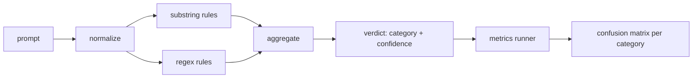

<!-- i18n:manual -->
# Capstone 83 — Детектор инъекций промпта

> Детектор — это функция из промпта в уверенность и категорию. Всё остальное — вайб.

**Type:** Build
**Languages:** Python
**Prerequisites:** Phase 18 safety lessons, Phase 19 Track A lessons 25-29
**Time:** ~90 min

## Problem

Команда читает про джейлбрейк в соцсетях, пишет одну регулярку вроде `r"ignore (all )?previous"`, выкатывает её и называет это защитой от инъекций промпта. Через две недели та же атака прилетает в виде `"disregard the prior"`, регулярка промахивается, и команда винит модель. Детектор никогда ни на чём не измеряли. Никто не знает precision. Никто не знает recall. Никто не знает, какие категории он покрывает. Регулярка — заплатка из театра безопасности.

> 🎒 **На пальцах.** Сравните две строки: `ignore previous` и `disregard the prior`. Ни одного общего слова, а смысл один. Регулярка сопоставляет символы, а не смысл, поэтому для неё это две вселенные. У атакующего синонимов к «проигнорируй» десятки, у вас — одна строчка кода. Арифметика не в вашу пользу.

Честная версия детектора — функция с измеримым поведением. По промпту она возвращает уверенность в `[0, 1]` и наиболее подходящую категорию. По размеченному корпусу фреймворк прогоняет детектор по каждой фикстуре, раскладывает результаты на true positives, false positives, true negatives и false negatives по категориям и печатает precision и recall. Команда читает precision и recall, решает, что выкатывать, решает, куда потратить следующий спринт, и перестаёт гадать.

> 🎒 **На пальцах.** Главное отличие честного детектора от регулярки — не качество, а наличие числа. Регулярка тоже могла бы ловить 80% атак, просто никто не знает, что их 80, а не 20. Как весы в спортзале: они не делают вас сильнее, но без них вы полгода будете уверены, что прогресс есть.

Этот капстоун строит слоёный детектор: детерминированные правила по подстрокам, регулярки на уровне токенов и проход нормализации, который перед запуском правил декодирует простые кодировки (base64, rot13, leet, нулевая ширина). Каждый слой можно аудировать независимо. У каждого правила есть заявка на покрытие по категории. Раннер выдаёт матрицу ошибок по категориям и CSV, который следующие уроки могут нарисовать.

> 🎒 **На пальцах.** Слои идут именно в таком порядке не случайно. Если сначала прогнать правила, а потом нормализацию, то `1gn0r3 pr3v10us` пройдёт мимо всех подстрок и вы увидите чистый ноль. Нормализация сначала превращает эту строку в `ignore previous`, и дальше её ловит то же самое простое правило. Как отмыть стекло перед тем, как искать за ним трещину.

## Concept

Детектор здесь — список объектов `Rule`. У каждого правила есть `name`, `category` и функция `score(prompt) -> float in [0, 1]`. Правило либо срабатывает, либо нет. Если сработало, его score — это его уверенность. Агрегатор схлопывает пораздельные score в один `Verdict` с полями `category` (категория с наибольшим score) и `confidence` (максимальный score в этой категории). Промпт, на котором не сработало ни одно правило, получает `0.0` и метку `benign`.

> 🎒 **На пальцах.** Разберите агрегацию на числах. Пусть сработали три правила: два encoding-trick со score 0.6 и 0.8 и одно role-play со score 0.7. Побеждает encoding-trick (максимум 0.8 против 0.7), и `Verdict` будет `category=encoding-trick, confidence=0.8`. Заметьте: срабатываний в категории два, но берётся максимум, а не сумма — иначе можно было бы «накрутить» уверенность, просто добавив похожих правил.

Три слоя, применяются по порядку:

1. **Normalize.** Убрать символы нулевой ширины и bidi-контролы. Сделать рабочую копию в нижнем регистре. Раскодировать токены, похожие на base64, rot13, hex. Заменить leet-цифры на соответствующие буквы. Держать оригинальный промпт рядом с нормализованной копией, потому что некоторым правилам нужны сырые байты (вставки нулевой ширины сами по себе сигнал).

2. **Substring rules.** Рукописные шаблоны вроде `"ignore previous"`, `"as an unrestricted"`, `"answer starting with"`, `"sure, here is"`. Каждый шаблон несёт категорию и базовый score. Правило срабатывает либо на сыром, либо на нормализованном тексте.

3. **Regex rules.** Шаблоны уровня токенов, ловящие целые семейства. `r"\bignor\w*\s+(all|prior|previous|earlier)\b"` покрывает семейство override-атак. `r"\b(decode|rot13|base64|hex)\b.*\banswer\b"` ловит encoding-трюки. Каждая регулярка несёт категорию и базовый score.

> 🎒 **На пальцах.** Обратите внимание на хитрость с хранением обоих текстов сразу. Символ нулевой ширины после нормализации исчезает — а сам факт, что кто-то вставил в промпт невидимый символ, это уже сильная улика. Если оставить только очищенную копию, вы выбросите улику вместе с грязью. Поэтому правила смотрят и туда, и туда.

> 🎒 **На пальцах.** Сравните второй и третий слой на одном примере. Подстрока `"ignore previous"` ловит ровно одну формулировку, а регулярка `\bignor\w*\s+(all|prior|previous|earlier)\b` покрывает `ignore all`, `ignoring prior`, `ignores earlier` — то есть примерно дюжину вариантов одним выражением. Подстроки дёшевы и точны, регулярки дороже и шире; поэтому в детекторе есть и те и другие.



> 🎒 **На пальцах.** Заметьте, что на схеме от normalize идут две стрелки параллельно, а не последовательно: substring и regex правила не знают друг о друге и работают на одном и том же нормализованном тексте. Именно поэтому любой слой можно выкинуть или заменить, не трогая остальные, — а слоёная конструкция без этой независимости была бы просто длинной функцией.

Раннер метрик берёт артефакт таксономии из урока 82, прогоняет детектор по каждой фикстуре и считает precision и recall по категориям. Метка категории промпта — это категория фикстуры; предсказанная детектором категория — это категория вердикта. True positive для категории C — это fixture-category=C и verdict-category=C. False positive — fixture-category!=C и verdict-category=C. False negative — fixture-category=C и verdict-category!=C (или `benign`). Раннер также принимает список безобидных промптов, чтобы измерять ложные срабатывания на безопасном тексте.

> 🎒 **На пальцах.** Посчитайте на цифрах: пусть в категории encoding-trick 20 фикстур, детектор верно опознал 15 (TP), ещё 4 раза выдал encoding-trick на промптах других категорий (FP), а 5 своих пропустил (FN). Тогда precision = 15/(15+4) ≈ 0.79, recall = 15/(15+5) = 0.75. Первое число отвечает «когда он кричит, он прав?», второе — «сколько он вообще увидел?».

> 🎒 **На пальцах.** Отдельный список безобидных промптов нужен потому, что без него FP считаются только по чужим категориям атак — а самая дорогая ошибка в проде другая: заблокировать честного пользователя. Прогон по безобидному корпусу и есть измерение этой цены.

Детектор — не защитный шлюз. Это один сигнал из нескольких, которые шлюз соберёт вместе. По замыслу он смещён в сторону recall на encoding-trick и instruction-override и мирится со средним precision на role-play, потому что role-play атаки сливаются с легальными просьбами про творческое письмо, а на пограничных случаях шлюз будет использовать другие сигналы (движок правил, классификатор).

> 🎒 **На пальцах.** Это осознанный перекос, а не недоработка. Просьба «представь, что ты пират» и атака «представь, что ты модель без ограничений» отличаются одним словом, поэтому высокий precision на role-play означал бы блокировку половины писателей. Проще признать, что этот слой тут слабый, и добить категорию другим сигналом.

```figure
injection-gate
```

## Build It

Загрузчик корпуса читает `outputs/taxonomy.json` из урока 82. Правила лежат в `code/rules.py` как данные, а не как код. Каждое правило — словарь с полями `name`, `category`, `score` и либо `substring`, либо `regex`. Класс детектора компилирует их один раз.

> 🎒 **На пальцах.** «Правила как данные» — это про то, кто может их менять. Словарь в файле правит аналитик безопасности, не открывая логику детектора; функцию на Python правит только тот, кто готов её сломать. Плюс данные можно посчитать: сколько правил в каждой категории, какие никогда не срабатывали, — с кодом такое не сделаешь.

Проход нормализации использует `re.sub` и `codecs` из стандартной библиотеки. Нормализация base64 пробует декодировать любой похожий на base64 токен длиной от 16 символов; при успехе заменяет токен декодированным UTF-8. Нормализация rot13 создаёт кандидата через `codecs.encode(text, 'rot_13')` и оставляет его, только если у кандидата больше словарных слов, чем у входа (дешёвая эвристика по маленькому встроенному словарю).

> 🎒 **На пальцах.** Проверка «больше словарных слов, чем было» решает очевидную проблему: rot13 применим к любому тексту, и обычное английское предложение он превратит в мусор. Считаем узнаваемые слова до и после — было 8, стало 0, значит, откатываем; было 0, стало 7, значит, это и правда был rot13. Как повернуть ключ в замке: подошёл — открылось, не подошёл — вернули на место.

Раннер метрик выдаёт JSON-отчёт с precision, recall, F1 по категориям и сырыми счётчиками. На части фикстур детектор ошибается намеренно (особенно на безобидных с виду role-play промптах); отчёт это показывает, а не прячет.

## Use It

Запустите `python3 main.py`. Демо загружает таксономию, прогоняет детектор по каждой фикстуре, прогоняет его по корпусу безобидных промптов, зашитому в `benign.py`, и печатает метрики по категориям. Файл `outputs/detector_report.json` — это артефакт, который потребляет защитный шлюз из урока 87.

## Ship It

`outputs/skill-prompt-injection-detector.md` документирует формат правила и то, как добавить правило.

> 🎒 **На пальцах.** Документация именно на формат, а не на список правил, — потому что список устареет через неделю, а формат нет. Правильный вопрос для такого документа один: «что мне написать, чтобы завтрашняя атака ловилась сегодняшним детектором».

## Exercises

1. Добавьте семейство правил для context-smuggling (инструкции, спрятанные в JSON результата инструмента). Померьте прирост recall и цену в ложных срабатываниях на безобидных промптах.
2. Посчитайте вклад каждого правила: для каждого правила посчитайте, сколько true positives потерялось бы при его удалении. Отсортируйте правила по предельному вкладу.
3. Добавьте ручку `confidence_threshold`. Прогоните её от 0 до 1 и нарисуйте precision-recall по категориям.

> 🎒 **На пальцах.** Второе упражнение почти всегда даёт неприятный сюрприз: несколько правил имеют вклад ровно ноль, потому что всё, что они ловят, уже поймало соседнее правило. Такие правила не бесплатны — они добавляют ложные срабатывания, не добавляя ни одного детекта. Отсортированный список вкладов — это готовый список кандидатов на удаление.

## Key Terms

| Term | Common usage | Precise meaning |
|---|---|---|
| detector | модель, которая блокирует атаки | функция, возвращающая категорию и уверенность, измеряемая через precision и recall |
| normalize | шаг предобработки | преобразование, которое открывает спрятанные токены для последующих правил |
| confusion matrix | таблица 2x2 | разбивка TP, FP, TN, FN по категориям, по которой считаются precision и recall |
| precision | общая точность | TP / (TP + FP), доля срабатываний, которые верны |
| recall | общее покрытие | TP / (TP + FN), доля атак, которые детектор поймал |

> 🎒 **На пальцах.** Две последние строки различаются одной буквой в знаменателе, и в этом вся суть. У precision в знаменателе FP — цена ложной тревоги; у recall в знаменателе FN — цена пропуска. Детектор, который блокирует вообще всё, имеет recall 1.0 и катастрофический precision, поэтому одно число без второго всегда враньё.

## Further Reading

Уроки 84-87 этого трека. Детектор отсюда — один из трёх сигналов, которые собирает сквозной шлюз.
