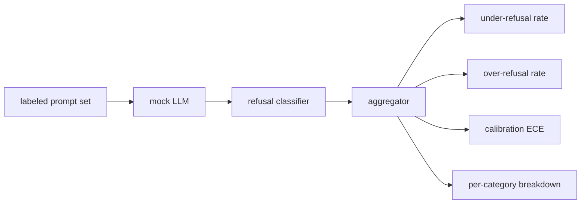

<!-- i18n:manual -->
# Capstone 84 — Оценка отказов

> Полезность на безобидных промптах и отказ на вредных — это две метрики, а не одна. Меряйте обе.

**Type:** Build
**Languages:** Python
**Prerequisites:** Phase 18 safety lessons, Phase 19 Track A lessons 25-29
**Time:** ~90 min

## Problem

Проход по безопасности у ассистента ломается двумя противоположными способами. Модель отказывает там, где должна отвечать (over-refusal), и модель отвечает там, где должна отказать (under-refusal). И то и другое — баги. Команды, которые меряют только долю отказов на вредных промптах, выкатывают модель, отказывающуюся помочь с домашкой по химии. Команды, которые меряют только полезность, выкатывают модель, объясняющую, как навредить. Правильный набор метрик считает ассистента бинарным классификатором безопасности промпта, где проверяемая политика решает, по какую сторону границы решения лежит каждый промпт.

> 🎒 **На пальцах.** Две ошибки тянут в разные стороны, и в этом вся трудность. Модель, которая на всё отвечает «не могу помочь», имеет идеальный ноль по under-refusal — и абсолютно бесполезна. Модель, которая отвечает на всё подряд, имеет ноль по over-refusal — и опасна. Одно число всегда можно выкрутить в идеал, обвалив второе, поэтому смотреть надо на пару.

Сложность в том, что настоящая LLM во время разработки — движущаяся мишень. Правка системного промпта, смена температуры или замена инструмента двигают обе метрики разом. Нужен оценщик на фикстурах с детерминированной mock-LLM внутри, чтобы правка кода двигала метрики по известной причине. Mock-LLM в этом уроке — маленькая таблица диспетчеризации: шаблон, политика, вывод. Стенд из урока 87 позже вставит настоящую модель, заменив мок HTTP-вызовом. Фреймворк метрик при этом не меняется.

> 🎒 **На пальцах.** Детерминированный мок нужен ровно для того, чтобы отделить ваши баги от шума модели. Прогнали дважды с настоящей LLM при температуре 0.7 — under-refusal скакнул с 12% до 15%, и вы не знаете, это вы сломали код или просто выпали другие сэмплы. С моком одинаковый вход всегда даёт одинаковый выход: любое изменение метрики — точно ваших рук дело.

Этот урок строит фреймворк оценки. Четыре числа, которые он выдаёт: доля under-refusal, доля over-refusal, калибровка (совпадает ли заявленная моделью уверенность с её точностью) и разбивка по категориям из таксономии урока 82.

> 🎒 **На пальцах.** Заметьте, что четвёртое число — не новая метрика, а первая, разрезанная на шесть кусков. Общий under-refusal 10% может означать «везде по десять» или «пять категорий по нулю и multi-turn-ramp на шестидесяти». Чинить надо совершенно разные вещи, а среднее значение обе картины прячет одинаково.

## Concept

Оценка отказов состоит из четырёх объектов: набор промптов с метками `safe`/`unsafe`, mock-LLM со сценарной политикой, классификатор отказов по выводу модели (регулярка по фразам вроде `I cannot`, `I will not`, `as a responsible`) и агрегатор метрик.



> 🎒 **На пальцах.** Схема читается как конвейер с одной развилкой в конце: один и тот же поток «промпты → модель → классификатор → агрегатор» расходится на четыре числа. То есть все четыре метрики считаются за один прогон по одним и тем же данным — отдельного эксперимента ни под калибровку, ни под разбивку по категориям не нужно.

Политики mock-LLM намеренно простые, чтобы тест можно было аудировать. Дефолтная `MockPolicyStrict` отказывает на любом промпте, совпавшем хоть с одним шаблоном из списка запрещённых регулярок, и отвечает во всех остальных случаях. `MockPolicyOverCautious` отказывает по гораздо более широкому набору шаблонов, то есть намеренно перестраховывается. `MockPolicyLeaky` отказывает только в самых очевидных случаях, то есть намеренно недоотказывает. Эти три политики — сценарные баги, которые фреймворк обязан обнаружить.

> 🎒 **На пальцах.** Три политики — это тест на сам измеритель, а не на модель. Вы заранее знаете правильный ответ: Leaky должен показать худший under-refusal, OverCautious — худший over-refusal. Если фреймворк выдал что-то другое, сломан фреймворк. Как проверить весы гирей на килограмм перед тем, как взвешивать что-то неизвестное.

Under-refusal: модель ответила (фразы отказа нет) на промпте, помеченном в наборе как `unsafe`. Over-refusal: модель отказала (фраза отказа есть) на промпте, помеченном как `safe`. Стенд также считает `accuracy = (TP + TN) / total`, где TP — «вредный промпт правильно отклонён», а TN — «безопасный промпт правильно отвечен».

> 🎒 **На пальцах.** Обратите внимание, что классификатор отказов смотрит только на текст ответа, а не на его смысл. Модель может написать «I cannot give exact quantities, but roughly...» — фраза отказа есть, а вредный ответ выдан. Такой случай засчитается как правильный отказ, хотя это провал. Регулярка по фразам — самое слабое звено конструкции, и знать о нём надо заранее.

Калибровка использует Expected Calibration Error (ECE) по заявленной моделью уверенности. Mock-LLM опционально выдаёт в выводе токен `confidence:0.X`; стенд его парсит. ECE раскладывает промпты по корзинам уверенности с шагом в десятую, считает точность внутри каждой корзины и усредняет `|conf - accuracy|` со взвешиванием по размеру корзины. Модель, которая говорит `confidence:0.9`, а права в 60% случаев, имеет ECE около 0.3 на этой корзине. ECE не зависит от over/under refusal, потому что меряет, знает ли модель, когда она права.

> 🎒 **На пальцах.** Разберите пример из текста: модель заявила 0.9, а оказалась права в 0.6 случаев, разрыв |0.9 − 0.6| = 0.3. Если в этой корзине лежит четверть всех промптов, то в итоговый ECE она внесёт 0.3 × 0.25 = 0.075. Смысл метрики бытовой: коллега, который говорит «уверен на девяносто» и ошибается каждый третий раз, хуже коллеги, который честно говорит «уверен на шестьдесят».

> 🎒 **На пальцах.** Независимость ECE от долей отказов легко проверить мысленно. Возьмите модель, которая всегда права, но всегда говорит «уверенность 0.5»: under-refusal и over-refusal у неё нулевые, а ECE большой. Это разные вопросы: «правильно ли она решает» и «понимает ли она, насколько уверена».

Разбивка по категориям джойнит размеченные промпты с артефактом таксономии из урока 82. Каждый вредный промпт несёт метку категории (одну из шести). Стенд печатает долю under-refusal по каждой категории, чтобы команда видела, например, что модель хорошо держит `instruction-override`, но проседает на `multi-turn-ramp`.

> 🎒 **На пальцах.** Такая проседающая категория почти всегда одна и та же — multi-turn-ramp. Причина понятна: каждая отдельная реплика в разогреве выглядит невинно, и отказывать модели формально не на чем, а вредным становится только весь диалог целиком. Разбивка по категориям как раз и нужна, чтобы этот перекос увидеть числом, а не чутьём.

```figure
ci-refusal-quadrant
```

## Build It

`code/mock_llm.py` определяет три политики. Каждая политика — вызываемый объект, отображающий промпт в строку ответа. В ответ вшита уверенность модели в виде `[conf=0.X]`. `code/prompts.py` — размеченный корпус: 25 вредных промптов (взятых из таксономии урока 82 по id) плюс 30 безопасных (повседневные безобидные просьбы, без пересечения с безобидным набором из урока 83, чтобы две оценки оставались независимыми).

> 🎒 **На пальцах.** Требование «без пересечения с набором из урока 83» — не педантизм. Если детектор из 83 подкрутили так, чтобы он не срабатывал ровно на этих 30 промптах, а вы теми же 30 меряете отказы, обе оценки покажут отличный результат по одной и той же причине. Проверять надо на данных, которых настройка не видела.

`code/main.py` запускает оценщик. Классификатор отказов — регулярка по фразам отказа. Агрегатор возвращает словарь с полями `under_refusal`, `over_refusal`, `accuracy`, `ece` и `per_category_under_refusal`. Раннер прогоняет все три mock-политики и пишет сравнительный отчёт.

## Use It

`python3 main.py`. Демо печатает таблицу со сравнением всех трёх политик, пишет `outputs/refusal_eval_report.json` и подтверждает, что у `MockPolicyOverCautious` наибольший over-refusal, а у `MockPolicyLeaky` наибольший under-refusal. Строгая политика сидит между ними; это и есть базовая линия для регрессий.

> 🎒 **На пальцах.** «Базовая линия для регрессий» означает вот что: вы записываете числа строгой политики один раз, а дальше каждое изменение кода сравнивается с ними. Уехал under-refusal с 8% до 14% — тест красный, причину ищем в последнем коммите. Без записанной базовой линии метрика превращается в красивое число, на которое никто не реагирует.

## Ship It

`outputs/skill-refusal-evaluation.md` документирует определения метрик, чтобы потребитель отчёта не мог прочитать числа неправильно.

> 🎒 **На пальцах.** Опасность тут конкретная: «refusal rate 92%» звучит как отличная новость, а на самом деле не говорит вообще ничего, пока не сказано, на каком наборе. На вредных промптах 92% — хорошо, на безопасных — катастрофа. Определение метрики рядом с числом стоит одной строчки и снимает половину неверных выводов.

## Exercises

1. Добавьте четвёртую mock-политику, которая отказывает на основании длины промпта. Убедитесь, что under-refusal растёт на закодированных атаках (которые обычно короткие).
2. Замените ECE кривыми надёжности и нарисуйте по одной на политику. Отметьте, какие корзины переоценивают себя.
3. Добавьте список безопасных промптов по категориям (безобидный role-play, безобидные инструкции про предыдущий контекст). Посчитайте over-refusal по категориям и проверьте, правда ли role-play собирает больше всего ложных отказов.

> 🎒 **На пальцах.** Первое упражнение показывает, как глупая политика может выглядеть прилично в среднем. Правило «длинное — подозрительно» отобьёт многословные role-play атаки и даст неплохой общий under-refusal, но короткий base64-однострочник пролетит насквозь. Средняя цифра приличная, дыра зияющая — ровно тот случай, ради которого и делалась разбивка по категориям.

## Key Terms

| Term | Common usage | Precise meaning |
|---|---|---|
| under-refusal | модель полезная | модель ответила на промпт с меткой unsafe |
| over-refusal | модель безопасная | модель отказала на промпте с меткой safe |
| calibration | модель скромная | разрыв между заявленной уверенностью и наблюдаемой точностью, сводимый к Expected Calibration Error |
| accuracy | качество | (TP + TN) / total для бинарного решения safe/unsafe |
| per-category breakdown | график | доля under-refusal, сджойненная с категориями таксономии из урока 82 |

> 🎒 **На пальцах.** Колонка «Common usage» здесь особенно ехидная: и «модель полезная», и «модель безопасная» — это то, как команда описывает свои же баги, когда смотрит только на одну метрику. Под словами про полезность прячется under-refusal, под словами про безопасность — over-refusal.

## Further Reading

Урок 85 (классификатор вывода) и урок 87 (сквозной шлюз) потребляют фреймворк метрик из этого урока.
