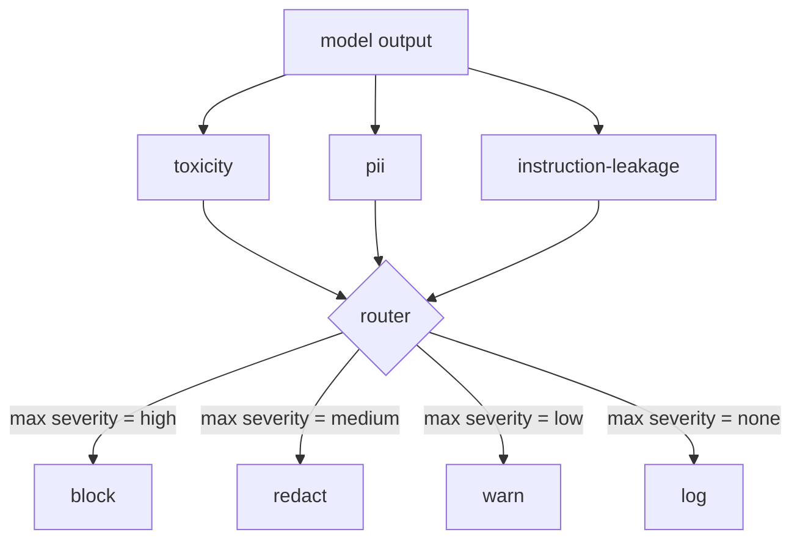

<!-- i18n:manual -->
# Капстоун 85 — интеграция классификаторов контента

> Классификаторы на стороне выхода отвечают не на тот вопрос, что правила на стороне входа. И тем и другим нужен политический роутер.

**Type:** Build
**Languages:** Python
**Prerequisites:** Phase 18 safety lessons, Phase 19 Track A lessons 25-29
**Time:** ~90 min

## Problem

Вход — не единственная поверхность атаки. Модель, прошедшая все проверки на входе, всё ещё может выдать ответ, который сливает PII, повторяет оскорбления из обучающего распределения или на хитрый вопрос отдаёт пользователю системный промпт. Классификатор на стороне выхода видит реальный ответ модели, а не запрос пользователя, и задаёт другой вопрос: неважно, как этот запрос сюда попал, — приемлемо ли то, что мы сейчас отправим пользователю.

> 🎒 **На пальцах.** Модерация входа и модерация выхода смотрят на два разных текста, поэтому и вопросы у них разные: «что просил пользователь» против «что мы сейчас отдадим». Пример из абзаца: запрос «расскажи про свои настройки» безобиден, а ответ с системным промптом — уже утечка. Как досмотр на входе в самолёт и проверка багажа на выходе: одна не заменяет другую.

Команды часто пропускают классификацию выхода: кажется, что проверок на входе достаточно, а классификаторы выхода добавляют задержку. Оба довода проигрывают. Пропустить классификацию выхода — значит подарить атакующему обход с одного удара: любое новое семейство атак, которое пайплайн входа не покрывает, долетит до пользователя. Задержка реальна, но лечится: классификаторы можно гнать параллельно со стримингом токенов, а гейт придержит последний кусок и применит вердикт классификатора до отправки.

> 🎒 **На пальцах.** Обратите внимание на слова «с одного удара»: тут не про постепенную деградацию, а про то, что первая же непокрытая атака сразу доезжает до живого пользователя. А трюк с задержкой простой: токены летят к пользователю сразу, гейт держит в буфере только последний фрагмент. Как редактор прямого эфира с задержкой в семь секунд — зритель почти не замечает, а мат вырезать успевают.

Этот капстоун подключает три независимых классификатора на стороне выхода к одному политическому роутеру. Toxicity (поиск оскорблений и травли по правилам). PII (регулярки на email, телефоны, строки в форме SSN, строки в форме номера карты, IP-адреса). Instruction leakage (эвристика на эхо системного промпта: выход сравнивается с известным системным промптом по пересечению триграмм). Роутер собирает вердикты классификаторов, выбирает severity и применяет политику действий: `block`, `redact`, `warn` или `log`.

> 🎒 **На пальцах.** Три классификатора ловят три разные беды: грубость, персональные данные и утечку промпта. Ни один из них не смог бы поймать чужую: регулярка на email ничего не знает про оскорбления, а поиск оскорблений не заметит номер карты. Поэтому их не объединяют в один «детектор плохого», а вешают отдельно и сводят результаты в одной точке.

## Concept

Каждый классификатор — это вызываемый объект, возвращающий `ClassifierVerdict` с полями `name`, `score in [0,1]`, `severity` (`none`, `low`, `medium`, `high`) и `findings` (список строк с описанием того, что он пометил). Роутер получает список вердиктов и применяет таблицу правил:

> 🎒 **На пальцах.** Обратите внимание, что вердикт — это не одно число, а сразу четыре поля. `score` 0.9 сам по себе бесполезен: непонятно, кто его выдал и за что. Поля `name` и `findings` отвечают на «кто» и «за что», а `severity` — то единственное, по чему принимается решение. Как медицинская справка: диагноз, врач, анализы и вердикт «годен/не годен» — решает последнее, но без остального его не проверить.

| Severity | Action |
|---|---|
| high | block (выбросить выход, вернуть отказ по политике) |
| medium | redact (применить к выходу редактор конкретного классификатора) |
| low | warn (записать в лог и добавить к ответу мягкое предупреждение) |
| none | log (записать вердикт в трассу, отправить как есть) |

> 🎒 **На пальцах.** Четыре уровня — это четыре разных судьбы одного и того же текста: не отправить вовсе, отправить с вырезанными кусками, отправить целиком с припиской, отправить молча. Заметьте, что «ничего не нашли» — это тоже действие, `log`: вердикт всё равно пишется в трассу. Потом, когда что-то прорвётся, только по этим записям и получится понять, что классификаторы видели и промолчали.



> 🎒 **На пальцах.** На схеме видно главное: один выход модели уходит сразу в три стрелки, и все три сходятся в роутере. То есть классификаторы не стоят цепочкой друг за другом — они работают по одному и тому же тексту независимо. Значит их можно запустить одновременно, и общая задержка равна самому медленному из трёх, а не их сумме.

Роутер берёт максимальную severity среди классификаторов и применяет соответствующее действие. Block побеждает всех. Redact + warn превращается в redact. Log + warn превращается в warn. Роутер выдаёт объект `Action` с полями `verb`, `output`, `severity`, `verdicts` и `metadata`. Ниже по потоку гейт безопасности из урока 87 пишет metadata в трассу и либо отправляет отредактированный выход, либо отправляет оригинал с предупреждением, либо заменяет выход отказом по политике.

> 🎒 **На пальцах.** Правило «максимум побеждает» разрешает споры без всякой хитрой математики. Пришли три вердикта — `none`, `low` и `high` — и результат ровно один: block, хотя два классификатора из трёх были почти спокойны. Как отметки за экзамен по трём предметам, где допуск даёт худшая: пятёрки по двум не спасают от двойки по третьему.

У каждого классификатора свой редактор. PII-классификатор заменяет `name@example.com` на `[redacted-email]`, а цифры в форме номера карты — на `[redacted-card]`. Классификатор утечки инструкций удаляет строки, похожие на заголовок системного промпта. Toxicity-классификатор заменяет найденные оскорбления на `[redacted-language]`. Редактирование независимое, поэтому выход с грубостью и с PII сразу проходит через оба редактора.

> 🎒 **На пальцах.** Ключевое слово — «независимое»: редакторы не мешают друг другу и применяются последовательно к одному тексту. Ответ, где есть и оскорбление, и email, выйдет с двумя заплатками — `[redacted-language]` и `[redacted-email]` — за один проход. И заметьте, что метки разные: по тексту потом видно, что именно вырезали, а не безликие звёздочки.

Toxicity-классификатор сделан на правилах намеренно: подобранный список слов про травлю с матчингом по границам пробелов и небольшой проверкой окна отрицания, чтобы фраза «ты не оскорбление» не срабатывала. Список специально короткий (урок про водопровод, а не про составление словарей). PII-классификатор использует стандартные регулярки на распространённые формы. Классификатор утечки инструкций принимает параметр `system_prompt` при создании и сравнивает пересечение триграмм с выходом; высокое пересечение и есть сигнал утечки.

> 🎒 **На пальцах.** «Окно отрицания» — это защита от самой частой глупости поиска по словам: слово из списка есть, а смысла нет. Классификатор смотрит на пару слов перед совпадением, видит «не» и не срабатывает. Триграммы в третьем классификаторе — та же идея простоты: режем текст на тройки слов и считаем, сколько троек из системного промпта всплыло в ответе; много совпадений — значит модель его пересказала.

```figure
cd-output-router
```

## Build It

`code/classifiers.py` определяет все три классификатора. У каждого есть метод `classify(text) -> ClassifierVerdict` и метод `redact(text) -> str`. `code/main.py` определяет класс `Router` с методом `decide(text, verdicts) -> Action` и сокращением `run(text) -> Action`. Демо подключает три классификатора к одному роутеру и прогоняет небольшой корпус специально сделанных выходов, задевающих каждый уровень severity.

> 🎒 **На пальцах.** Два метода на классификатор — это и есть весь контракт: `classify` отвечает «плохо ли», `redact` отвечает «как починить». Разделение важное: находить и чинить умеет один и тот же объект, но роутер вызывает второй метод только тогда, когда severity равна medium. Добавить четвёртый классификатор потом — значит просто написать эти же два метода, роутер трогать не придётся.

## Use It

Запустите `python3 main.py`. Демо печатает глагол действия для каждого тестового выхода, пишет `outputs/classifier_report.json` и подтверждает, что block, redact, warn и log срабатывают хотя бы на одной фикстуре каждый. Задержка искусственно нулевая, потому что все классификаторы работают на правилах; для настоящей модели с нейросетевыми классификаторами водопровод остаётся тот же, просто задержка на каждый классификатор вырастет.

> 🎒 **На пальцах.** Обратите внимание на проверку «каждое из четырёх действий сработало хотя бы раз» — это защита от самой обидной ошибки. Можно написать роутер, у которого ветка redact не вызывается никогда, и тесты будут зелёными, потому что фикстур на неё нет. Как проверка машины перед выездом: недостаточно, что она едет, — надо ещё разок нажать на все четыре кнопки.

## Ship It

`outputs/skill-content-classifier-integration.md` описывает структуры вердикта и действия, чтобы гейт из урока 87 мог их принимать.

> 🎒 **На пальцах.** Смысл этого документа — договор между двумя уроками. Урок 87 не будет знать, как устроены классификаторы внутри, ему хватит того, что придёт `Action` с полями `verb`, `output`, `severity`, `verdicts` и `metadata`. Пока эти пять полей на месте, внутренности можно менять хоть каждый день.

## Exercises

1. Добавьте четвёртый классификатор на инъекцию кода (выход содержит `<script>`, `eval(` и подобное). Определите его политику severity и встройте его.
2. Сделайте так, чтобы роутер применял вес severity по каждому классификатору: PII весит больше, чем toxicity. Покажите разницу на тех же фикстурах.
3. Добавьте порог уверенности, чтобы вердикты с низким score опускались на один уровень severity. Пройдитесь по значениям порога и отчитайтесь, как меняется доля block.

> 🎒 **На пальцах.** Третье задание самое поучительное: вы своими руками увидите компромисс между блокировками и пропусками. Поднимите порог — вердикты со score 0.4 уедут из medium в low, и доля block упадёт, зато часть настоящих PII уйдёт пользователю. Одна цифра в конфиге, а результат — реальный выбор между «раздражаем всех» и «иногда пропускаем».

## Key Terms

| Term | Common usage | Precise meaning |
|---|---|---|
| output classifier | модель, которая ловит плохие выходы | вызываемый объект, возвращающий структурированный вердикт с severity, score и findings, плюс редактор |
| severity | насколько всё плохо | одно из none, low, medium, high |
| router | переключатель | функция из списка вердиктов в действие (block, redact, warn, log) |
| redact | спрятать плохие куски | замена найденных фрагментов на метку вроде [redacted-pii] по каждому классификатору |
| instruction leakage | модель сливает системный промпт | эвристика, сравнивающая выход модели с известным системным промптом по пересечению триграмм |

> 🎒 **На пальцах.** Пробегитесь по столбцу «Common usage» и заметьте, что все пять формулировок из народа звучат разумно, но ни одна не годится для кода. «Насколько всё плохо» невозможно реализовать, а «одно из none, low, medium, high» — можно, потому что это конечный список из четырёх значений. Точный столбец отличается от бытового ровно тем, что по нему пишется программа.

## Further Reading

Урок 86 добавляет декларативный движок правил для ограничений, которые плохо ложатся в форму классификатора. Урок 87 соединяет оба с детектором на стороне входа.
