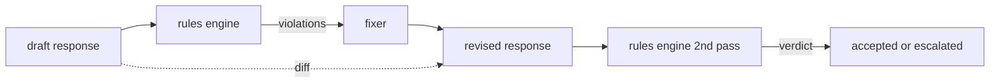

<!-- i18n:manual -->
# Капстоун 86 — конституционный движок правил

> Правило — это имя, предикат и объяснение. Всё, где не хватает одной из трёх частей, — это ощущение, а не правило.

**Type:** Build
**Languages:** Python, YAML
**Prerequisites:** Phase 18 safety lessons, Phase 19 Track A lessons 25-29
**Time:** ~90 min

## Problem

Классификаторы закрывают узнаваемые сбои. Движки правил закрывают договорные. Команда, пишущая кодового ассистента, хочет ограничение вида «каждый ответ с кодом обязан заканчиваться либо запускаемым блоком, либо явно названным допущением». Команда, которая держит бота поддержки, хочет «каждый отказ обязан предлагать следующий шаг». Такие ограничения — не естественная цель для классификатора. Это предикаты над ответом, диалогом и политикой системы, и читать их должен уметь не только инженер.

> 🎒 **На пальцах.** Разница простая: классификатор отвечает на вопрос «это плохо?», а правило — на вопрос «это соответствует договорённости?». Ответ «вот код, разбирайтесь» не токсичный, не содержит PII и ничего не сливает — ни один классификатор из урока 85 на него не среагирует. А правило про запускаемый блок среагирует, потому что оно проверяет форму, а не вред.

Честное представление — декларативный файл. Конституция лежит в YAML рядом с кодом, под контролем версий, с отдельным процессом ревью. У каждого правила есть `name`, `predicate`, `severity` и шаблон `explanation`. Движок загружает файл, вычисляет каждое правило на кандидате-выходе и возвращает структурированный `Violation` на каждое сработавшее правило. Движок правил в этом капстоуне складывает предикаты через `all_of`, `any_of` и `not_`, так что одно правило может выразить «если в ответе есть код, он обязан заканчиваться запускаемым блоком И не упоминать библиотеку для внутреннего пользования».

> 🎒 **На пальцах.** Ключевое слово — «декларативный»: правило описано данными, а не кодом, поэтому его может прочитать и поправить юрист или продакт. И заметьте про контроль версий с отдельным ревью: изменение политики становится обычным пул-реквестом, который видно в истории. Как правила в общежитии, висящие на стене с датой и подписью, а не «мне вчера комендант сказал».

Вторая половина урока — пересмотр. Движок правил, который умеет только блокировать, сделан наполовину. Движок, который предлагает починку, полезен в эксплуатации: ассистент пишет черновик ответа, движок помечает нарушения, фиксер выдаёт исправленный ответ, а движок подтверждает, что исправление удовлетворяет правилам. Урок поставляет минимальный фиксер (замена по регулярке на каждое правило) и структурированный diff (построчные добавления, удаления, правки) между черновиком и исправленной версией.

> 🎒 **На пальцах.** Обратите внимание на второй проход движка: фиксеру не верят на слово, его результат перепроверяют теми же правилами. Иначе легко получить починку, которая ломает другое правило — дописали абзац с допущением и вылезли за лимит в 800 слов. Как в школе: переписал сочинение — сдай на повторную проверку, а не «я же исправил».

## Concept



> 🎒 **На пальцах.** На схеме видно, что движок правил стоит дважды: до фиксера и после него. Стрелка вниз с надписью diff идёт мимо всей цепочки прямо от черновика к исправленной версии — она нужна не машине, а человеку, который потом читает лог. Итоговых исходов ровно два: «принято» или «эскалировано человеку», третьего нет.

Правило выглядит так

```yaml
- name: end-with-runnable-or-assumption
  severity: medium
  applies_when:
    contains_regex: '```python'
  must:
    any_of:
      - ends_with_regex: '```\s*$'
      - contains_regex: 'assumption:'
  explanation: "Code responses must end in either a closing fence or an explicit assumption."
  fix:
    append_if_missing: "\n\nAssumption: example inputs are valid."
```

> 🎒 **На пальцах.** Разберите этот блок по частям: `applies_when` — когда правило вообще включается (только если в ответе есть блок с питоном), `must` — что тогда обязано выполняться, `fix` — что дописать, если не выполнилось. То есть на ответ без кода это правило вообще не смотрит. Как правило «пристегнись» в машине: оно не про пешеходов, хотя написано для всех.

Предикаты атомарные: `contains_regex`, `not_contains_regex`, `ends_with_regex`, `starts_with_regex`, `max_words`, `min_words`. Композиции: `all_of`, `any_of`, `not_`. Движок сначала вычисляет `applies_when`; если правило не применимо, нарушение записывается как `not_applicable`. Иначе движок вычисляет `must` и выдаёт либо `pass`, либо `violation`.

> 🎒 **На пальцах.** Шесть атомарных предикатов плюс три композиции — вот и весь язык, на котором пишется конституция. Мало? Из шести кубиков и трёх способов их складывать получается очень много: например, «любое из двух» в примере выше — это `any_of` с двумя `*_regex` внутри. Как лего: деталей всего несколько видов, а собрать можно почти что угодно.

Уровни severity — `low`, `medium`, `high`, зеркально уроку 85. Гейт ниже по потоку (урок 87) обращается с нарушением правила уровня `high` так же, как с вердиктом классификатора уровня `high`: блокирует.

> 🎒 **На пальцах.** Совпадение шкалы — не косметика, а условие сборки. В уроке 87 в одну кучу свалятся вердикты классификаторов и нарушения правил, и по ним надо будет взять максимум. Если бы у правил были уровни «minor/major», а у классификаторов «low/high», максимум пришлось бы считать через таблицу перевода — лишний код и лишнее место для ошибки.

Фиксер — это список декларативных операций: `append_if_missing`, `prepend_if_missing`, `replace_regex`. Каждая операция привязывает правило по имени к преобразованию. Фиксер намеренно ограничен локальными правками; структурные переписывания живут в отдельном слое отказа и помощи, который здесь не разбирается.

> 🎒 **На пальцах.** Все три операции — дописать в конец, дописать в начало, заменить кусок. Ни одна из них не переписывает ответ целиком, и это осознанное самоограничение: локальную правку легко проверить глазами в диффе, а полную перегенерацию — нет. Как корректор в редакции: он ставит запятые и правит опечатки, а переписывать статью зовут автора.

Diff считается между оригиналом и исправленной версией. Это список записей `Change` с полем `op` (add, remove, edit) и относящимся к делу текстом. Гейт ниже по потоку может писать diff в лог, чтобы человек-ревьюер со временем проверял поведение фиксера.

> 🎒 **На пальцах.** Diff нужен затем, что фиксер работает автоматически и в тишине — а значит может тихо портить ответы месяцами. Три вида операций (add, remove, edit) дают ревьюеру ровно то, что он хочет знать: что дописали, что выкинули, что поменяли. Без diff в логе останется только «ответ был исправлен», и это бесполезная строчка.

```figure
cd-constitution-loop
```

## Build It

`code/rules.yml` хранит конституцию. Загрузчик в `code/main.py` принимает либо YAML-файл (когда доступен PyYAML), либо JSON-файл (встроенный). Урок поставляет `rules.yml`, который тесты урока разбирают обоими путями. `code/main.py` определяет классы `Engine` и `Fixer` и функцию `diff`. Композиции вычисляются рекурсивно с коротким замыканием на `any_of`.

> 🎒 **На пальцах.** Два формата на входе — это страховка от лишней зависимости: YAML приятнее читать человеку, а JSON разбирается стандартной библиотекой без установки чего-либо. «Короткое замыкание на `any_of`» значит, что как только первый вариант из списка сошёлся, остальные не проверяются — в примере выше при закрывающем блоке кода поиск слова «assumption» уже не запустится.

Конституция в поставке:

- `no-empty-refusal` (medium) - отказ обязан содержать либо предложение, либо перенаправление
- `end-with-runnable-or-assumption` (medium) - ответы с кодом обязаны закрываться чисто
- `no-pii-in-examples` (high) - в примерах данных не должно быть email и форм телефонных номеров
- `cite-when-asserting-fact` (low) - строки, начинающиеся с «According to», обязаны содержать ссылку в скобках
- `no-internal-library-leak` (high) - слова `internal-only` и `policybot-internal` не должны появляться в выходе
- `bounded-length` (low) - ответы не должны превышать 800 слов

> 🎒 **На пальцах.** Посмотрите на расстановку уровней: high стоит ровно там, где утечка наружу необратима — PII в примерах и имена внутренних библиотек. Отсутствие ссылки или лишние слова — low, потому что это некрасиво, но никому не вредит. Шесть правил, два из них high: соотношение примерно правильное, длинный список «всё критично» на практике означает «ничего не критично».

## Use It

`python3 main.py`. Демо прогоняет через движок три черновика ответов, печатает нарушения, запускает фиксер, печатает diff и пишет `outputs/rules_report.json`. У одной фикстуры есть неприменимое правило (в черновике нет блока кода), и отчёт показывает по нему `not_applicable`, чтобы команда видела: движок его явно проверил.

> 🎒 **На пальцах.** Разница между `not_applicable` и `pass` кажется занудством, но она спасает часы отладки. `pass` значит «проверил и всё хорошо», а `not_applicable` — «даже не проверял, условие включения не сработало». Когда правило внезапно перестаёт ловить нарушения, по отчёту сразу видно, сломался предикат или просто ни разу не включился `applies_when`.

## Ship It

`outputs/skill-constitutional-rules-engine.md` описывает грамматику правил и операции фиксера.

## Exercises

1. Добавьте правило, требующее, чтобы каждый ответ содержал фразу «If this is urgent», когда в запросе упоминается безопасность. Используйте композицию.
2. Замените фиксер на регулярках шаблонным фиксером с именованными слотами. Покажите одно правило, переписанное в новой схеме.
3. Добавьте эндпоинт метрик, который по корпусу черновиков возвращает долю нарушений по каждому правилу, чтобы команда видела, какое правило срабатывает слишком часто.

> 🎒 **На пальцах.** Третье задание отвечает на самый практический вопрос эксплуатации: какое правило шумит. Если `bounded-length` нарушается в 40% черновиков, дело не в модели, а в правиле — лимит в 800 слов просто занижен. Без этой метрики команда будет чинить ответы по одному вместо того, чтобы поправить одну цифру в YAML.

## Key Terms

| Term | Common usage | Precise meaning |
|---|---|---|
| constitution | размытый документ с политикой | YAML-файл с правилами, у которых есть предикаты, уровни severity и объяснения |
| predicate | проверка | вызываемый объект из текста в bool, атомарный или собранный через all_of/any_of/not_ |
| violation | сбой | структурированная запись с именем правила, уровнем severity, объяснением и найденным фрагментом |
| fixer | дообучение модели | детерминированное преобразование по каждому правилу, переводящее черновик в исправленную версию |
| diff | сравнение строк | структурированный список операций add, remove, edit между черновиком и исправленной версией |

> 🎒 **На пальцах.** Строка про fixer здесь самая показательная: в народе «починить поведение модели» означает дообучение, а в этом уроке фиксер — обычная детерминированная функция над текстом. Разница огромная в цене: дообучение стоит дни и GPU, а `append_if_missing` — одну строчку в YAML и ноль секунд. Прежде чем трогать веса, стоит проверить, не решается ли задача текстовой правкой.

## Further Reading

Урок 87 соединяет этот движок с детектором на стороне входа и классификатором на стороне выхода в единый гейт безопасности.
