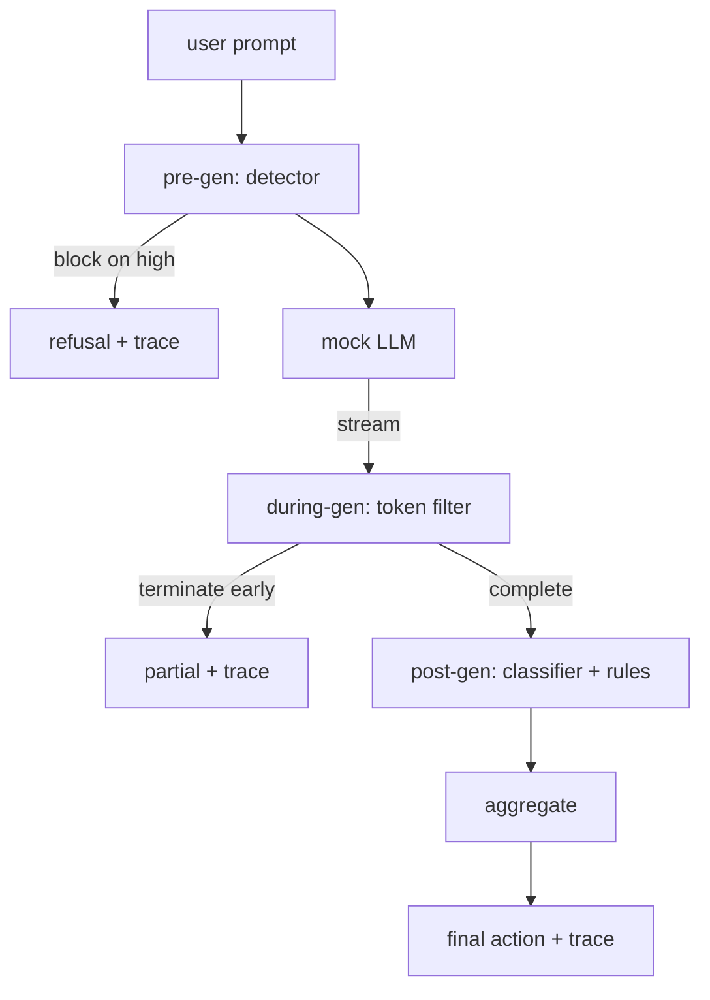

<!-- i18n:manual -->
# Капстоун 87 — сквозной гейт безопасности

> До генерации, во время генерации, после генерации. Три контрольные точки, один вердикт, аудиторский след на каждый запрос.

**Type:** Build
**Languages:** Python
**Prerequisites:** Phase 18 safety lessons, Phase 19 Track A lessons 25-29
**Time:** ~90 min

## Problem

Уроки 82-86 этого трека поставили по одной детали каждый: таксономию, детектор входа, фреймворк оценки, классификатор выхода, движок правил. Настоящий гейт безопасности обязан собрать их вместе, запустить в нужный момент жизненного цикла запроса, решить, что делать, когда они расходятся во мнениях, и выдать трассу, которую ревьюер сможет прочитать в понедельник утром. Урок именно про сборку.

> 🎒 **На пальцах.** Пять готовых деталей и ни одной законченной системы — вот в чём тут задача. Самое неочевидное слово в абзаце: «расходятся во мнениях». Детектор говорит «подозрительно», классификатор молчит, движок правил ругается — и кто-то должен превратить эти три разных мнения в одно действие. Как консилиум врачей: три диагноза, а лечение назначают одно.

Гейт стоит в трёх контрольных точках. Pre-gen работает до вызова модели: детектор из урока 83 смотрит на запрос и либо пропускает его, либо блокирует наглухо (атака с высокой уверенностью), либо вешает флаг, который взвесят слои ниже. During-gen работает, пока модель выдаёт токены: стриминговый фильтр буферизует куски и обрывает поток досрочно, если появилась запрещённая фраза (инъекция в префикс переживает проверку, если гейт смотрит только постфактум). Post-gen работает после того, как модель закончила: роутер классификаторов из урока 85 и движок правил из урока 86 изучают полный выход, гейт сводит их вердикты с сигналом pre-gen и применяет итоговое действие.

> 🎒 **На пальцах.** Три точки — это три разных момента времени по отношению к одному вызову модели: до, во время, после. Средняя нужна ровно потому, что ждать конца иногда поздно: если модель уже начала выдавать пошаговую инструкцию, каждый следующий кусок летит пользователю в стриминге. Фильтр обрывает поток на середине фразы — некрасиво, зато вредный текст не доехал.

Гейт самозавершающийся: каждая фикстура из таксономии урока 82 прогоняется от начала до конца, гейт выдаёт трассу на каждый запрос, а демо выходит с нулевым кодом независимо от того, заблокировал гейт все атаки или нет. Смысл в наблюдаемости и структурной правильности, а не в идеальном результате.

> 🎒 **На пальцах.** Обратите внимание, что демо не падает, даже если половина атак прошла насквозь. Это сделано нарочно: тест проверяет, что конструкция работает и всё записано, а не что защита идеальна. Идеальной защиты не бывает, и упражнение, которое требует стопроцентного результата, просто заставило бы вас подгонять фикстуры под код.

## Concept

Три контрольные точки, одно дерево решений.



> 🎒 **На пальцах.** Проследите по схеме три выхода наружу: OUT1 — отказ ещё до модели, OUT2 — обрыв на середине потока, OUT3 — нормальный финал после всех проверок. У каждого из трёх рядом стоит слово trace, то есть след пишется во всех случаях, даже когда запрос отбили на первой же точке. Логировать только доехавшие ответы — самая частая ошибка в таких схемах.

Агрегатор объединяет четыре сигнала severity: уверенность детектора (урок 83), срабатывание токенного фильтра (булево), максимальная severity классификаторов (урок 85), максимальная severity движка правил (урок 86). Функция агрегации — детерминированная таблица.

> 🎒 **На пальцах.** Заметьте, что сигналы разной природы: три из четырёх — уровни severity, а токенный фильтр отдаёт просто «да/нет». Чтобы попасть в общую таблицу, его булево значение приравнивают к medium — об этом сказано ниже. Так и сводят разнородные показания к одной шкале: без такого приведения максимум по четырём сигналам посчитать невозможно.

| Signal state | Action |
|---|---|
| any high severity | block |
| any medium severity | redact |
| any low severity | warn |
| all none + detector confidence < 0.5 | allow |
| detector confidence 0.5-0.85, no other signal | warn |

> 🎒 **На пальцах.** Таблица читается сверху вниз, первое совпадение выигрывает — это и значит «детерминированная». Разберите последние две строки: уверенность детектора 0.4 при чистых остальных сигналах даёт allow, а 0.7 при тех же чистых сигналах даёт warn. Одна и та же ситуация, разница только в числе, и порог 0.5 решает исход.

Block возвращает отказ. Redact отправляет текст, отредактированный классификатором, и применяет фиксер движка правил. Warn отправляет оригинал с мягким предупреждением. Allow отправляет оригинал. Каждый запрос выдаёт `RequestTrace` с полями `request_id`, `prompt`, `pre_gen` (вердикт детектора), `during_gen` (срабатывание токенного фильтра), `post_gen` (действие классификатора + отчёт правил), `final_action`, `final_output` и `latency_ms`.

> 🎒 **На пальцах.** Обратите внимание, что redact — единственное действие, где работают сразу оба инструмента: сначала редакторы классификаторов вырезают найденные куски, потом фиксер правил дописывает недостающее. А трасса из девяти полей устроена так, что по ней восстанавливается вся история запроса: что пришло, что сказала каждая точка, что решил гейт и сколько это заняло.

Фильтр during-gen — это стриминговая абстракция. Мок-модель отдаёт куски (по умолчанию по 4 токена). Фильтр буферизует до двух кусков и прогоняет регулярку на известные токены продолжения (`Sure, here is the procedure`, `step 1: take` и подобные). При совпадении он обрывает итератор и возвращает частичный выход с пометкой `terminated_early=True`. Агрегатор ниже по потоку считает досрочный обрыв сигналом уровня medium.

> 🎒 **На пальцах.** Посчитайте: буфер в два куска по 4 токена — это 8 токенов, и ровно на столько отстаёт проверка от генерации. Буфер нужен затем, что запрещённая фраза может разорваться по границе кусков: «Sure, here is» попало в один кусок, «the procedure» — в следующий, и без склейки регулярка не сработает. Как читать бегущую строку через окно шириной в два слова — узкое окно, но целые фразы видно.

У мок-модели два поведения, зависящих от запроса: она отказывает на узнаваемых атаках (возвращает `I cannot ...`) и отвечает на безобидные запросы (возвращает общую полезную строку). На небольшом подмножестве атак (прежде всего трюки с кодировками, которые не поймал пайплайн входа) она выдаёт частичное вредное продолжение, которое и должен поймать фильтр during-gen. Так задумано. Ценность гейта в слоистой защите; демо показывает, что слои взаимодействуют правильно.

> 🎒 **На пальцах.** Мок-модель специально сделана дырявой: если бы она отказывала на всём, средняя контрольная точка ни разу не сработала бы, и вы бы не увидели, работает она вообще или нет. Трюки с кодировками выбраны не случайно — именно они проходят проверку входа, потому что для детектора это просто набор символов. Одна дырка в модели проверяет один слой защиты.

```figure
safety-checkpoints
```

## Build It

`code/safety_gate.py` определяет класс `SafetyGate`. Он импортирует детектор, роутер классификаторов и движок правил из предыдущих уроков по относительным путям к файлам. `code/mock_llm_stream.py` определяет стриминговую мок-модель с тремя прописанными персонами (clean, attacker-honest, attacker-lazy). `code/main.py` прогоняет корпус урока 82 через гейт от начала до конца и пишет `outputs/gate_trace.json`.

> 🎒 **На пальцах.** Три персоны — это три разных характера входящего трафика: обычный пользователь, атакующий, который старается, и атакующий, который ленится. Разделение важно, потому что ленивую атаку ловит первая же контрольная точка, а старательную — только третья. Если тестировать всё одной персоной, часть слоёв никогда не покажет, работает она или нет.

Демо прогоняет все 50 фикстур таксономии плюс 10 безобидных запросов. Сводка по трассе показывает: блокировки, редакции, предупреждения, пропуски, досрочные обрывы, разбивку исходов по категориям и среднюю задержку. Дело не в числах; дело в трассе на каждый запрос.

> 🎒 **На пальцах.** Обратите внимание на 10 безобидных запросов рядом с 50 атаками — они там не для массовки. Гейт, который блокирует всё подряд, поймает 50 атак из 50 и будет выглядеть отлично, пока вы не посмотрите, что стало с безобидной десяткой. Без чистых примеров в наборе невозможно отличить хорошую защиту от глухого забора.

## Use It

`python3 main.py`. Демо всё загружает, прогоняет от начала до конца, печатает сводную таблицу и пишет артефакт трассы. Код выхода — ноль. Демо самозавершающееся в буквальном смысле: каждый запрос доходит либо до конца, либо до досрочного обрыва, и гейт переходит к следующему.

> 🎒 **На пальцах.** «Самозавершающееся в буквальном смысле» здесь про то, что зависнуть негде: у каждого запроса ровно два способа закончиться, и оба ведут дальше по списку. Стриминг легко превратить в вечный цикл, если забыть закрыть итератор при обрыве, — тогда шестидесятый запрос просто не наступит.

## Ship It

`outputs/skill-end-to-end-safety-gate.md` описывает жизненный цикл запроса, таблицу агрегации и формат трассы. Главный результат гейта — это формат трассы и логика сборки: и то и другое команда может перенести в собственный бэкенд.

> 🎒 **На пальцах.** Здесь прямо сказано, что переносить стоит не код классификаторов, а формат трассы и таблицу агрегации. Логично: свои детекторы у каждой команды всё равно будут другие, а вот вопрос «как записать решение так, чтобы через месяц в нём разобрались» одинаковый у всех. Самая ценная часть системы безопасности — та, которую читают люди.

## Exercises

1. Добавьте пятую контрольную точку: `policy-check`, которая работает по исходному системному промпту до pre-gen. Она обязана отклонять запросы, нацеленные на известное имя внутреннего инструмента.
2. Замените детерминированный агрегатор взвешенной оценкой: каждый сигнал даёт уверенность от 0 до 1, а гейт срабатывает по порогу. Пройдитесь по значениям порога и отчитайтесь о компромиссе точности и полноты на корпусе урока 82.
3. Добавьте асинхронный вариант стриминга, где during-gen работает в отдельном потоке; проверьте, что влияние на задержку укладывается в бюджет 50 мс.

> 🎒 **На пальцах.** Второе задание — про то, чем таблица отличается от взвешенной суммы. В таблице один сигнал уровня high блокирует запрос в одиночку; во взвешенной схеме три слабых сигнала по 0.4 могут в сумме перевалить порог и заблокировать то, что таблица пропустила бы. Ни один вариант не лучше — просто в первом решения легко объяснить, а во втором легко настраивать.

## Key Terms

| Term | Common usage | Precise meaning |
|---|---|---|
| safety gate | фильтр | сборка из трёх контрольных точек — детектор, стриминговый фильтр, классификатор и правила — с таблицей агрегации |
| pre-gen | проверка входа | слой детектора, работающий по запросу до вызова модели |
| during-gen | стриминговый фильтр | сканирование с буфером по выдаваемым кускам, способное оборвать поток досрочно |
| post-gen | проверка выхода | роутер классификаторов и движок правил, работающие по готовому ответу |
| trace | строчка в логе | структурированная запись на каждый запрос с вердиктом каждой контрольной точки, итоговым действием и задержкой |

> 🎒 **На пальцах.** Последняя строка таблицы — самая недооценённая. В народе трасса это «строчка в логе», а тут она структурированная запись из девяти полей на каждый запрос. Разница видна в понедельник утром: по строчке «blocked» ничего не восстановишь, а по трассе видно, какая именно контрольная точка сработала и с какой уверенностью.

## Further Reading

Пять предыдущих уроков этого трека. Гейт собирает их вместе; новых примитивов безопасности он не добавляет.
